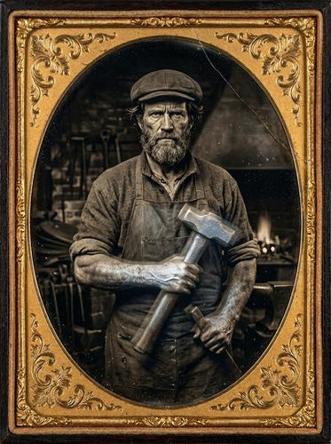

# Daguerreotype / Tintype

[← Back to Image Prompts](../README.md)

Antique photographic process aesthetic with sepia-metallic tones, mirror-like reflectivity, oval vignettes, surface scratches, and Victorian formal posing. Captures the haunting, time-capsule quality of the earliest photographs from the 1840s–1860s.



> **Sample prompt used to generate the above image (Nano Banana 2):**
> ```text
> Daguerreotype portrait of a stern Victorian-era blacksmith holding a hammer across his chest, 4:5 vertical format. The image has the distinctive silver-metallic sheen of a true daguerreotype — the surface appears to shift between positive and negative depending on the viewing angle. Soft oval vignette fading to dark at the edges. Warm sepia and cool silver tones. Long exposure apparent — the subject is perfectly still but there is a slight ghosting on the fingers suggesting micro-movement. Surface imperfections: fine scratches, small spots of oxidation, and a thin crack across the upper right corner. Mounted in an ornate gold-leaf decorative mat with embossed floral corners.
> ```

**ChatGPT**
```text
Create a daguerreotype portrait of [SUBJECT] in a formal Victorian-era pose. The image should have the distinctive silver-metallic sheen of a true daguerreotype. Include a soft oval vignette fading to dark at the edges. Warm sepia and cool silver tones. Simulate long-exposure stillness with slight ghosting on extremities. Add surface imperfections: fine scratches, small spots of oxidation, and subtle aging. Mount in an ornate gold-leaf decorative mat with embossed floral corners. The overall effect should be haunting and timeless.
```

**Midjourney**
```text
Daguerreotype portrait of [SUBJECT], Victorian formal pose, silver-metallic sheen, soft oval vignette, sepia and silver tones, long-exposure stillness, surface scratches and oxidation, ornate gold-leaf mat, haunting timeless quality --ar 4:5 --s 100
```

**Stable Diffusion**
- **Prompt:** `Daguerreotype portrait, [SUBJECT], Victorian pose, silver-metallic sheen, oval vignette, sepia silver tones, surface scratches, oxidation spots, ornate gold-leaf mat, antique photograph, 1850s aesthetic`
- **Negative Prompt:** `modern, color, digital, sharp, clean, bright`

**Nano Banana 2**
```text
Daguerreotype portrait of [SUBJECT] in a formal Victorian-era pose, 4:5 vertical format. Distinctive silver-metallic sheen of a true daguerreotype. Soft oval vignette fading to dark at the edges. Warm sepia and cool silver tones. Long-exposure stillness with slight ghosting on extremities. Surface imperfections: fine scratches, spots of oxidation, and subtle aging. Mounted in an ornate gold-leaf decorative mat with embossed floral corners. Haunting, timeless quality.
```
