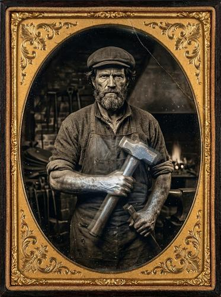

# Daguerreotype / Tintype

[← Back to Image Prompts](../README.md)

The earliest photographic processes — portraits on mirror-polished silver plates (daguerreotype) or dark lacquered metal (tintype/ferrotype). The unique qualities: mirror-like reflective surfaces that shift between positive and negative depending on viewing angle, extraordinarily fine detail from the plateless grain, long exposure motion blur on anything that moved, and the haunting, ghostly presence of subjects captured at the very dawn of photography. These images feel like windows into the past.

**Best for:** Art prints · Social media posts · Portrait photography · Historical content · Desktop wallpapers · Conceptual art



> **Sample prompt used to generate the above image (Nano Banana 2):**
> ```text
> Daguerreotype portrait on a mirror-polished silver plate of a person in Victorian-era clothing, seated in a formal pose, 3:4 vertical format. The silver surface is reflective — you can see the faint ghost of the photography studio reflected in the dark areas. Extraordinarily fine detail on the face and clothing fabric. Slight motion blur on the hands due to long exposure. The image shifts between positive and negative tones depending on the viewing angle. Dark velvet background. Housed in an ornate brass mat and leather case. The plate shows age — slight tarnishing at the edges, oxidation patterns. Haunting, luminous, otherworldly.
> ```

---

## Prompt Variations

### 🔵 Nano Banana 2 _(Featured)_

**Variation 1 — Portrait / Daguerreotype** _(Portrait)_
```text
Mirror-polished silver plate daguerreotype portrait of [SUBJECT], Victorian clothing, reflective surface, extremely fine detail, long exposure blur on movement, brass mat, leather case, [FORMAT].
```

**Variation 2 — Tintype Portrait** _(Portrait)_
```text
Tintype/ferrotype portrait of [SUBJECT], dark lacquered metal plate, Civil War era aesthetic, matte warm sepia tones, slightly underexposed, visible hand-poured collodion edges, [FORMAT].
```

**Variation 3 — Group / Family** _(Family Portrait)_
```text
Daguerreotype/tintype of [GROUP], formal poses, period clothing, some motion blur, silver/metal plate, brass mat, aged patina, [FORMAT].
```

**Variation 4 — Modern Subject in Period Process** _(Social Media)_
```text
Daguerreotype of [MODERN SUBJECT — e.g., a person with modern clothing/technology], treated with complete period authenticity — silver plate, motion blur, brass mat, the anachronism creates intrigue, [FORMAT].
```

**Variation 5 — Post-Mortem / Memento Mori Style** _(Art Print)_
```text
Daguerreotype memento mori composition — [STILL LIFE — e.g., wilted flowers, pocket watch, old letter], mirror-polished silver, fine detail, ornate brass mat, contemplative, haunting, [FORMAT].
```

### ChatGPT

**Variation 1 — Daguerreotype Portrait** _(Art Print, Historical Content)_
```text
Create a daguerreotype portrait of [SUBJECT] on a mirror-polished silver plate — Victorian-era clothing, formal seated pose, extraordinarily fine detail on face and fabric, slight motion blur on the hands from the long exposure. Reflective silver surface with tonal shift, ornate brass mat and leather case, edge tarnishing and oxidation. Haunting and luminous. 3:4 vertical format.
```

**Variation 2 — Tintype Portrait** _(Portrait Photography)_
```text
Create a tintype (ferrotype) portrait of [SUBJECT] on a dark lacquered metal plate — Civil War era aesthetic, matte warm sepia tones, slightly underexposed, visible hand-poured collodion edges and imperfections. 3:4 vertical format.
```

**Variation 3 — Modern Anachronism** _(Social Media, Conceptual)_
```text
Create a daguerreotype of [MODERN SUBJECT — e.g., a person holding a smartphone] treated with complete 1850s period authenticity — mirror-polished silver plate, fine detail, motion blur, brass mat, aged patina. The anachronism is the point. 3:4 vertical format.
```

### Midjourney

**Variation 1 — Daguerreotype Portrait** _(Art Print)_
```text
daguerreotype portrait of [SUBJECT], mirror-polished silver plate, Victorian clothing, formal pose, extremely fine detail, long exposure motion blur, ornate brass mat, edge tarnishing, haunting luminous --ar 3:4 --s 100
```

**Variation 2 — Tintype Portrait** _(Portrait Photography)_
```text
tintype ferrotype portrait of [SUBJECT], dark lacquered metal plate, Civil War era, matte sepia tones, underexposed, hand-poured collodion edges --ar 3:4 --s 100
```

**Variation 3 — Memento Mori Still Life** _(Conceptual Art)_
```text
daguerreotype still life, [STILL LIFE — wilted flowers, pocket watch, old letter], mirror-polished silver plate, fine detail, ornate brass mat, contemplative haunting mood --ar 4:5 --s 150
```

### Stable Diffusion

**Variation 1 — Daguerreotype Portrait** _(Art Print)_
- **Prompt:** `daguerreotype portrait, [SUBJECT], mirror-polished silver plate, Victorian era, extremely fine detail, long exposure motion blur, brass mat, leather case, tarnished edges, monochromatic silver tones`
- **Negative Prompt:** `color, modern photography, digital sharpness, smooth clean plate, low quality`

**Variation 2 — Tintype Portrait** _(Portrait Photography)_
- **Prompt:** `tintype portrait, [SUBJECT], dark lacquered metal plate, collodion process, Civil War era, matte sepia tones, underexposed, hand-poured edges`
- **Negative Prompt:** `color, modern, glossy, digital, oversharpened`

---

## 🔄 Image-to-Image Transformations

**Nano Banana 2** _(Featured)_
```text
Using the attached portrait, transform it into a daguerreotype on a mirror-polished silver plate. Convert to monochromatic silver tones. Add mirror-like reflectivity in the dark areas. Add extremely fine detail on the face. Introduce slight motion blur on the hands/extremities. Frame in an ornate brass mat. Add edge tarnishing and oxidation. Haunting, luminous, 1850s photographic process.
```

**ChatGPT**
```text
[Upload Photo] "Transform this portrait into an 1850s daguerreotype — monochromatic silver tones on a mirror-polished plate, fine detail, slight motion blur on hands, ornate brass mat, edge tarnishing and oxidation."
```

**Midjourney**
```text
[IMAGE_URL] daguerreotype, mirror-polished silver plate, monochromatic silver tones, fine detail, motion blur, brass mat, tarnished edges, 1850s --iw 1.5 --ar 3:4
```

**Stable Diffusion**
- **Pipeline:** Img2Img · Denoising Strength: `0.45–0.6` (preserves likeness; process look is mostly tonal)
- **Prompt:** `daguerreotype, silver plate, monochromatic, fine detail, motion blur, brass mat, tarnished edges, 1850s photography`
- **Negative Prompt:** `color, modern photo, digital sharpness, clean plate`

---

## 💡 Tips & Best Practices
- **Mirror surface**: "Mirror-polished silver plate" with reflectivity is the daguerreotype's signature — it's unique in all photography.
- **Motion blur from long exposure**: Hands, clothing that moved during the long exposure should be slightly blurred.
- **Brass mat and leather case**: The housing is part of the aesthetic — always include it.
- **Daguerreotype ≠ tintype**: Daguerreotype = reflective silver, extremely fine detail. Tintype = matte dark metal, slightly rough. They're different processes.
- **Pairs well with:** [Cyanotype / Sun Print](cyanotype-sun-print.md) (same era processes), [Cinematic Headshots](cinematic-headshots.md) (modern vs. antique portraiture)
