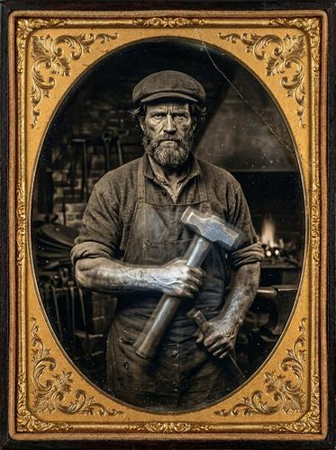

# Daguerreotype / Tintype

[← Back to Image Prompts](../README.md)

The earliest photographic processes — portraits on mirror-polished silver plates (daguerreotype) or dark lacquered metal (tintype/ferrotype). The unique qualities: mirror-like reflective surfaces that shift between positive and negative depending on viewing angle, extraordinarily fine detail from the plateless grain, long exposure motion blur on anything that moved, and the haunting, ghostly presence of subjects captured at the very dawn of photography. These images feel like windows into the past.

**Best for:** Art prints · Social media posts · Portrait photography · Historical content · Desktop wallpapers · Conceptual art



---

## Prompt

Replace the bracketed details with your subject and preferred format.

```text
Mirror-polished silver-plate daguerreotype portrait of [SUBJECT — e.g., a seated person in Victorian clothing], [FORMAT]. Use a formal pose against dark velvet, extraordinarily fine detail on the face and fabric, and the faintest movement blur on the hands from a long exposure. Let the dark areas reflect a ghost of the studio; silver tones shift subtly between positive and negative. Frame the plate with an ornate brass mat inside a worn leather case, with slight tarnish and oxidation near the edges. Luminous, intimate early-photography atmosphere.
```

## With a Reference Image

Attach your image and use this prompt to preserve its defining features while applying the style.

```text
Using the attached portrait, transform it into a daguerreotype on a mirror-polished silver plate. Convert to monochromatic silver tones. Add mirror-like reflectivity in the dark areas. Add extremely fine detail on the face. Introduce slight motion blur on the hands/extremities. Frame in an ornate brass mat. Add edge tarnishing and oxidation. Haunting, luminous, 1850s photographic process.
```

---

## 💡 Tips & Best Practices
- **Mirror surface**: "Mirror-polished silver plate" with reflectivity is the daguerreotype's signature — it's unique in all photography.
- **Motion blur from long exposure**: Hands, clothing that moved during the long exposure should be slightly blurred.
- **Brass mat and leather case**: The housing is part of the aesthetic — always include it.
- **Daguerreotype ≠ tintype**: Daguerreotype = reflective silver, extremely fine detail. Tintype = matte dark metal, slightly rough. They're different processes.
- **Pairs well with:** [Cyanotype / Sun Print](cyanotype-sun-print.md) (same era processes), [Cinematic Headshots](cinematic-headshots.md) (modern vs. antique portraiture)
