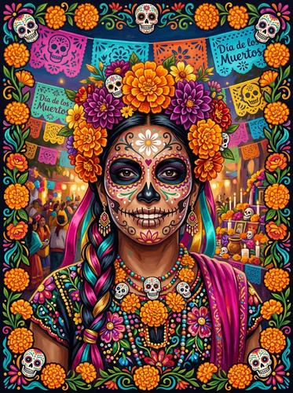

# Día de los Muertos (Mexican Folk Art)

[← Back to Image Prompts](../README.md)

Sugar skull aesthetics, marigold flowers, papel picado banners, vibrant saturated colors, intricate symmetrical patterns, and calavera face paint. The joyful, celebratory visual language of Mexico's Day of the Dead tradition.



> **Sample prompt used to generate the above image (Nano Banana 2):**
> ```text
> Día de los Muertos portrait illustration of a woman with elaborate calavera sugar skull
> face paint — intricate symmetrical floral patterns in white on her face with black eye
> sockets and a heart-shaped nose, 4:5 vertical format. Her hair is adorned with a crown
> of bright orange cempasúchil marigolds and deep purple dahlias. Papel picado tissue
> paper banners in fuchsia, yellow, and turquoise flutter in the background. Vibrant
> saturated colors throughout — the palette celebrates life rather than mourns death.
> Ornate decorative border of marigold vines and sugar skulls framing the portrait. Rich
> hand-painted illustration style with folk art patterns.
> ```

**ChatGPT**
```text
Create a Día de los Muertos illustration of [SUBJECT] with elaborate calavera sugar skull face paint — intricate symmetrical floral patterns in white with black eye sockets. Adorn the subject with a crown of bright orange cempasúchil marigolds and deep purple dahlias. Include papel picado tissue paper banners in fuchsia, yellow, and turquoise in the background. Vibrant saturated colors celebrating life. Add an ornate decorative border of marigold vines and sugar skulls. Rich hand-painted folk art illustration style.
```

**Midjourney**
```text
Día de los Muertos portrait of [SUBJECT] with calavera sugar skull face paint, symmetrical floral patterns, crown of orange marigolds and purple dahlias, papel picado banners in fuchsia yellow turquoise, vibrant saturated colors, ornate marigold border, folk art illustration style --ar 4:5 --s 250
```

**Stable Diffusion**
- **Prompt:** `Día de los Muertos illustration, [SUBJECT] with calavera sugar skull face paint, symmetrical floral patterns, marigold crown, papel picado banners, vibrant saturated colors, ornate marigold border, Mexican folk art style, masterpiece`
- **Negative Prompt:** `photograph, 3d, realistic, dark, horror, grim, desaturated`

**Nano Banana 2**
```text
Día de los Muertos portrait illustration of [SUBJECT] with elaborate calavera sugar skull face paint — intricate symmetrical floral patterns in white with black eye sockets, 4:5 vertical format. Crown of bright orange cempasúchil marigolds and deep purple dahlias. Papel picado tissue paper banners in fuchsia, yellow, and turquoise in the background. Vibrant saturated colors celebrating life. Ornate decorative border of marigold vines and sugar skulls. Rich hand-painted folk art illustration style.
```
