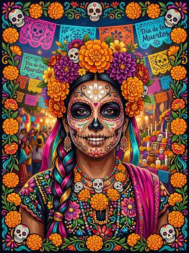

# Día de los Muertos (Day of the Dead)

[← Back to Image Prompts](../README.md)

The vibrant visual language of Mexico's Day of the Dead celebration — sugar skull (calavera) face painting with intricate floral patterns, marigold (cempasúchil) flowers, papel picado banners, ofrendas (altars with candles and photos), and a palette that celebrates life through death's imagery. Every surface is decorated — faces become canvases, altars overflow with color, and the boundary between life and the spirit world is joyfully blurred.

**Best for:** Social media posts · Profile pictures · Art prints · Greeting cards · Desktop wallpapers · Poster prints · Halloween/cultural content



> **Sample prompt used to generate the above image (Nano Banana 2):**
> ```text
> Portrait photograph of a woman with elaborate Día de los Muertos (Day of the Dead) sugar skull face paint — intricate floral patterns around the eyes, a painted nose as an inverted heart, and decorative line work across the forehead and chin — wearing a flower crown of vibrant orange marigolds (cempasúchil), 3:4 vertical format. Rich, saturated palette — deep purples, hot pinks, vivid oranges, and gold. Warm candlelight glow mixed with dramatic side-lighting. Bokeh background of out-of-focus papel picado banners and marigolds. Celebratory, vibrant, honoring the departed.
> ```

---

## Prompt Variations

### 🔵 Nano Banana 2 _(Featured)_

**Variation 1 — Portrait with Face Paint** _(Portrait)_
```text
Día de los Muertos portrait, sugar skull face paint, floral patterns, marigold crown, candlelight, vivid palette, [FORMAT].
```

**Variation 2 — Ofrenda / Altar** _(Cultural Content)_
```text
Traditional ofrenda altar with candles, marigolds, papel picado, sugar skulls, photos, fruit, pan de muerto, warm candlelight, vivid, [FORMAT].
```

**Variation 3 — Calacas / Skeleton Figures** _(Illustration)_
```text
Elegant skeleton figures (calacas) in formal clothing, dancing/celebrating, surrounded by marigolds, vivid palette, festive, [FORMAT].
```

**Variation 4 — Sugar Skull Still Life** _(Art Print)_
```text
Decorated sugar skulls (calaveras de azúcar) with intricate icing patterns, surrounded by marigolds and candles, close-up, vivid colors, [FORMAT].
```

**Variation 5 — Street Scene / Parade** _(Social Media)_
```text
Día de los Muertos street parade with costumed participants, papel picado overhead, marigold carpets, candlelight procession, vivid colors, [FORMAT].
```

### ChatGPT

**Variation 1 — Portrait with Face Paint** _(Profile Picture, Social Media)_
```text
Create a portrait of [SUBJECT] with elaborate Día de los Muertos sugar skull face paint — intricate floral patterns around the eyes, an inverted-heart painted nose, decorative line work on forehead and chin — wearing a crown of vibrant orange marigolds. Rich saturated palette of deep purples, hot pinks, vivid oranges, and gold. Warm candlelight with bokeh of papel picado banners behind. Celebratory and vibrant. 3:4 vertical format.
```

**Variation 2 — Ofrenda / Altar** _(Cultural Content, Print)_
```text
Create a traditional Día de los Muertos ofrenda altar overflowing with lit candles, orange marigolds, papel picado banners, decorated sugar skulls, framed photos, fruit, and pan de muerto. Warm candlelight glow, vivid celebratory colors. 3:2 landscape format.
```

**Variation 3 — Calacas / Skeleton Figures** _(Greeting Card, Poster)_
```text
Create a scene of elegant skeleton figures (calacas) in formal vintage clothing dancing and celebrating, surrounded by marigolds and papel picado. Festive, joyful, vivid palette — celebrating life through death's imagery. 3:2 landscape format.
```

### Midjourney

**Variation 1 — Portrait with Face Paint** _(Profile Picture)_
```text
Día de los Muertos portrait, sugar skull face paint, intricate floral patterns around eyes, marigold flower crown, deep purples hot pinks vivid oranges gold, warm candlelight, papel picado bokeh --ar 3:4 --s 300
```

**Variation 2 — Ofrenda / Altar** _(Cultural Content)_
```text
traditional ofrenda altar, candles, orange marigolds, papel picado, sugar skulls, framed photos, pan de muerto, warm candlelight glow, vivid celebratory colors --ar 3:2 --s 250
```

**Variation 3 — Calacas Celebration** _(Poster)_
```text
elegant calacas skeleton figures in formal clothing, dancing celebration, marigolds, papel picado overhead, festive vivid palette, joyful --ar 3:2 --s 350
```

### Stable Diffusion

**Variation 1 — Portrait with Face Paint** _(Profile Picture)_
- **Prompt:** `Día de los Muertos portrait, [SUBJECT], sugar skull face paint, floral patterns around eyes, marigold crown, deep purple hot pink orange gold palette, warm candlelight, papel picado bokeh background`
- **Negative Prompt:** `horror, scary, gore, desaturated, halloween monster, low quality`

**Variation 2 — Ofrenda / Altar** _(Cultural Content)_
- **Prompt:** `Día de los Muertos ofrenda altar, candles, orange marigolds, papel picado banners, sugar skulls, framed photos, pan de muerto, warm candlelight, vivid colors`
- **Negative Prompt:** `dark horror, gloomy, desaturated, modern minimalism, blur`

---

## 🔄 Image-to-Image Transformations

**Nano Banana 2** _(Featured)_
```text
Using the attached portrait, apply Día de los Muertos sugar skull face paint. Add intricate floral patterns around the eyes, decorative line work on forehead and chin. Add a crown of vibrant orange marigolds. Change the palette to rich purples, hot pinks, vivid oranges, and gold. Apply warm candlelight glow. Add bokeh of marigolds and papel picado in the background.
```

**ChatGPT**
```text
[Upload Photo] "Apply elaborate Día de los Muertos sugar skull face paint to this portrait — floral patterns around the eyes, decorative line work, a marigold flower crown, and a warm candlelit palette of purples, pinks, oranges, and gold."
```

**Midjourney**
```text
[IMAGE_URL] Día de los Muertos sugar skull face paint, floral eye patterns, marigold crown, vivid purples pinks oranges gold, warm candlelight, papel picado bokeh --iw 1.5 --ar 3:4
```

**Stable Diffusion**
- **Pipeline:** Img2Img · Denoising Strength: `0.45–0.6` (face paint over preserved likeness)
- **Prompt:** `Día de los Muertos sugar skull face paint, floral patterns, marigold crown, vivid palette, candlelight, papel picado background`
- **Negative Prompt:** `horror, gore, desaturated, scary, distorted face`

---

## 💡 Tips & Best Practices
- **Sugar skull face paint details**: "Floral patterns around the eyes, painted nose as inverted heart, decorative line work" — specificity matters.
- **Marigolds (cempasúchil)**: The signature flower. "Vibrant orange marigolds" should appear prominently.
- **Papel picado**: "Intricately cut papel picado banners" add the festive cultural texture.
- **Celebrate, don't mourn**: The tone is joyful, vibrant, and celebratory — honoring the departed with color and life.
- **Pairs well with:** [Kente / Ankara Portraits](kente-ankara-portraits.md) (cultural celebration), [Art Nouveau / Mucha](art-nouveau-mucha.md) (similar ornate decorative sensibility)
