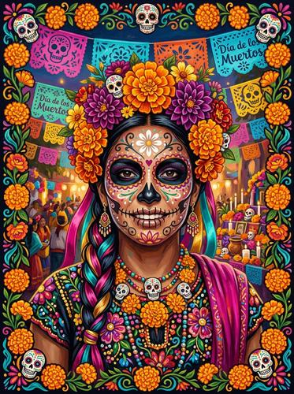

# Día de los Muertos (Day of the Dead)

[← Back to Image Prompts](../README.md)

The vibrant visual language of Mexico's Day of the Dead celebration — sugar skull (calavera) face painting with intricate floral patterns, marigold (cempasúchil) flowers, papel picado banners, ofrendas (altars with candles and photos), and a palette that celebrates life through death's imagery. Every surface is decorated — faces become canvases, altars overflow with color, and the boundary between life and the spirit world is joyfully blurred.

**Best for:** Social media posts · Profile pictures · Art prints · Greeting cards · Desktop wallpapers · Poster prints · Halloween/cultural content



---

## Prompt

Replace the bracketed details with your subject and preferred format.

```text
Celebratory Día de los Muertos portrait photograph of [SUBJECT], [FORMAT]. Paint intricate sugar skull motifs around the eyes, an inverted-heart nose, and fine decorative lines across the forehead and chin. Crown the subject with vibrant orange cempasúchil marigolds; include softly blurred papel picado and candlelight in the background. Use saturated purples, pinks, orange, and gold with warm side lighting that preserves natural facial features and expression. Compose with dignity and warmth, honoring remembrance rather than horror.
```

## With a Reference Image

Attach your image and use this prompt to preserve its defining features while applying the style.

```text
Using the attached portrait, apply Día de los Muertos sugar skull face paint. Add intricate floral patterns around the eyes, decorative line work on forehead and chin. Add a crown of vibrant orange marigolds. Change the palette to rich purples, hot pinks, vivid oranges, and gold. Apply warm candlelight glow. Add bokeh of marigolds and papel picado in the background.
```

---

## 💡 Tips & Best Practices
- **Sugar skull face paint details**: "Floral patterns around the eyes, painted nose as inverted heart, decorative line work" — specificity matters.
- **Marigolds (cempasúchil)**: The signature flower. "Vibrant orange marigolds" should appear prominently.
- **Papel picado**: "Intricately cut papel picado banners" add the festive cultural texture.
- **Celebrate, don't mourn**: The tone is joyful, vibrant, and celebratory — honoring the departed with color and life.
- **Pairs well with:** [Kente / Ankara Portraits](kente-ankara-portraits.md) (cultural celebration), [Art Nouveau / Mucha](art-nouveau-mucha.md) (similar ornate decorative sensibility)
