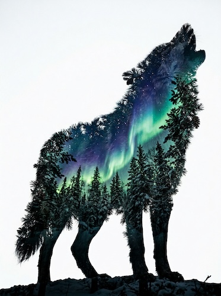

# Double Exposure

[← Back to Image Prompts](../README.md)

Two images merged into a single frame — typically a human silhouette filled with a landscape, cityscape, or natural texture. The darkest areas of the portrait become windows into the second image, creating a poetic visual metaphor where identity and environment intertwine. The technique originates from analog film photography, where two exposures were layered on the same frame.

**Best for:** Profile pictures · Album covers · Social media posts · Art prints · Movie posters · Book covers · Editorial illustrations



> **Sample prompt used to generate the above image (Nano Banana 2):**
> ```text
> Double exposure photograph merging a side-profile silhouette of a woman with an autumn forest landscape, 4:5 vertical format. The darkest areas of the silhouette — hair, jawline, shoulder — reveal dense golden and crimson autumn foliage. The lighter skin areas blend with the soft misty sky visible between the trees. The silhouette's outline is crisp and recognizable against a clean white background. Warm amber and gold color palette. The two images blend seamlessly — neither dominates, they coexist as a single unified composition.
> ```

---

## Prompt Variations

### 🔵 Nano Banana 2 _(Featured)_

**Variation 1 — Portrait + Nature** _(Profile Picture, Art Print)_
```text
Double exposure photograph merging a [ANGLE — e.g., side-profile / front-facing / three-quarter] silhouette of [SUBJECT] with [LANDSCAPE — e.g., a misty mountain forest at sunrise], [FORMAT]. The darkest areas of the silhouette reveal [NATURE DETAILS — e.g., dense pine trees and rocky peaks]. Lighter areas blend with the sky. Crisp silhouette outline against a clean [BACKGROUND — e.g., white / black] background. [COLOR PALETTE — e.g., cool greens and misty blues]. Seamless blend — neither image dominates.
```

**Variation 2 — Portrait + Cityscape** _(Social Media, Book Cover)_
```text
Double exposure photograph merging a [ANGLE] silhouette of [SUBJECT] with [CITYSCAPE — e.g., the New York skyline at golden hour with the sun setting between skyscrapers], 4:5 vertical format. The buildings and light emerge through the dark areas of the silhouette. Warm urban colors — [PALETTE]. Clean white background. The city and the person are one — a visual metaphor for urban identity.
```

**Variation 3 — Portrait + Texture** _(Album Cover, Art Print)_
```text
Double exposure photograph merging a [ANGLE] silhouette of [SUBJECT] with [TEXTURE — e.g., swirling galaxies, nebulae, and star fields], 1:1 square album cover format. The cosmic texture fills the silhouette entirely — stars visible in the hair, nebula colors across the face. The silhouette outline is crisp against pure black. [PALETTE — e.g., deep indigo, violet, and bright stellar whites]. The subject becomes the universe. Contemplative, cosmic, infinite.
```

**Variation 4 — Animal + Environment** _(Desktop Wallpaper, Print)_
```text
Double exposure merging the silhouette of [ANIMAL — e.g., a wolf howling] with [ENVIRONMENT — e.g., a winter pine forest under a full moon], 16:9 landscape format. The forest fills the animal's body — trees visible through the fur, moon positioned inside the head. The silhouette outline is crisp against [BACKGROUND]. [PALETTE]. Neither image dominates — they fuse into a single unified composition. The animal IS its habitat.
```

**Variation 5 — Multi-Exposure / Triple** _(Social Media, Experimental)_
```text
Triple exposure photograph layering three elements: [ELEMENT 1 — e.g., a ballet dancer in mid-leap], [ELEMENT 2 — e.g., scattered rose petals], and [ELEMENT 3 — e.g., soft window light with curtain shadows], 4:5 vertical format. The dancer's silhouette is filled with rose petals, while the window light creates atmospheric depth across the entire image. [PALETTE — e.g., soft pinks, warm whites, and golden light]. Ethereal, layered, dreamlike. The three exposures create a visual poem.
```

### ChatGPT
```text
Var 1: Create a double exposure merging [SUBJECT] silhouette with [LANDSCAPE]. Dark areas reveal nature. Crisp outline on [BACKGROUND]. [PALETTE]. Seamless blend. [FORMAT].
Var 2: Create a double exposure: [ANIMAL] silhouette filled with [ENVIRONMENT]. Crisp outline. [PALETTE]. [FORMAT].
Var 3: Create a triple exposure: [ELEMENT 1], [ELEMENT 2], [ELEMENT 3]. Layered, ethereal, dreamlike. [FORMAT].
```

### Midjourney
```text
Var 1: Double exposure, [SUBJECT] silhouette filled with [LANDSCAPE], crisp outline, [BACKGROUND], [PALETTE] --ar 4:5
Var 2: Double exposure, [ANIMAL] silhouette with [ENVIRONMENT], seamless blend, [PALETTE] --ar 16:9
Var 3: Triple exposure, [ELEMENTS], ethereal layered dreamlike --ar 4:5
```

### Stable Diffusion
- **Var 1:** `Double exposure photograph, [SUBJECT] silhouette, [LANDSCAPE] filling, crisp outline, [BACKGROUND], [PALETTE], 8k` / Neg: `collage, separate images, harsh edges, cartoon`
- **Var 2:** `Double exposure, [ANIMAL] silhouette, [ENVIRONMENT], seamless, poetic, 8k` / Neg: `collage, separate, harsh, cartoon, digital`

---

## 🔄 Image-to-Image Transformations

**Nano Banana 2** _(Featured)_
```text
Using the attached portrait photo, create a double exposure effect by blending the subject's silhouette with [SECOND IMAGE — e.g., an autumn forest / city skyline / ocean waves]. The darkest areas of the portrait should reveal the second image. Lighter areas blend with the sky/background of the second image. Maintain a crisp silhouette outline. Clean [white/black] background outside the silhouette. [PALETTE].
```
> 💡 **Refinements:** "Make the blend more subtle / more dramatic" · "Switch the second image to [DIFFERENT SCENE]" · "Add a third exposure layer" · "Make the outline softer — more gradual fade"

**ChatGPT / Midjourney / Stable Diffusion** — Standard I2I with "double exposure, silhouette blend, [SECOND IMAGE]" keywords. SD denoising: `0.50–0.65`.

---

## 💡 Tips & Best Practices

- **Side-profile works best**: The recognizable shape of a side-profile creates the strongest silhouette for the second image to fill.
- **Contrast is the mechanism**: The dark areas of image 1 reveal image 2. Choose subjects with clear dark/light separation.
- **Clean background**: White or black backgrounds outside the silhouette prevent visual clutter.
- **Metaphor matters**: The best double exposures create meaning — a person + their city = urban identity. A wolf + forest = wild nature. Choose pairings with intent.
- **Common pitfalls**: Don't place two busy images together — one should be a simple silhouette, the other a landscape/texture.
- **Pairs well with:** [Cloud / Smoke Sculpture](cloud-smoke-sculpture.md) (similar form-in-substance concept), [Vinyl Album Cover](vinyl-album-cover.md) (double exposure is a popular album cover technique)
