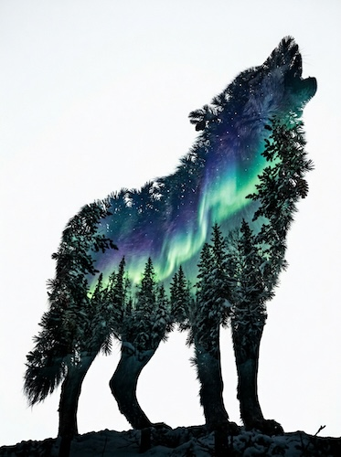

# Double Exposure

[← Back to Image Prompts](../README.md)

Two images merged into a single frame — typically a human silhouette filled with a landscape, cityscape, or natural texture. The darkest areas of the portrait become windows into the second image, creating a poetic visual metaphor where identity and environment intertwine. The technique originates from analog film photography, where two exposures were layered on the same frame.

**Best for:** Profile pictures · Album covers · Social media posts · Art prints · Movie posters · Book covers · Editorial illustrations



---

## Prompt

Replace the bracketed details with your subject and preferred format.

```text
Double exposure photograph merging a [ANGLE — e.g., side-profile / front-facing / three-quarter] silhouette of [SUBJECT] with [LANDSCAPE — e.g., a misty mountain forest at sunrise], [FORMAT]. The darkest areas of the silhouette reveal [NATURE DETAILS — e.g., dense pine trees and rocky peaks]. Lighter areas blend with the sky. Crisp silhouette outline against a clean [BACKGROUND — e.g., white / black] background. [COLOR PALETTE — e.g., cool greens and misty blues]. Seamless blend — neither image dominates.
```

## With a Reference Image

Attach your image and use this prompt to preserve its defining features while applying the style.

```text
Using the attached portrait photo, create a double exposure effect by blending the subject's silhouette with [SECOND IMAGE — e.g., an autumn forest / city skyline / ocean waves]. The darkest areas of the portrait should reveal the second image. Lighter areas blend with the sky/background of the second image. Maintain a crisp silhouette outline. Clean [white/black] background outside the silhouette. [PALETTE].
```

---

## 💡 Tips & Best Practices

- **Side-profile works best**: The recognizable shape of a side-profile creates the strongest silhouette for the second image to fill.
- **Contrast is the mechanism**: The dark areas of image 1 reveal image 2. Choose subjects with clear dark/light separation.
- **Clean background**: White or black backgrounds outside the silhouette prevent visual clutter.
- **Metaphor matters**: The best double exposures create meaning — a person + their city = urban identity. A wolf + forest = wild nature. Choose pairings with intent.
- **Common pitfalls**: Don't place two busy images together — one should be a simple silhouette, the other a landscape/texture.
- **Pairs well with:** [Cloud / Smoke Sculpture](cloud-smoke-sculpture.md) (similar form-in-substance concept), [Vinyl Album Cover](vinyl-album-cover.md) (double exposure is a popular album cover technique)
