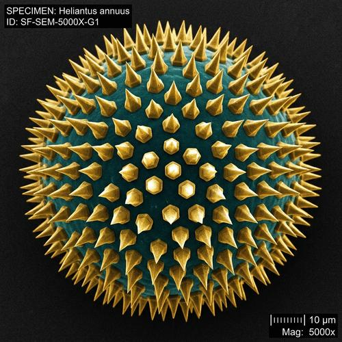

# Electron Microscope

[← Back to Image Prompts](../README.md)

The alien landscapes revealed by scanning electron microscopy (SEM) — extreme magnification turning everyday surfaces into surreal topographies. At 1000x–50,000x magnification, a pollen grain becomes a gothic cathedral, an insect's eye becomes a geodesic dome, and salt crystals become perfect geometric citadels. SEM images are grayscale (electrons, not light) with dramatic directional lighting that emphasizes three-dimensional topology.

**Best for:** Desktop wallpapers · Art prints · Social media posts · Educational content · Poster prints · Science communication



> **Sample prompt used to generate the above image (Nano Banana 2):**
> ```text
> Scanning electron microscope (SEM) image of a single pollen grain at 5000x magnification, 1:1 square format. The pollen grain's surface is revealed as an elaborate alien architecture — spikes, ridges, and pore openings creating a complex three-dimensional topography. Monochromatic grey-scale with dramatic directional lighting from the upper right creating strong shadows that emphasize every surface detail. The depth of field is characteristic of SEM — nearly everything is sharp. The background fades to a smooth dark void where the electron beam didn't reach. Scientific specimen aesthetic with a scale bar in the lower right showing "5 μm."
> ```

---

## Prompt Variations

### 🔵 Nano Banana 2 _(Featured)_

**Variation 1 — Biological Micro-Structure** — SEM image of [SPECIMEN — e.g., insect compound eye / butterfly wing scale], [MAGNIFICATION], grayscale, directional lighting, three-dimensional topology, scale bar, [FORMAT].

**Variation 2 — Material Surface** — SEM image of [MATERIAL — e.g., fabric fiber weave / metal fracture surface / crystal growth], [MAGNIFICATION], grayscale, surface detail, dramatic shadows, scale bar, [FORMAT].

**Variation 3 — Food / Organic** — SEM image of [FOOD — e.g., sugar crystals / bread crumb cross-section / coffee ground], [MAGNIFICATION], revealing alien microscale geometry, grayscale, directional lighting, [FORMAT].

**Variation 4 — False Color SEM** — False-color SEM image of [SPECIMEN], scientific colorization applied — [COLORS assigned to different elements/regions], dramatic detail, scale bar, [FORMAT].

**Variation 5 — Comparative Scale** — Split-image showing [OBJECT] at normal scale on the left and SEM magnification on the right, revealing the hidden micro-structure, grayscale SEM half, scale bars, [FORMAT].

### ChatGPT / Midjourney / Stable Diffusion — Standard templates with "SEM, scanning electron microscope, extreme magnification, grayscale, directional lighting, three-dimensional topology, scale bar" core keywords.

---

## 🔄 Image-to-Image Transformations

**Nano Banana 2** _(Featured)_
```text
Using the attached photo, reimagine it as if viewed through a scanning electron microscope at extreme magnification. Convert to grayscale. Reveal hidden three-dimensional surface topology invisible at normal scale. Add dramatic directional lighting from the upper right. Nearly infinite depth of field. Dark void background. Add a scale bar in the lower right. Scientific specimen aesthetic.
```

---

## 💡 Tips & Best Practices
- **Grayscale only (unless false-color)**: Real SEM uses electrons, not light, so images are monochromatic.
- **Dramatic directional lighting**: "Lighting from upper right" casting strong shadows that reveal 3D surface features.
- **Name the magnification**: "5000x magnification" calibrates the level of detail and alien-ness.
- **Scale bar**: "Scale bar showing '5 μm'" adds scientific authenticity.
- **Pairs well with:** [X-Ray / Medical Imaging](x-ray-imaging.md) (both reveal hidden structures), [Cinematic Macro Photography](cinematic-macro-photography.md) (next step down in magnification)
