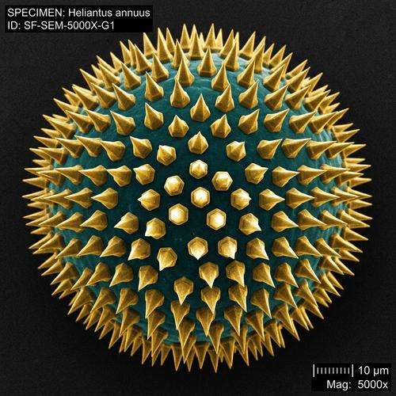

# Electron Microscope

[← Back to Image Prompts](../README.md)

The alien landscapes revealed by scanning electron microscopy (SEM) — extreme magnification turning everyday surfaces into surreal topographies. At 1000x–50,000x magnification, a pollen grain becomes a gothic cathedral, an insect's eye becomes a geodesic dome, and salt crystals become perfect geometric citadels. SEM images are grayscale (electrons, not light) with dramatic directional lighting that emphasizes three-dimensional topology.

**Best for:** Desktop wallpapers · Art prints · Social media posts · Educational content · Poster prints · Science communication



> **Sample prompt used to generate the above image (Nano Banana 2):**
> ```text
> Scanning electron microscope (SEM) image of a single pollen grain at 5000x magnification, 1:1 square format. The pollen grain's surface is revealed as an elaborate alien architecture — spikes, ridges, and pore openings creating a complex three-dimensional topography. Monochromatic grey-scale with dramatic directional lighting from the upper right creating strong shadows that emphasize every surface detail. The depth of field is characteristic of SEM — nearly everything is sharp. The background fades to a smooth dark void where the electron beam didn't reach. Scientific specimen aesthetic with a scale bar in the lower right showing "5 μm."
> ```

---

## Prompt Variations

### 🔵 Nano Banana 2 _(Featured)_

**Variation 1 — Biological Micro-Structure** _(Science Communication)_
```text
SEM image of [SPECIMEN — e.g., insect compound eye / butterfly wing scale], [MAGNIFICATION], grayscale, directional lighting, three-dimensional topology, scale bar, [FORMAT].
```

**Variation 2 — Material Surface** _(Science Communication)_
```text
SEM image of [MATERIAL — e.g., fabric fiber weave / metal fracture surface / crystal growth], [MAGNIFICATION], grayscale, surface detail, dramatic shadows, scale bar, [FORMAT].
```

**Variation 3 — Food / Organic** _(Editorial)_
```text
SEM image of [FOOD — e.g., sugar crystals / bread crumb cross-section / coffee ground], [MAGNIFICATION], revealing alien microscale geometry, grayscale, directional lighting, [FORMAT].
```

**Variation 4 — False Color SEM** _(Desktop Wallpaper)_
```text
False-color SEM image of [SPECIMEN], scientific colorization applied — [COLORS assigned to different elements/regions], dramatic detail, scale bar, [FORMAT].
```

**Variation 5 — Comparative Scale** _(Educational Content)_
```text
Split-image showing [OBJECT] at normal scale on the left and SEM magnification on the right, revealing the hidden micro-structure, grayscale SEM half, scale bars, [FORMAT].
```

### ChatGPT

**Variation 1 — Biological Micro-Structure** _(Science Communication)_
```text
Create a scanning electron microscope (SEM) image of [SPECIMEN — e.g., an insect compound eye] at [MAGNIFICATION — e.g., 5000x] magnification. Monochromatic grayscale with dramatic directional lighting from the upper right, revealing elaborate three-dimensional surface topology. Nearly infinite depth of field, dark void background, and a scale bar in the lower right. Scientific specimen aesthetic. 1:1 square format.
```

**Variation 2 — Material Surface** _(Educational Content)_
```text
Create an SEM image of [MATERIAL — e.g., fabric fiber weave or a metal fracture surface] at extreme magnification — grayscale, strong directional shadows emphasizing surface detail, alien microscale geometry, scale bar in the corner. 16:9 landscape format.
```

**Variation 3 — False Color SEM** _(Desktop Wallpaper)_
```text
Create a false-color SEM image of [SPECIMEN] with scientific colorization — [COLORS] assigned to different structures — over dramatic grayscale topology, directional lighting, dark void background, scale bar. 16:9 landscape format.
```

### Midjourney

**Variation 1 — Biological Micro-Structure** _(Science Communication)_
```text
scanning electron microscope image of [SPECIMEN], [MAGNIFICATION] magnification, monochromatic grayscale, dramatic directional lighting, three-dimensional surface topology, infinite depth of field, dark void background, scale bar --ar 1:1 --s 100
```

**Variation 2 — Material Surface** _(Educational Content)_
```text
SEM image of [MATERIAL] surface, extreme magnification, grayscale, strong directional shadows, alien microscale geometry, scientific specimen, scale bar --ar 16:9 --s 100
```

**Variation 3 — False Color SEM** _(Desktop Wallpaper)_
```text
false-color scanning electron microscope image of [SPECIMEN], scientific colorization, [COLORS], dramatic surface topology, directional lighting, dark background, scale bar --ar 16:9 --s 150
```

### Stable Diffusion

**Variation 1 — Biological Micro-Structure** _(Science Communication)_
- **Prompt:** `scanning electron microscope image, [SPECIMEN], extreme magnification, monochromatic grayscale, dramatic directional lighting, three-dimensional topology, infinite depth of field, dark void background, scale bar, scientific specimen`
- **Negative Prompt:** `color photograph, blurry, shallow depth of field, artistic painting, low quality`

**Variation 2 — False Color SEM** _(Desktop Wallpaper)_
- **Prompt:** `false-color SEM image, [SPECIMEN], scientific colorization, [COLORS], dramatic surface topology, directional lighting, dark background, scale bar`
- **Negative Prompt:** `natural photograph, oversaturated rainbow, painting, blur`

---

## 🔄 Image-to-Image Transformations

**Nano Banana 2** _(Featured)_
```text
Using the attached photo, reimagine it as if viewed through a scanning electron microscope at extreme magnification. Convert to grayscale. Reveal hidden three-dimensional surface topology invisible at normal scale. Add dramatic directional lighting from the upper right. Nearly infinite depth of field. Dark void background. Add a scale bar in the lower right. Scientific specimen aesthetic.
```

**ChatGPT**
```text
[Upload Photo] "Reimagine this photo as a scanning electron microscope image — grayscale, extreme magnification revealing 3D surface topology, dramatic directional lighting, infinite depth of field, dark void background, and a scale bar."
```

**Midjourney**
```text
[IMAGE_URL] scanning electron microscope image, grayscale, extreme magnification, dramatic directional lighting, surface topology, dark void background, scale bar --iw 1 --ar 1:1
```

**Stable Diffusion**
- **Pipeline:** Img2Img · Denoising Strength: `0.6–0.75` (heavy re-interpretation into microscale detail)
- **Prompt:** `scanning electron microscope image, grayscale, extreme magnification, directional lighting, three-dimensional topology, dark background, scale bar`
- **Negative Prompt:** `color photo, blur, shallow focus, painting`

---

## 💡 Tips & Best Practices
- **Grayscale only (unless false-color)**: Real SEM uses electrons, not light, so images are monochromatic.
- **Dramatic directional lighting**: "Lighting from upper right" casting strong shadows that reveal 3D surface features.
- **Name the magnification**: "5000x magnification" calibrates the level of detail and alien-ness.
- **Scale bar**: "Scale bar showing '5 μm'" adds scientific authenticity.
- **Pairs well with:** [X-Ray / Medical Imaging](x-ray-imaging.md) (both reveal hidden structures), [Cinematic Macro Photography](cinematic-macro-photography.md) (next step down in magnification)
