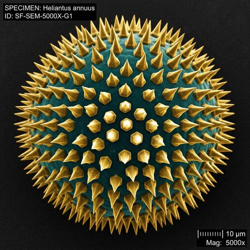

# Electron Microscope

[← Back to Image Prompts](../README.md)

The alien landscapes revealed by scanning electron microscopy (SEM) — extreme magnification turning everyday surfaces into surreal topographies. At 1000x–50,000x magnification, a pollen grain becomes a gothic cathedral, an insect's eye becomes a geodesic dome, and salt crystals become perfect geometric citadels. SEM images are grayscale (electrons, not light) with dramatic directional lighting that emphasizes three-dimensional topology.

**Best for:** Desktop wallpapers · Art prints · Social media posts · Educational content · Poster prints · Science communication



---

## Prompt

Replace the bracketed details with your subject and preferred format.

```text
Scanning electron microscope image of [SPECIMEN — e.g., a pollen grain] at [MAGNIFICATION — e.g., 5000×], [FORMAT]. Reveal its microscopic three-dimensional surface topology: [STRUCTURES — e.g., ridges, pores, and sharp spines]. Use monochrome grayscale and strong directional relief illumination from the upper right so tiny structures cast crisp shadows. Keep the specimen sharply focused against a featureless dark field. Add a small scale bar labeled with an appropriate unit for the stated magnification in the lower right. Scientific imaging clarity with an almost alien geometry.
```

## With a Reference Image

Attach your image and use this prompt to preserve its defining features while applying the style.

```text
Using the attached photo, reimagine it as if viewed through a scanning electron microscope at extreme magnification. Convert to grayscale. Reveal hidden three-dimensional surface topology invisible at normal scale. Add dramatic directional lighting from the upper right. Nearly infinite depth of field. Dark void background. Add a scale bar in the lower right. Scientific specimen aesthetic.
```

---

## 💡 Tips & Best Practices
- **Grayscale only (unless false-color)**: Real SEM uses electrons, not light, so images are monochromatic.
- **Dramatic directional lighting**: "Lighting from upper right" casting strong shadows that reveal 3D surface features.
- **Name the magnification**: "5000x magnification" calibrates the level of detail and alien-ness.
- **Scale bar**: "Scale bar showing '5 μm'" adds scientific authenticity.
- **Pairs well with:** [X-Ray / Medical Imaging](x-ray-imaging.md) (both reveal hidden structures), [Cinematic Macro Photography](cinematic-macro-photography.md) (next step down in magnification)
