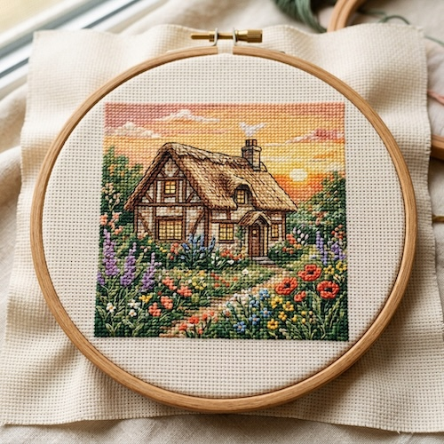

# Embroidered / Cross-Stitch

[← Back to Image Prompts](../README.md)

Subjects rendered as thread on fabric — visible canvas weave, precise cross-stitch grid patterns, and rich thread textures with raised surfaces catching directional light. The style merges cottagecore warmth with pixel-precise craftsmanship, often presented inside a traditional round embroidery hoop. The grid constraint (each stitch is a pixel) produces charmingly simplified forms, while the physical thread texture adds a tactile quality that pure digital art can't replicate.

**Best for:** Social media posts · Greeting cards · Nursery art · Desktop wallpapers · Pattern designs · Merchandise mockups · Holiday cards



> **Sample prompt used to generate the above image (Nano Banana 2):**
> ```text
> Close-up photograph of a completed cross-stitch embroidery piece in a round wooden hoop, depicting a cozy cottage with a thatched roof surrounded by a wildflower garden at sunset, 1:1 square format. Every element is rendered in tiny X-shaped cross-stitches on cream Aida cloth — the visible grid of the fabric weave forms the underlying structure. Rich DMC thread colors: warm golden yellows for the sunset sky, forest greens for the garden, rustic browns for the cottage, and pops of lavender, coral, and poppy red in the flowers. Soft natural window light highlighting the raised thread texture and subtle shadows in the stitch valleys.
> ```

---

## Prompt Variations

### 🔵 Nano Banana 2 _(Featured)_

> NB2 excels at rendering the texture contrast between raised thread and recessed fabric. The key phrases are "tiny X-shaped cross-stitches on cream Aida cloth" and "visible grid of the fabric weave." Always mention "DMC thread colors" for authentic embroidery palette references.

**Variation 1 — Landscape / Scene in Hoop** _(Social Media, Wall Art)_
```text
Close-up photograph of a completed cross-stitch embroidery piece in a round wooden hoop depicting [SCENE — e.g., a mountain lake at sunset with pine trees reflected in the water], 1:1 square format. Every element rendered in tiny X-shaped cross-stitches on cream Aida cloth — the visible grid of the fabric weave forms the underlying structure. Rich DMC thread colors: [PALETTE — e.g., deep cobalt blues for the lake, burnt orange and peach for the sunset, forest greens for the pines]. Soft natural window light highlighting the raised thread texture and subtle shadows in the stitch valleys.
```

**Variation 2 — Character / Portrait** _(Profile Picture, Gift)_
```text
Close-up photograph of a completed cross-stitch portrait in a round wooden hoop depicting [SUBJECT — e.g., a cat curled up on a stack of books], 1:1 square format. The subject's features are simplified into the cross-stitch grid — each stitch acts as a colored pixel. Rendered on cream Aida cloth with rich DMC thread colors. Fine details like whiskers are rendered in backstitch — thin single lines of thread over the cross-stitch base. Soft natural lighting. The wooden hoop is visible as a warm frame around the piece.
```

**Variation 3 — Repeating Pattern / Sampler** _(Pattern Design, Merchandise)_
```text
Close-up photograph of a cross-stitch sampler displaying a repeating pattern of [MOTIF — e.g., alternating rows of folk art birds, flowers, and geometric borders in a Scandinavian style], on cream Aida cloth, 16:9 landscape format. Traditional sampler layout — decorative borders framing rows of motifs. Rich DMC thread colors in a harmonious palette of [COLORS — e.g., rust red, navy blue, sage green, and gold]. Each X-shaped stitch is individually visible. The fabric weave grid shows between stitches. Flat composition shot from directly above. Soft even lighting.
```

**Variation 4 — Holiday / Seasonal** _(Greeting Card, Social Media)_
```text
Close-up photograph of a completed cross-stitch [HOLIDAY — e.g., Christmas] ornament in a small round wooden hoop depicting [DESIGN — e.g., a gingerbread house with candy decorations and snow on the roof], 1:1 square format. Rendered in cross-stitches on cream Aida cloth with a festive DMC thread palette — [COLORS — e.g., cinnamon brown, candy red, mint green, snow white, and gold metallic thread for accents]. A thin satin ribbon threaded through the hoop top for hanging. Soft warm lighting from the side. Holiday craft aesthetic.
```

**Variation 5 — Embroidery with Mixed Techniques** _(Art Print, Advanced Craft)_
```text
Close-up photograph of an advanced embroidery piece in a large oval wooden hoop depicting [SCENE — e.g., a botanical arrangement of wildflowers — poppies, daisies, and lavender], 3:4 vertical format. Mixed embroidery techniques on natural linen: French knots for flower centers, satin stitch for petals with smooth thread surfaces, backstitch for stems and text, and cross-stitch for background fill. Rich variation of thread types — glossy silk, matte cotton, fuzzy wool. Visible fabric texture beneath and between stitches. Soft natural sidelight revealing the three-dimensional thread relief.
```

### ChatGPT

**Variation 1 — Scene in Hoop**
```text
Create a close-up photograph of a cross-stitch embroidery in a round wooden hoop depicting [SCENE]. Every element in tiny X-shaped stitches on cream Aida cloth. Rich DMC thread colors: [PALETTE]. Soft natural window light highlighting raised thread texture. 1:1 square format.
```

**Variation 2 — Character Portrait**
```text
Create a cross-stitch portrait in a wooden hoop of [SUBJECT]. Features simplified to the cross-stitch grid. Fine details in backstitch. Cream Aida cloth, rich DMC colors. Soft natural lighting. 1:1 square format.
```

**Variation 3 — Holiday Ornament**
```text
Create a cross-stitch [HOLIDAY] ornament in a small wooden hoop: [DESIGN]. Festive DMC palette — [COLORS]. Satin ribbon through the hoop top. Craft aesthetic. 1:1 square format.
```

### Midjourney

**Variation 1 — Scene in Hoop**
```text
Cross-stitch embroidery in wooden hoop, [SCENE], X-shaped stitches on cream Aida cloth, visible fabric grid, rich DMC thread colors, soft natural lighting, raised thread texture --ar 1:1
```

**Variation 2 — Sampler Pattern**
```text
Cross-stitch sampler, repeating [MOTIF] pattern, cream Aida cloth, folk art style, rich DMC colors, visible stitch grid, flat overhead composition, soft even lighting --ar 16:9
```

**Variation 3 — Mixed Techniques**
```text
Advanced embroidery in oval hoop, [SCENE], mixed techniques — French knots satin stitch backstitch, natural linen, varied thread textures, soft sidelight, three-dimensional thread relief --ar 4:5
```

### Stable Diffusion

**Variation 1 — Scene in Hoop**
- **Prompt:** `Cross-stitch embroidery photograph, [SCENE], round wooden hoop, X-shaped stitches on cream Aida cloth, visible fabric grid, rich DMC thread colors, soft natural lighting, 8k macro`
- **Negative Prompt:** `digital art, painting, smooth, illustration, blurry fabric`

**Variation 2 — Character**
- **Prompt:** `Cross-stitch portrait, [SUBJECT], wooden embroidery hoop, simplified pixel grid, cream Aida cloth, DMC thread, backstitch details, soft lighting, 8k`
- **Negative Prompt:** `photograph of real subject, smooth, digital, painting`

**Variation 3 — Holiday**
- **Prompt:** `Cross-stitch [HOLIDAY] ornament, small wooden hoop, [DESIGN], festive DMC colors, ribbon hanger, craft aesthetic, soft warm lighting, 8k`
- **Negative Prompt:** `digital, painting, smooth, illustration, dark`

---

## 🔄 Image-to-Image Transformations

Transform photos into cross-stitch embroidery:

**Nano Banana 2** _(Featured)_
```text
Using the attached photo as reference, recreate the scene as a completed cross-stitch embroidery piece displayed in a round wooden hoop. Simplify all elements to the cross-stitch grid — each stitch acts as a colored pixel. Render on cream Aida cloth with visible fabric weave. Use rich DMC thread colors matching the original photo's palette. Add fine backstitch details for outlines and small elements. Soft natural window light highlighting the raised thread texture. 1:1 square format.
```
> 💡 **Follow-up refinements:**
> - "Simplify further — fewer colors, more pixelated"
> - "Add a decorative border around the edge"
> - "Switch to mixed embroidery — French knots for textures, satin stitch for smooth areas"
> - "Make it an ornament with a ribbon hanger"

**ChatGPT**
```text
[Upload Photo] "Recreate this scene as a cross-stitch embroidery in a wooden hoop. Simplify to the stitch grid — each stitch is a pixel. Cream Aida cloth, rich DMC thread colors. Soft natural lighting."
```

**Midjourney**
```text
[IMAGE_URL] Cross-stitch embroidery in wooden hoop, X-shaped stitches on cream Aida cloth, simplified to stitch grid, rich DMC colors, soft natural lighting --iw 1.5 --ar 1:1
```

**Stable Diffusion**
- **Pipeline:** Img2Img · Denoising Strength: `0.70–0.85`
- **Prompt:** `Cross-stitch embroidery, wooden hoop, X-shaped stitches, cream Aida cloth, DMC thread colors, soft lighting, 8k`
- **Negative Prompt:** `photograph, smooth, digital, painting, realistic`

---

## 💡 Tips & Best Practices

- **"X-shaped cross-stitches on cream Aida cloth"**: This specific phrase activates the right texture. "Embroidery" alone is too vague — it could produce satin stitch, crewel, or other techniques.
- **Grid = pixels**: Cross-stitch is inherently pixel art on fabric. Embrace the grid constraint — simplified, pixelated forms are correct for this style.
- **DMC thread colors**: Referencing "DMC" (the most well-known embroidery thread brand) helps the AI choose realistic, saturated craft colors.
- **Mixed techniques for advanced results**: Combine cross-stitch base with backstitch outlines and French knot textures for richer, more realistic embroidery.
- **The hoop frames it**: "Round wooden embroidery hoop" gives the image context and warmth. Without it, embroidery can look like a flat textile.
- **Common pitfalls**: "Embroidery" alone often produces satin stitch or machine embroidery. Always specify "cross-stitch" for the grid pattern. Avoid "digital" or "pixel art" — you want physical thread texture.
- **Pairs well with:** [Pixelated / 16-bit](pixelated-16-bit.md) (same pixel-grid concept, digital vs. craft), [Made of Yarn / Amigurumi](yarn-amigurumi.md) (same thread medium, 3D vs. flat)
