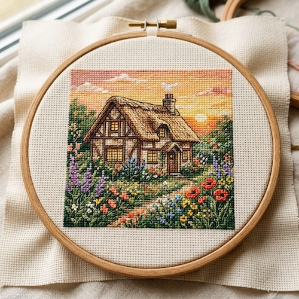

# Embroidered / Cross-Stitch

[← Back to Image Prompts](../README.md)

Subjects rendered as thread on fabric — visible canvas weave, precise cross-stitch grid patterns, and rich thread textures with raised surfaces catching directional light. The style merges cottagecore warmth with pixel-precise craftsmanship, often presented inside a traditional round embroidery hoop. The grid constraint (each stitch is a pixel) produces charmingly simplified forms, while the physical thread texture adds a tactile quality that pure digital art can't replicate.

**Best for:** Social media posts · Greeting cards · Nursery art · Desktop wallpapers · Pattern designs · Merchandise mockups · Holiday cards



---

## Prompt

Replace the bracketed details with your subject and preferred format.

```text
Close-up photograph of a completed cross-stitch embroidery piece in a round wooden hoop depicting [SCENE — e.g., a mountain lake at sunset with pine trees reflected in the water], 1:1 square format. Every element rendered in tiny X-shaped cross-stitches on cream Aida cloth — the visible grid of the fabric weave forms the underlying structure. Rich DMC thread colors: [PALETTE — e.g., deep cobalt blues for the lake, burnt orange and peach for the sunset, forest greens for the pines]. Soft natural window light highlighting the raised thread texture and subtle shadows in the stitch valleys.
```

## With a Reference Image

Attach your image and use this prompt to preserve its defining features while applying the style.

```text
Using the attached photo as reference, recreate the scene as a completed cross-stitch embroidery piece displayed in a round wooden hoop. Simplify all elements to the cross-stitch grid — each stitch acts as a colored pixel. Render on cream Aida cloth with visible fabric weave. Use rich DMC thread colors matching the original photo's palette. Add fine backstitch details for outlines and small elements. Soft natural window light highlighting the raised thread texture. 1:1 square format.
```

---

## 💡 Tips & Best Practices

- **"X-shaped cross-stitches on cream Aida cloth"**: This specific phrase activates the right texture. "Embroidery" alone is too vague — it could produce satin stitch, crewel, or other techniques.
- **Grid = pixels**: Cross-stitch is inherently pixel art on fabric. Embrace the grid constraint — simplified, pixelated forms are correct for this style.
- **DMC thread colors**: Referencing "DMC" (the most well-known embroidery thread brand) helps the AI choose realistic, saturated craft colors.
- **Mixed techniques for advanced results**: Combine cross-stitch base with backstitch outlines and French knot textures for richer, more realistic embroidery.
- **The hoop frames it**: "Round wooden embroidery hoop" gives the image context and warmth. Without it, embroidery can look like a flat textile.
- **Common pitfalls**: "Embroidery" alone often produces satin stitch or machine embroidery. Always specify "cross-stitch" for the grid pattern. Avoid "digital" or "pixel art" — you want physical thread texture.
- **Pairs well with:** [Pixelated / 16-bit](pixelated-16-bit.md) (same pixel-grid concept, digital vs. craft), [Made of Yarn / Amigurumi](yarn-amigurumi.md) (same thread medium, 3D vs. flat)
