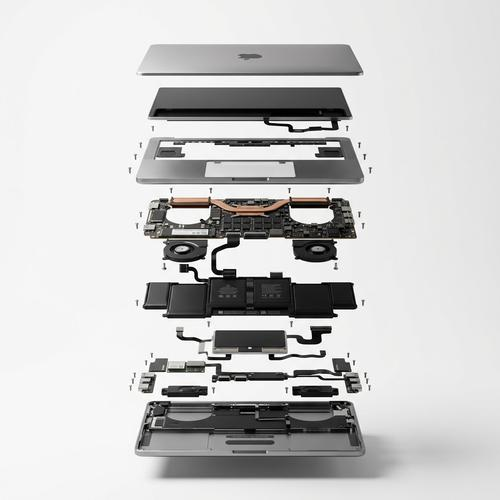

# Exploded Product View

[← Back to Image Prompts](../README.md)

High-end product photography showing objects in an exploded/deconstructed view — outer shells hovering above exposed inner mechanics, micro screws and components suspended in perfect alignment. The style reveals the hidden complexity inside everyday objects, turning a pair of headphones or a camera into a mesmerizing engineering diagram brought to life. Clean white studio backdrop, macro lens precision, and surgical alignment create a premium technical-editorial aesthetic.

**Best for:** Product marketing · Tech presentations · Social media posts · Brand assets · Educational content · Portfolio pieces · Editorial layouts



> **Sample prompt used to generate the above image (Nano Banana 2):**
> ```text
> MacBook Pro laptop, high-end product photography, white seamless background, exploded view with inner mechanics revealed, aluminum unibody shell hovering above the logic board, battery cells, fan assembly, and trackpad module all suspended in mid-air in perfect vertical alignment, micro screws and ribbon cables visible, crisp soft shadow beneath each floating layer, ultra realistic, macro product photography, 100mm lens look, f/8, 8k, 1:1 square format. The scene is set against a seamless, matte white studio backdrop with soft, directional studio lighting that emphasizes form and texture.
> ```

---

## Prompt Variations

### 🔵 Nano Banana 2 _(Featured)_

> NB2's precision rendering excels at the fine mechanical details — tiny screws, circuit boards, gear trains — that make exploded views compelling. Name specific real products for accuracy; NB2's search grounding will reference actual internal components.

**Variation 1 — Consumer Electronics** _(Product Marketing, Tech Content)_
```text
[PRODUCT — e.g., Apple AirPods Pro], high-end product photography, white seamless background, exploded view with inner mechanics revealed, 1:1 square format. Outer shell hovering above core internal components — tiny drivers, batteries, and circuit boards suspended in mid-air with perfect vertical alignment. Micro screws and ribbon cables visible. Crisp soft shadow beneath each floating layer. Ultra realistic, macro product photography, 100mm lens look, f/8. Seamless matte white studio backdrop with soft, directional studio lighting that emphasizes form and texture. 8k resolution.
```

**Variation 2 — Mechanical / Analog Object** _(Educational, Editorial)_
```text
[OBJECT — e.g., a vintage mechanical wristwatch], high-end product photography, white seamless background, exploded view revealing internal mechanics, 16:9 landscape format. The watch case, dial, and crystal hover above the exposed movement — tiny gears, springs, jewel bearings, and escapement mechanism suspended in precise layered alignment. Each component separated by equal vertical spacing. Crisp soft shadows. Macro photography, 100mm lens, f/8. Soft directional studio lighting. 8k resolution.
```

**Variation 3 — Everyday Object** _(Social Media, Creative Content)_
```text
[OBJECT — e.g., a mechanical pencil], high-end product photography, white seamless background, exploded view showing every internal component, 1:1 square format. The barrel, tip assembly, click mechanism, spring, lead advance clutch, and eraser cap all hovering in perfect vertical alignment, separated by equal spacing. Surprisingly complex interior revealed. Crisp soft shadows. Macro product photography, 100mm lens, f/8. Clean studio lighting. 8k resolution.
```

**Variation 4 — Luxury / Fashion Item** _(Brand Asset, Marketing)_
```text
[PRODUCT — e.g., a designer leather handbag], high-end product photography, white seamless background, exploded view revealing construction layers, 3:4 vertical format. Outer leather shell hovering above the structural frame, inner lining, hardware (clasps, zippers, studs), and stitching elements all suspended in alignment. Cross-section of leather showing grain layers. Premium editorial aesthetic. Macro photography, soft directional lighting. 8k resolution.
```

**Variation 5 — Side-by-Side Comparison** _(Product Marketing, Technical Content)_
```text
Two [PRODUCTS — e.g., wireless earbuds from competing brands] shown side by side, each in exploded view revealing their internal components, 16:9 landscape format. Matched framing and alignment — both products deconstructed to the same degree. Internal drivers, batteries, circuit boards, and chassis visible. High-end product photography against white seamless background. Macro lens, f/8. Soft studio lighting. 8k resolution.
```

### ChatGPT

**Variation 1 — Consumer Electronics**
```text
Create a high-end product photograph of [PRODUCT] in an exploded view against a white seamless background. Show the outer shell hovering above the exposed internal components — circuit boards, drivers, batteries, micro screws — all suspended in perfect vertical alignment. Macro lens precision with crisp soft shadows. Studio lighting. 1:1 square format.
```

**Variation 2 — Mechanical Object**
```text
Create an exploded view product photograph of [OBJECT] showing all internal mechanical components separated and hovering in alignment. Each gear, spring, and component suspended with equal spacing. White seamless background, macro photography, soft studio lighting. 3:2 landscape format.
```

**Variation 3 — Everyday Object**
```text
Create a high-end exploded view photograph of [OBJECT] revealing surprisingly complex internals. Every component hovering in vertical alignment. White background, macro lens, studio lighting. 1:1 square format.
```

### Midjourney

**Variation 1 — Consumer Electronics**
```text
High-end product photography, [PRODUCT], exploded view, inner mechanics revealed, outer shell hovering above core, micro screws and components suspended, white seamless background, macro photography, 100mm lens, f/8, crisp shadows, 8k --ar 1:1
```

**Variation 2 — Mechanical Object**
```text
High-end product photography, [OBJECT], exploded view, internal gears and mechanisms revealed, components hovering in alignment, white background, macro lens, soft studio lighting --ar 16:9 --s 150
```

**Variation 3 — Luxury Item**
```text
High-end product photography, [LUXURY PRODUCT], exploded view revealing construction layers, leather grain cross-section, hardware suspended, white background, macro photography, editorial aesthetic --ar 4:5
```

### Stable Diffusion

**Variation 1 — Consumer Electronics**
- **Prompt:** `High-end product photography, [PRODUCT], exploded view, inner mechanics revealed, outer shell hovering, micro screws suspended, white seamless background, macro photography, 100mm lens, f/8, soft shadows, 8k`
- **Negative Prompt:** `assembled, intact, closed, illustration, cartoon, low quality, blurry`

**Variation 2 — Mechanical Object**
- **Prompt:** `Product photography, [OBJECT], exploded view, internal gears and mechanisms, components hovering in alignment, white background, macro lens, studio lighting, 8k`
- **Negative Prompt:** `assembled, cartoon, illustration, flat, closed, low detail`

---

## 🔄 Image-to-Image Transformations

Transform product photos into exploded views:

**Nano Banana 2** _(Featured)_
```text
Using the attached product photo as reference, create a high-end exploded view version of this object. Separate every component and show them hovering in perfect vertical alignment above each other — outer shell, inner frame, mechanical parts, screws, and electronics all suspended in mid-air with equal spacing. White seamless studio background. Macro photography aesthetic with crisp soft shadows. 100mm lens look, f/8.
```
> 💡 **Follow-up refinements:**
> - "Add labels on thin wire stalks pointing to key components"
> - "Show only the top half exploded — keep the bottom assembled"
> - "Increase the spacing between layers"
> - "Add a second product next to it for comparison"

**ChatGPT**
```text
[Upload Photo] "Create an exploded view of this product. Separate every component and show them hovering in perfect vertical alignment. White background. Macro lens. Crisp shadows. Studio lighting."
```

**Midjourney**
```text
[IMAGE_URL] High-end exploded view product photography, components hovering in alignment, white seamless background, macro lens, studio lighting --iw 1.5 --ar 1:1
```

**Stable Diffusion**
- **Pipeline:** Img2Img · Denoising Strength: `0.70–0.85` (heavy to create the separation and suspension effect)
- **Prompt:** `Exploded view product photography, components hovering, white seamless background, macro lens, studio lighting, 8k`
- **Negative Prompt:** `assembled, closed, intact, cartoon, illustration`

---

## 💡 Tips & Best Practices

- **Name specific products**: NB2 and ChatGPT will reference actual internal components of named products (e.g., "iPhone 15 Pro" will show the correct camera module, battery shape, and Taptic Engine).
- **"Perfect vertical alignment"**: This phrase prevents components from scattering randomly. The precision alignment is what makes the style feel premium rather than chaotic.
- **Macro lens language**: "100mm lens look, f/8" produces the crisp-but-natural depth of field that defines professional product photography. Without it, outputs can look like 3D renders.
- **Crisp soft shadows**: Each floating component should cast a subtle shadow below it, reinforcing the illusion of real suspension.
- **Common pitfalls**: "Disassembled" produces parts lying on a surface. "Broken apart" produces destruction. Always use "exploded view" for the clean engineering-diagram aesthetic.
- **Pairs well with:** [Blueprint / Technical Drawing](blueprint-technical-drawing.md) (similar engineering-reveal aesthetic, different medium), [Glass Embossed 3D](glass-embossed-3d.md) (complementary premium product visualization)
