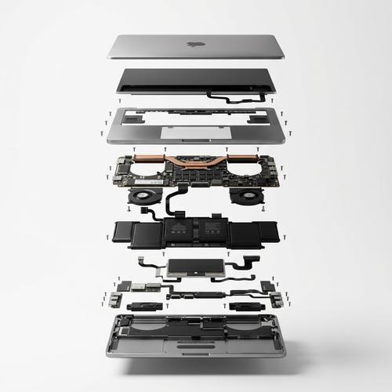

# Exploded Product View

[← Back to Image Prompts](../README.md)

High-end product photography showing objects in an exploded/deconstructed view — outer shells hovering above exposed inner mechanics, micro screws and components suspended in perfect alignment. The style reveals the hidden complexity inside everyday objects, turning a pair of headphones or a camera into a mesmerizing engineering diagram brought to life. Clean white studio backdrop, macro lens precision, and surgical alignment create a premium technical-editorial aesthetic.

**Best for:** Product marketing · Tech presentations · Social media posts · Brand assets · Educational content · Portfolio pieces · Editorial layouts



---

## Prompt

Replace the bracketed details with your subject and preferred format.

```text
[PRODUCT — e.g., Apple AirPods Pro], high-end product photography, white seamless background, exploded view with inner mechanics revealed, 1:1 square format. Outer shell hovering above core internal components — tiny drivers, batteries, and circuit boards suspended in mid-air with perfect vertical alignment. Micro screws and ribbon cables visible. Crisp soft shadow beneath each floating layer. Ultra realistic, macro product photography, 100mm lens look, f/8. Seamless matte white studio backdrop with soft, directional studio lighting that emphasizes form and texture. 8k resolution.
```

## With a Reference Image

Attach your image and use this prompt to preserve its defining features while applying the style.

```text
Using the attached product photo as reference, create a high-end exploded view version of this object. Separate every component and show them hovering in perfect vertical alignment above each other — outer shell, inner frame, mechanical parts, screws, and electronics all suspended in mid-air with equal spacing. White seamless studio background. Macro photography aesthetic with crisp soft shadows. 100mm lens look, f/8.
```

---

## 💡 Tips & Best Practices

- **Identify real components**: For an existing product, describe the actual battery, camera, frame, fasteners, and connectors you need shown; a product name alone cannot guarantee mechanical accuracy.
- **"Perfect vertical alignment"**: This phrase prevents components from scattering randomly. The precision alignment is what makes the style feel premium rather than chaotic.
- **Macro lens language**: "100mm lens look, f/8" produces the crisp-but-natural depth of field that defines professional product photography. Without it, outputs can look like 3D renders.
- **Crisp soft shadows**: Each floating component should cast a subtle shadow below it, reinforcing the illusion of real suspension.
- **Common pitfalls**: "Disassembled" produces parts lying on a surface. "Broken apart" produces destruction. Always use "exploded view" for the clean engineering-diagram aesthetic.
- **Pairs well with:** [Blueprint / Technical Drawing](blueprint-technical-drawing.md) (similar engineering-reveal aesthetic, different medium), [Glass Embossed 3D](glass-embossed-3d.md) (complementary premium product visualization)
