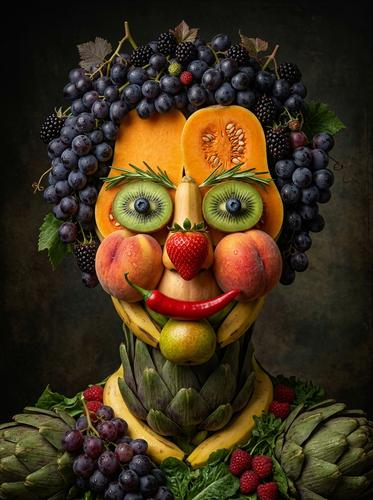

# Food Art & Portraiture

[← Back to Image Prompts](../README.md)

Restaurant-quality food photography elevated to fine art — where arrangement becomes composition, sauce becomes paint, and the plate becomes a canvas. Dramatic studio lighting, shallow depth of field, and meticulously styled scenes transform food into something between commercial photography and still-life painting.

**Best for:** Social media posts · Restaurant menus · Blog headers · Cookbook covers · Brand imagery · Desktop wallpapers · Recipe content



> **Sample prompt used to generate the above image (Nano Banana 2):**
> ```text
> Professional food photograph of an elaborate sushi platter presented on a slate serving board with a single orchid garnish, 16:9 landscape format. Each piece is a miniature artwork — nigiri with jewel-like fish arranged in a gradient from salmon pink to tuna ruby to hamachi gold. Edible microgreens and shiso leaves provide green accents. A small ceramic dish of soy sauce with a single wasabi quenelle. Dramatic side-lighting from the left creating deep shadows and bright highlights on the glossy fish surfaces. Shallow depth of field — front pieces tack-sharp, back row softly blurred. Dark moody background. Shot at f/2.8.
> ```

---

## Prompt Variations

### 🔵 Nano Banana 2 _(Featured)_

**Variation 1 — Plated Dish / Fine Dining** _(Social Media, Menu)_
```text
Professional food photograph of [DISH — e.g., a seared duck breast with cherry gastrique, served on a white porcelain plate with artistic sauce swoosh], [FORMAT]. [ARRANGEMENT DETAILS]. Dramatic [LIGHTING — e.g., moody side-light from the left]. Shallow depth of field at f/2.8. [GARNISH DETAILS]. Dark [BACKGROUND — e.g., reclaimed wood table]. The plate dressed as art — every element placed with tweezers. Michelin-star plating.
```

**Variation 2 — Overhead Flat Lay / Spread** _(Social Media, Blog Header)_
```text
Overhead flat-lay food photograph of [SPREAD — e.g., a Mediterranean brunch — hummus swirled with paprika oil, fresh pita, falafel, pickled vegetables, olives, and feta], shot from directly above, [FORMAT]. [COLOR PALETTE — e.g., warm earths, bright herb greens, paprika reds]. Every element placed with intention — asymmetric but balanced. Natural window light with [SHADOW — e.g., soft dappled light through a window blind]. Rustic [SURFACE — e.g., linen tablecloth with ceramic bowls].
```

**Variation 3 — Ingredient Portrait** _(Art Print, Product Photography)_
```text
Dramatic food portrait of a single [INGREDIENT — e.g., pomegranate cut in half, seeds spilling outward onto a dark surface], [FORMAT]. Treated as a fine art subject — dramatic chiaroscuro lighting from one side. Extreme detail — [DETAILS — e.g., individual seeds glow like rubies, juice droplets catch the light, the membrane structure is visible]. Dark moody background. Renaissance still-life painting aesthetic applied to food photography. Shot at f/4.
```

**Variation 4 — Action / Process** _(Social Media, Recipe Content)_
```text
Professional food photograph capturing a frozen moment — [ACTION — e.g., olive oil being poured in a thin stream onto a Caprese salad, the oil catching the light mid-pour], [FORMAT]. Frozen at high shutter speed — the liquid is suspended mid-air. [LIGHTING — e.g., dramatic backlight making the olive oil glow golden]. Shallow depth of field. The surrounding dish is styled and ready. The action adds dynamism to the still composition.
```

**Variation 5 — Seasonal / Holiday Spread** _(Social Media, Holiday Content)_
```text
Professional food photograph of a [HOLIDAY] feast table — [DETAILS — e.g., a golden roasted turkey at center, surrounded by cranberry sauce, roasted vegetables, gravy boat, corn bread, and autumn leaf decorations], [FORMAT]. Overhead angle showing the full table. Warm tungsten candlelight with [DETAILS]. Rich autumnal palette. Every dish styled with intention. Place settings with linen napkins. Communal, abundant, celebratory.
```

### ChatGPT / Midjourney / Stable Diffusion — Standard templates.

### ChatGPT
```text
Var 1: Create a professional food photo of [DISH]. Dramatic side-lighting. Shallow DOF. Michelin-star plating. Dark background. [FORMAT].
Var 2: Create an overhead flat-lay food photograph of [SPREAD]. Every element placed with intention. Natural window light. Rustic surface. [FORMAT].
Var 3: Create a dramatic ingredient portrait of [INGREDIENT]. Chiaroscuro lighting. Extreme detail. Renaissance still-life aesthetic. [FORMAT].
```

### Midjourney
```text
Var 1: Professional food photograph, [DISH], dramatic side-light, shallow DOF, Michelin plating, dark background --ar 16:9
Var 2: Overhead flat-lay, [SPREAD], intentional placement, natural light, rustic surface --ar 1:1
Var 3: Food art portrait, [INGREDIENT], chiaroscuro, extreme detail, dark moody --ar 4:5
```

### Stable Diffusion
- **Var 1:** `Professional food photograph, [DISH], dramatic lighting, shallow DOF, fine dining plating, dark background, 8k` / Neg: `amateur, bright flat, blurry, cartoon, illustration`

---

## 🔄 Image-to-Image Transformations

**Nano Banana 2** _(Featured)_
```text
Using the attached food photo, elevate it to professional food art. Improve the lighting to dramatic side-light. Apply shallow depth of field. Enhance the plating to Michelin-star standards — refine garnish placement, add micro-details. Darken the background for mood. Create a fine art quality food photograph from this reference.
```
> 💡 **Refinements:** "Make the lighting moodier" · "Add a sauce swoosh" · "Switch to overhead flat-lay angle" · "Add steam/action — pour, drizzle, sprinkle"

---

## 💡 Tips & Best Practices

- **Lighting sells food**: Dramatic side-light with deep shadows turns ordinary food into art. Never use flat lighting.
- **Shallow DOF = premium**: f/2.8 or f/4 shallow depth of field makes food photography feel professional.
- **Dark backgrounds for mood**: Dark wood, slate, or moody fabric backgrounds let the food pop.
- **Name specific foods**: "Seared duck breast" > "cooked meat." Specificity creates realistic results.
- **Common pitfalls**: "Food photo" alone produces generic snapshots. Always specify lighting, DOF, and plating quality.
- **Pairs well with:** [Wes Anderson Symmetry](wes-anderson-symmetry.md) (overhead flat-lay aesthetic), [Cinematic Macro Photography](cinematic-macro-photography.md) (extreme close-up food details)
