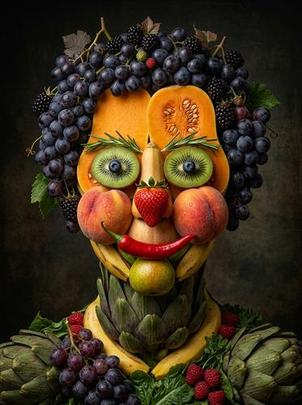

# Food Art & Portraiture

[← Back to Image Prompts](../README.md)

Restaurant-quality food photography elevated to fine art — where arrangement becomes composition, sauce becomes paint, and the plate becomes a canvas. Dramatic studio lighting, shallow depth of field, and meticulously styled scenes transform food into something between commercial photography and still-life painting.

**Best for:** Social media posts · Restaurant menus · Blog headers · Cookbook covers · Brand imagery · Desktop wallpapers · Recipe content



---

## Prompt

Replace the bracketed details with your subject and preferred format.

```text
Professional food photograph of [DISH — e.g., a seared duck breast with cherry gastrique, served on a white porcelain plate with artistic sauce swoosh], [FORMAT]. [ARRANGEMENT DETAILS]. Dramatic [LIGHTING — e.g., moody side-light from the left]. Shallow depth of field at f/2.8. [GARNISH DETAILS]. Dark [BACKGROUND — e.g., reclaimed wood table]. The plate dressed as art — every element placed with tweezers. Michelin-star plating.
```

## With a Reference Image

Attach your image and use this prompt to preserve its defining features while applying the style.

```text
Using the attached food photo, elevate it to professional food art. Improve the lighting to dramatic side-light. Apply shallow depth of field. Enhance the plating to Michelin-star standards — refine garnish placement, add micro-details. Darken the background for mood. Create a fine art quality food photograph from this reference.
```

---

## 💡 Tips & Best Practices

- **Lighting sells food**: Dramatic side-light with deep shadows turns ordinary food into art. Never use flat lighting.
- **Shallow DOF = premium**: f/2.8 or f/4 shallow depth of field makes food photography feel professional.
- **Dark backgrounds for mood**: Dark wood, slate, or moody fabric backgrounds let the food pop.
- **Name specific foods**: "Seared duck breast" > "cooked meat." Specificity creates realistic results.
- **Common pitfalls**: "Food photo" alone produces generic snapshots. Always specify lighting, DOF, and plating quality.
- **Pairs well with:** [Wes Anderson Symmetry](wes-anderson-symmetry.md) (overhead flat-lay aesthetic), [Cinematic Macro Photography](cinematic-macro-photography.md) (extreme close-up food details)
