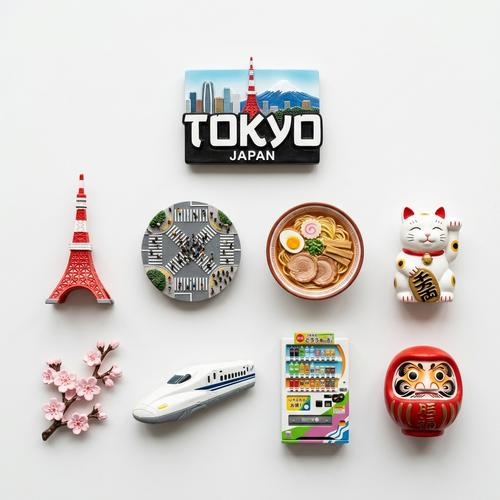

# Fridge Magnet Knolling

[← Back to Image Prompts](../README.md)

Top-down, perfectly organized photographs of themed 3D fridge magnets arranged in a neat knolled grid — parallel lines, right angles, and surgical precision. Each magnet set represents a city, country, or theme: miniature landmarks, local objects, weather-specific items, and a souvenir name badge. The style combines the satisfying geometry of knolling photography with the charm of handmade 3D souvenir magnets in realistic resin textures.

**Best for:** Social media posts · Travel content · City guides · Gift ideas · Sticker/merch design · Desktop wallpapers · Educational content



> **Sample prompt used to generate the above image (Nano Banana 2):**
> ```text
> Top-down, knolled photograph of Tokyo-themed 3D fridge magnets on a white background, 1:1 square format. Arranged in a neat grid with parallel lines and right angles. Includes miniatures of: Tokyo Tower, Shibuya Crossing pedestrian scramble, a bowl of ramen, a maneki-neko lucky cat, cherry blossom branch, a bullet train, a vending machine, and a daruma doll. A "TOKYO" souvenir magnet is centered at the top. Realistic resin textures with soft studio lighting and subtle shadows.
> ```

---

## Prompt Variations

### 🔵 Nano Banana 2 _(Featured)_

> NB2's search grounding helps enormously here — it can reference accurate landmark shapes and iconic local objects when you name a specific city. List 6-10 specific items for a well-filled grid. Always include "arranged in a neat grid with parallel lines and right angles" for the knolling aesthetic.

**Variation 1 — City Collection** _(Social Media, Travel Content)_
```text
Top-down, knolled photograph of [CITY — e.g., Paris]-themed 3D fridge magnets on a white background, 1:1 square format. Arranged in a neat grid with parallel lines and right angles. Includes miniatures of: [LANDMARKS — e.g., Eiffel Tower, Arc de Triomphe, Notre-Dame], [LOCAL OBJECTS — e.g., a baguette, croissant, beret, glass of red wine], and [EXTRAS — e.g., a Métro sign, a bicycle with a basket]. A "[CITY NAME]" souvenir magnet is centered at the top. Realistic resin textures with soft studio lighting and subtle shadows.
```

**Variation 2 — Country / Region** _(Educational, Desktop Wallpaper)_
```text
Top-down, knolled photograph of [COUNTRY — e.g., Japan]-themed 3D fridge magnets on a white background, 16:9 landscape format. Arranged in a neat grid with parallel lines and right angles. A larger collection: [12-16 ITEMS — e.g., Mount Fuji, torii gate, sushi platter, ramen bowl, sakura branch, lucky cat, samurai helmet, bullet train, Japanese castle, origami crane, taiko drum, matcha tea set, koi fish, daruma doll]. A "[COUNTRY NAME]" souvenir magnet centered at the top. Realistic resin textures. Soft studio lighting. Subtle cast shadows.
```

**Variation 3 — Themed Collection (Non-Geographic)** _(Gift Idea, Social Media)_
```text
Top-down, knolled photograph of [THEME — e.g., Coffee Lover]-themed 3D fridge magnets on a white background, 1:1 square format. Arranged in a neat grid with parallel lines and right angles. Includes miniatures of: [ITEMS — e.g., an espresso cup and saucer, a moka pot, coffee beans, a pour-over dripper, a latte with foam art, a French press, a bag of roasted coffee, a coffee grinder]. A "[THEME NAME]" souvenir magnet centered at the top. Realistic resin textures. Soft studio lighting with subtle shadows.
```

**Variation 4 — Seasonal / Holiday** _(Social Media, Holiday Content)_
```text
Top-down, knolled photograph of [HOLIDAY — e.g., Christmas]-themed 3D fridge magnets on a [SURFACE — e.g., dark green felt] background, 1:1 square format. Arranged in a neat grid. Includes miniatures of: [ITEMS — e.g., a Christmas tree, wrapped gift box, candy cane, gingerbread man, snowflake, reindeer, stocking, Santa hat, hot cocoa mug, ornament ball]. A "[HOLIDAY NAME]" souvenir magnet centered at the top. Realistic resin textures with festive paint details. Soft warm studio lighting with subtle shadows.
```

**Variation 5 — Comparison / Multi-City Grid** _(Desktop Wallpaper, Presentation)_
```text
Top-down, knolled photograph showing three separate groups of 3D fridge magnets on a white background, 16:9 landscape format. Three city collections side by side — [CITY 1 — e.g., New York], [CITY 2 — e.g., London], [CITY 3 — e.g., Tokyo] — each with 5-6 iconic magnets arranged in a neat grid under their respective city-name magnet. Visual separation between groups. Realistic resin textures. Consistent soft studio lighting across all three collections.
```

### ChatGPT

**Variation 1 — City Collection**
```text
Create a top-down knolled photograph of [CITY]-themed 3D fridge magnets on a white background. Arranged in a neat grid with parallel lines and right angles. Include miniatures of: [LIST 8-10 ITEMS]. A "[CITY]" souvenir magnet at the top. Realistic resin textures. Soft studio lighting. 1:1 square format.
```

**Variation 2 — Country Collection**
```text
Create a top-down knolled photograph of [COUNTRY]-themed 3D fridge magnets. Larger grid with 12-16 items including landmarks, food, cultural objects, and nature. "[COUNTRY]" name magnet at top. Realistic resin textures. White background. 3:2 landscape format.
```

**Variation 3 — Themed Collection**
```text
Create a top-down knolled photograph of [THEME]-themed 3D fridge magnets on a white background. Neat grid arrangement. Include 8-10 themed miniatures. "[THEME]" label magnet at top. Realistic resin textures. Soft lighting. 1:1 square format.
```

### Midjourney

**Variation 1 — City Collection**
```text
Top-down knolled photograph, [CITY]-themed 3D fridge magnets on white background, neat grid, parallel lines, right angles, miniature landmarks and local objects, realistic resin textures, soft studio lighting, subtle shadows --ar 1:1
```

**Variation 2 — Country / Large Grid**
```text
Top-down knolled photograph, [COUNTRY]-themed 3D fridge magnets, 16 miniatures arranged in neat grid, landmarks food culture nature, realistic resin, soft lighting, white background --ar 16:9
```

**Variation 3 — Multi-City**
```text
Top-down knolled photograph, three groups of 3D fridge magnets, [CITY 1] and [CITY 2] and [CITY 3], side by side collections, neat grids, city name magnets, realistic resin, white background --ar 16:9 --s 150
```

### Stable Diffusion

**Variation 1 — City Collection**
- **Prompt:** `Top-down knolled photograph, [CITY]-themed 3D fridge magnets on white background, neat grid arrangement, miniature landmarks and objects, realistic resin textures, soft studio lighting, 8k`
- **Negative Prompt:** `messy, scattered, angled view, illustration, cartoon, flat, low detail`

**Variation 2 — Themed Collection**
- **Prompt:** `Top-down knolled photograph, [THEME]-themed 3D fridge magnets, neat grid with parallel lines, realistic resin textures, white background, soft lighting, 8k`
- **Negative Prompt:** `scattered, messy, tilted, flat illustration, cartoon, low quality`

---

## 🔄 Image-to-Image Transformations

Transform photos of real fridge magnets or souvenirs into the knolled 3D style:

**Nano Banana 2** _(Featured)_
```text
Using the attached photo of souvenirs/magnets as reference, recreate them as a knolled top-down photograph of 3D fridge magnets on a white background. Rearrange all items into a perfect grid with parallel lines and right angles. Convert each item into a realistic 3D resin magnet miniature. Add a location-name souvenir magnet centered at the top. Soft studio lighting with subtle shadows.
```
> 💡 **Follow-up refinements:**
> - "Add more magnets to fill the grid — include [ADDITIONAL ITEMS]"
> - "Change the background to [COLOR]"
> - "Make the resin textures more glossy / more matte"
> - "Add a second city collection next to it for comparison"

**ChatGPT**
```text
[Upload Photo] "Recreate these souvenirs as a knolled top-down photograph of 3D fridge magnets on white background. Perfect grid arrangement. Realistic resin textures. Add a location-name magnet at top. Studio lighting."
```

**Midjourney**
```text
[IMAGE_URL] Top-down knolled photograph of 3D fridge magnets, neat grid, realistic resin textures, white background, studio lighting --iw 1.0 --ar 1:1
```

**Stable Diffusion**
- **Pipeline:** Img2Img · Denoising Strength: `0.75–0.90` (heavy transformation to achieve 3D magnet aesthetic)
- **Prompt:** `Top-down knolled photograph, 3D fridge magnets, neat grid, realistic resin, white background, studio lighting, 8k`
- **Negative Prompt:** `messy, scattered, real photograph, flat, illustration`

---

## 💡 Tips & Best Practices

- **Name specific items**: Don't say "local landmarks" — list them. "Eiffel Tower, croissant, Métro sign" produces far better results than vague category references.
- **6-10 items for square, 12-16 for landscape**: This fills the grid appropriately without overcrowding or leaving gaps.
- **"Neat grid with parallel lines and right angles"**: This is the knolling instruction. Without it, AI scatters magnets randomly, losing the satisfying organizational aesthetic.
- **The city-name magnet anchors the set**: "A 'TOKYO' souvenir magnet centered at the top" ties the whole collection together and immediately communicates the theme.
- **Common pitfalls**: "Fridge magnets" alone often produces flat illustrated magnets. Specify "3D" and "realistic resin textures" for the handmade souvenir look. Avoid "scattered" or "collection" without grid instruction.
- **Pairs well with:** [Miniature People in Everyday Objects](miniature-people.md) (similar macro-miniature aesthetic), [Landmark Dioramas](landmark-dioramas.md) (same travel/location theme, different execution)
