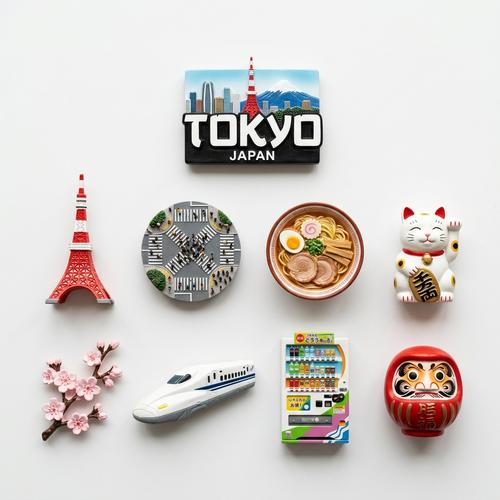

# Fridge Magnet Knolling

[← Back to Image Prompts](../README.md)

Top-down, perfectly organized photographs of themed 3D fridge magnets arranged in a neat knolled grid — parallel lines, right angles, and surgical precision. Each magnet set represents a city, country, or theme: miniature landmarks, local objects, weather-specific items, and a souvenir name badge. The style combines the satisfying geometry of knolling photography with the charm of handmade 3D souvenir magnets in realistic resin textures.

**Best for:** Social media posts · Travel content · City guides · Gift ideas · Sticker/merch design · Desktop wallpapers · Educational content



---

## Prompt

Replace the bracketed details with your subject and preferred format.

```text
Top-down, knolled photograph of [CITY — e.g., Paris]-themed 3D fridge magnets on a white background, 1:1 square format. Arranged in a neat grid with parallel lines and right angles. Includes miniatures of: [LANDMARKS — e.g., Eiffel Tower, Arc de Triomphe, Notre-Dame], [LOCAL OBJECTS — e.g., a baguette, croissant, beret, glass of red wine], and [EXTRAS — e.g., a Métro sign, a bicycle with a basket]. A "[CITY NAME]" souvenir magnet is centered at the top. Realistic resin textures with soft studio lighting and subtle shadows.
```

## With a Reference Image

Attach your image and use this prompt to preserve its defining features while applying the style.

```text
Using the attached photo of souvenirs/magnets as reference, recreate them as a knolled top-down photograph of 3D fridge magnets on a white background. Rearrange all items into a perfect grid with parallel lines and right angles. Convert each item into a realistic 3D resin magnet miniature. Add a location-name souvenir magnet centered at the top. Soft studio lighting with subtle shadows.
```

---

## 💡 Tips & Best Practices

- **Name specific items**: Don't say "local landmarks" — list them. "Eiffel Tower, croissant, Métro sign" produces far better results than vague category references.
- **6-10 items for square, 12-16 for landscape**: This fills the grid appropriately without overcrowding or leaving gaps.
- **"Neat grid with parallel lines and right angles"**: This is the knolling instruction. Without it, AI scatters magnets randomly, losing the satisfying organizational aesthetic.
- **The city-name magnet anchors the set**: "A 'TOKYO' souvenir magnet centered at the top" ties the whole collection together and immediately communicates the theme.
- **Common pitfalls**: "Fridge magnets" alone often produces flat illustrated magnets. Specify "3D" and "realistic resin textures" for the handmade souvenir look. Avoid "scattered" or "collection" without grid instruction.
- **Pairs well with:** [Miniature People in Everyday Objects](miniature-people.md) (similar macro-miniature aesthetic), [Landmark Dioramas](landmark-dioramas.md) (same travel/location theme, different execution)
