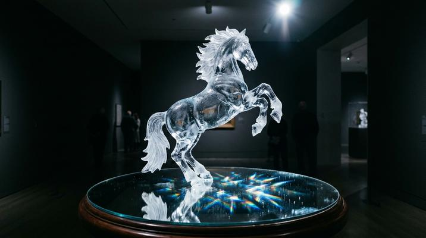

# Frosted Glass / Ice Sculpture

[← Back to Image Prompts](../README.md)

Translucent, crystalline subjects carved from clear and frosted ice or glass. Internal refractions, cold blue-white color palette, condensation droplets, and studio lighting that reveals frozen structural detail.



> **Sample prompt used to generate the above image (Nano Banana 2):**
> ```text
> Photograph of an intricate ice sculpture of a rearing horse on a mirrored pedestal in a
> dark gallery, 16:9 landscape format. The horse is carved from crystal-clear ice with frosted
> matte sections on the mane, tail, and hooves creating contrast against the transparent body.
> Internal refractions split a single white spotlight into rainbow caustic patterns on the
> mirrored surface below. Fine condensation droplets bead on the surface, catching the light
> like tiny diamonds. Cold blue-white color palette with a deep charcoal background. A single
> dramatic spotlight from above-right creating sharp highlights along the ice edges.
> ```

**ChatGPT**
```text
Create a photograph of an intricate ice sculpture depicting [SUBJECT], displayed on a mirrored pedestal in a dark gallery. The sculpture is carved from crystal-clear ice with frosted matte sections creating contrast against transparent areas. Internal refractions split the spotlight into rainbow caustic patterns on the surface below. Fine condensation droplets bead on the surface, catching the light. Cold blue-white color palette with a deep charcoal background. A single dramatic spotlight from above-right creating sharp highlights along every ice edge.
```

**Midjourney**
```text
Intricate ice sculpture of [SUBJECT] on a mirrored pedestal in a dark gallery, crystal-clear ice with frosted matte sections, internal refractions, rainbow caustic patterns, condensation droplets, cold blue-white palette, dramatic spotlight, sharp ice edge highlights --ar 16:9 --s 200
```

**Stable Diffusion**
- **Prompt:** `Ice sculpture photograph, [SUBJECT] carved from crystal-clear ice, frosted sections, mirrored pedestal, dark gallery, internal refractions, rainbow caustics, condensation droplets, cold blue-white palette, dramatic spotlight, 8k`
- **Negative Prompt:** `warm colors, illustration, cartoon, opaque, painted, blurry`

**Nano Banana 2**
```text
Photograph of an intricate ice sculpture depicting [SUBJECT] on a mirrored pedestal in a dark gallery, 16:9 landscape format. Carved from crystal-clear ice with frosted matte sections creating contrast against transparent areas. Internal refractions split the spotlight into rainbow caustic patterns on the mirrored surface below. Fine condensation droplets bead on the surface catching the light. Cold blue-white color palette with a deep charcoal background. Single dramatic spotlight from above-right creating sharp highlights along every ice edge.
```
