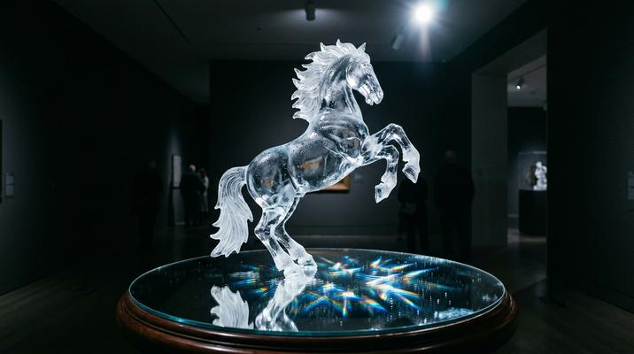

# Frosted Glass / Ice Sculpture

[← Back to Image Prompts](../README.md)

Translucent, crystalline subjects carved from clear and frosted ice or glass, with internal refractions, caustic light patterns, condensation droplets, and a cold blue-white palette against dramatic dark backgrounds. The interplay between transparent and frosted surfaces creates stunning optical effects — light splits into rainbow caustics, surfaces bead with condensation, and every edge catches a crisp highlight. The style feels simultaneously elegant, fragile, and powerful.

**Best for:** Desktop wallpapers · Social media posts · Art prints · Product concept renders · Holiday content · Luxury branding



---

## Prompt

Replace the bracketed details with your subject and preferred format.

```text
Photograph of an intricate ice sculpture depicting [ANIMAL — e.g., an eagle mid-flight with wings fully spread], on a mirrored pedestal in a dark gallery, 16:9 landscape format. Carved from crystal-clear ice with frosted matte sections on [DETAILS — e.g., feather tips and talons] creating contrast against transparent body. Internal refractions split spotlight into rainbow caustic patterns on the mirrored surface. Fine condensation droplets beading on the surface. Cold blue-white palette with deep charcoal background. Single dramatic spotlight from above-right. Sharp highlights along every ice edge.
```

## With a Reference Image

Attach your image and use this prompt to preserve its defining features while applying the style.

```text
Using the attached photo as reference, reimagine the subject as an intricate ice sculpture on a mirrored pedestal. Carve the main form from crystal-clear ice with frosted matte sections on detailed areas. Add internal refractions splitting light into rainbow caustic patterns on the mirrored surface. Fine condensation droplets beading on all surfaces. Replace the background with a dark gallery setting. Cold blue-white palette. Single dramatic spotlight from above-right.
```

---

## 💡 Tips & Best Practices

- **Clear vs. frosted contrast**: The magic is in mixing "crystal-clear" and "frosted matte" surfaces on the same sculpture. Pure clear or pure frosted is less visually interesting.
- **Caustic patterns are the wow factor**: "Internal refractions splitting light into rainbow caustic patterns" creates the prismatic light show on the mirrored surface that makes ice sculptures stunning.
- **Condensation sells the cold**: "Fine condensation droplets beading on the surface" is a small detail with huge impact — it makes the viewer *feel* the cold.
- **Dark backgrounds are essential**: Ice sculptures look best against deep charcoal or black. Bright backgrounds wash out the transparency effects.
- **Common pitfalls**: Don't say "frozen" (implies a frozen object, not a carved sculpture). Don't skip the mirrored pedestal — it doubles the caustic light effects.
- **Pairs well with:** [Cloud / Smoke Sculpture](cloud-smoke-sculpture.md) (similar ethereal, transient quality in a different medium), [X-Ray / Medical Imaging](x-ray-imaging.md) (similar transparency aesthetic)
