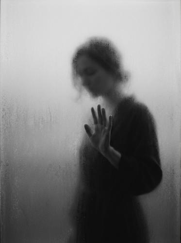

# Frosted Silhouette

[← Back to Image Prompts](../README.md)

Moody, understated black-and-white photography where subjects are captured behind a frosted or translucent surface — faces and forms softly emerging through diffused glass, creating an intimate, editorial atmosphere. The hallmark is low overall contrast with muted blacks and lifted shadows, producing a slightly washed-out matte look. The effect is hauntingly quiet: more about what you can almost-but-not-quite see than what's fully revealed.

**Best for:** Album covers · Editorial layouts · Social media posts · Mood boards · Brand campaigns · Fine art prints · Book covers · Desktop wallpapers



> **Sample prompt used to generate the above image (Nano Banana 2):**
> ```text
> A black and white photograph shows the blurred silhouette of a woman behind a frosted or translucent surface, 3:4 vertical format. Her hand is gently pressed against the surface and remains readable but not overly sharp, softly emerging through the haze. Overall contrast is low, with muted blacks and lifted shadows, giving the image a slightly washed-out, matte look. The background fades into a pale gray gradient with subtle grain, creating a quiet, understated, editorial mood. Soft, diffused lighting, minimal highlights, no harsh blacks.
> ```

---

## Prompt Variations

### 🔵 Nano Banana 2 _(Featured)_

> NB2 handles the delicate tonal balance well — the key is explicit contrast control. Always include "low contrast, muted blacks, lifted shadows" and "no harsh blacks" to prevent the model from producing high-contrast dramatic images instead of the quiet, washed-out matte look.

**Variation 1 — Portrait / Editorial** _(Album Cover, Social Media)_
```text
A black and white photograph shows the blurred silhouette of [SUBJECT — e.g., a person] behind a frosted or translucent surface, 3:4 vertical format. [DETAIL — e.g., Their hand] is gently pressed against the surface and remains readable but not overly sharp, softly emerging through the haze. Overall contrast is low, with muted blacks and lifted shadows, giving the image a slightly washed-out, matte look. The background fades into a pale gray gradient with subtle grain, creating a quiet, understated, editorial mood. Soft, diffused lighting, minimal highlights, no harsh blacks.
```

**Variation 2 — Full Body / Dance Pose** _(Fine Art, Desktop Wallpaper)_
```text
A black and white photograph shows the blurred full-body silhouette of [SUBJECT — e.g., a dancer in an arabesque pose] behind a large frosted glass panel, 16:9 landscape format. The body's contours are softly visible through the diffused surface — limbs readable as shapes but stripped of surface detail. Low contrast with muted tones and lifted shadows. Pale gray background fading to white at the edges. Subtle film grain throughout. Quiet, contemplative, gallery-exhibition aesthetic. No harsh blacks.
```

**Variation 3 — Close-Up / Partial** _(Book Cover, Brand Campaign)_
```text
A black and white photograph showing only [BODY PART — e.g., a pair of hands] pressed against a frosted glass surface from behind, 1:1 square format. The fingers are softly visible through the translucent haze — readable shapes but not sharp. Condensation droplets on the glass surface near the point of contact. Low contrast, muted blacks, lifted shadows. Pale gray gradient background with fine grain. Softly diffused lighting. Minimal, understated editorial mood. No harsh blacks.
```

**Variation 4 — Multiple Figures** _(Editorial, Social Media)_
```text
A black and white photograph shows the blurred silhouettes of [SUBJECTS — e.g., two people facing each other, almost touching] behind a frosted translucent surface, 16:9 landscape format. Their forms are soft and indistinct, merging at the edges where they nearly meet. Low overall contrast, muted blacks with lifted shadows. The image has a washed-out, matte quality. Pale gray background with subtle grain. Soft diffused lighting creating no harsh shadows or highlights. Intimate, editorial mood.
```

**Variation 5 — Object / Still Life** _(Brand Campaign, Fine Art)_
```text
A black and white photograph shows [OBJECT — e.g., a single flower in a slender vase] behind a frosted glass surface, 3:4 vertical format. The object's silhouette is softly visible — recognizable shape but stripped of texture and detail. Low contrast with muted tones and lifted shadows. Pale gray background fading deeper gray at the bottom. Subtle grain. Minimalist, gallery-quality still life aesthetic. Soft diffused lighting, no harsh blacks.
```

### ChatGPT

**Variation 1 — Portrait**
```text
Create a black and white photograph of [SUBJECT] behind a frosted glass surface. The silhouette is blurred and softly emerging through the haze. Low contrast, muted blacks, lifted shadows, washed-out matte look. Pale gray gradient background with subtle grain. Soft diffused lighting. Editorial mood. 2:3 vertical format.
```

**Variation 2 — Full Body**
```text
Create a black and white photograph of [SUBJECT in POSE] behind a large frosted glass panel. Full body visible as a soft, blurred silhouette. Low contrast, muted tones. Pale gray background. Film grain. Contemplative, gallery aesthetic. 3:2 landscape format.
```

**Variation 3 — Close-Up**
```text
Create a black and white photograph showing only [BODY PART] pressed against a frosted glass surface from behind. Softly visible through the haze. Condensation droplets. Low contrast, muted blacks. Pale gray background. Subtle grain. 1:1 square format.
```

### Midjourney

**Variation 1 — Portrait**
```text
Black and white photograph, blurred silhouette of [SUBJECT] behind frosted glass, softly emerging through haze, low contrast, muted blacks, lifted shadows, washed-out matte look, pale gray background, subtle grain, diffused lighting --ar 4:5
```

**Variation 2 — Full Body**
```text
Black and white photograph, full body silhouette of [SUBJECT in POSE] behind frosted glass panel, soft blurred contours, low contrast, muted tones, pale gray background, film grain, gallery aesthetic --ar 16:9
```

**Variation 3 — Object / Still Life**
```text
Black and white photograph, [OBJECT] behind frosted glass, soft silhouette, low contrast, muted blacks, lifted shadows, pale gray background, subtle grain, minimalist still life --ar 4:5 --s 100
```

### Stable Diffusion

**Variation 1 — Portrait**
- **Prompt:** `Black and white photograph, blurred silhouette behind frosted glass, softly emerging through haze, low contrast, muted blacks, lifted shadows, pale gray background, film grain, diffused lighting, editorial, 8k`
- **Negative Prompt:** `high contrast, harsh shadows, sharp detail, color, vibrant, bright, overexposed`

**Variation 2 — Full Body**
- **Prompt:** `Black and white photograph, full body silhouette behind frosted glass panel, soft contours, low contrast, muted tones, pale gray background, film grain, gallery aesthetic, 8k`
- **Negative Prompt:** `sharp, detailed, high contrast, color, bright highlights, harsh blacks`

---

## 🔄 Image-to-Image Transformations

Transform photos into frosted silhouette versions:

**Nano Banana 2** _(Featured)_
```text
Using the attached photograph, create a frosted silhouette version. Convert to black and white and place the subject behind a frosted or translucent glass surface so their form is blurred and softly diffused — recognizable shapes but no sharp detail. Lower the contrast: muted blacks, lifted shadows, slightly washed-out matte look. Background should fade to a pale gray gradient. Add subtle film grain. Soft diffused lighting, no harsh blacks or bright highlights.
```
> 💡 **Follow-up refinements:**
> - "Add condensation droplets near where the subject touches the glass"
> - "Blur further — make the silhouette even more abstract"
> - "Add a subtle warm tone — sepia-tinted rather than pure black and white"
> - "Show just the [BODY PART] — crop out the rest"

**ChatGPT**
```text
[Upload Photo] "Transform this into a frosted silhouette. Convert to black and white, place the subject behind frosted glass so they appear as a soft, blurred silhouette. Low contrast, muted blacks, lifted shadows. Pale gray gradient background. Film grain."
```

**Midjourney**
```text
[IMAGE_URL] Black and white frosted glass silhouette, blurred diffused figure, low contrast, muted blacks, lifted shadows, pale gray background, film grain --iw 1.0 --ar 4:5
```

**Stable Diffusion**
- **Pipeline:** Img2Img · Denoising Strength: `0.70–0.85`
- **Prompt:** `Black and white photograph, frosted glass silhouette, blurred diffused, low contrast, muted blacks, lifted shadows, pale gray background, film grain`
- **Negative Prompt:** `high contrast, sharp, detailed, color, bright, harsh blacks`

---

## 💡 Tips & Best Practices

- **"Low contrast, muted blacks, lifted shadows"**: This tonal specification is everything. Without it, AI produces typical high-contrast B&W photography, which completely misses the washed-out, quiet aesthetic.
- **"No harsh blacks"**: This prevents the deep, dramatic blacks that dominate standard B&W photography. The darkest tone in a frosted silhouette should be medium gray, not black.
- **Body parts against glass sell the illusion**: Having hands, face, or forehead pressed against the surface adds a tangible, physical quality — the subject is *behind* something, not just blurred.
- **Grain adds analog quality**: "Subtle film grain" makes the image feel like it was shot on high-ISO film, adding texture to the otherwise smooth tonal gradients.
- **Common pitfalls**: "Silhouette" alone produces sharp, high-contrast black shapes against white. Always pair with "frosted glass" or "translucent surface" to get the diffusion. "Dramatic" and "moody" produce high-contrast images — use "quiet," "understated," "editorial" instead.
- **Pairs well with:** [Double Exposure](double-exposure.md) (both merge subject with environment through transparency), [Daguerreotype / Tintype](daguerreotype-tintype.md) (similar muted tonal range)
