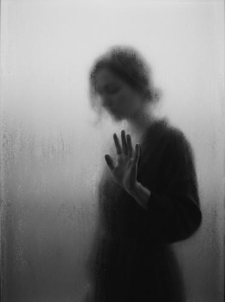

# Frosted Silhouette

[← Back to Image Prompts](../README.md)

Moody, understated black-and-white photography where subjects are captured behind a frosted or translucent surface — faces and forms softly emerging through diffused glass, creating an intimate, editorial atmosphere. The hallmark is low overall contrast with muted blacks and lifted shadows, producing a slightly washed-out matte look. The effect is hauntingly quiet: more about what you can almost-but-not-quite see than what's fully revealed.

**Best for:** Album covers · Editorial layouts · Social media posts · Mood boards · Brand campaigns · Fine art prints · Book covers · Desktop wallpapers



---

## Prompt

Replace the bracketed details with your subject and preferred format.

```text
A black and white photograph shows the blurred silhouette of [SUBJECT — e.g., a person] behind a frosted or translucent surface, 3:4 vertical format. [DETAIL — e.g., Their hand] is gently pressed against the surface and remains readable but not overly sharp, softly emerging through the haze. Overall contrast is low, with muted blacks and lifted shadows, giving the image a slightly washed-out, matte look. The background fades into a pale gray gradient with subtle grain, creating a quiet, understated, editorial mood. Soft, diffused lighting, minimal highlights, no harsh blacks.
```

## With a Reference Image

Attach your image and use this prompt to preserve its defining features while applying the style.

```text
Using the attached photograph, create a frosted silhouette version. Convert to black and white and place the subject behind a frosted or translucent glass surface so their form is blurred and softly diffused — recognizable shapes but no sharp detail. Lower the contrast: muted blacks, lifted shadows, slightly washed-out matte look. Background should fade to a pale gray gradient. Add subtle film grain. Soft diffused lighting, no harsh blacks or bright highlights.
```

---

## 💡 Tips & Best Practices

- **"Low contrast, muted blacks, lifted shadows"**: This tonal specification is everything. Without it, AI produces typical high-contrast B&W photography, which completely misses the washed-out, quiet aesthetic.
- **"No harsh blacks"**: This prevents the deep, dramatic blacks that dominate standard B&W photography. The darkest tone in a frosted silhouette should be medium gray, not black.
- **Body parts against glass sell the illusion**: Having hands, face, or forehead pressed against the surface adds a tangible, physical quality — the subject is *behind* something, not just blurred.
- **Grain adds analog quality**: "Subtle film grain" makes the image feel like it was shot on high-ISO film, adding texture to the otherwise smooth tonal gradients.
- **Common pitfalls**: "Silhouette" alone produces sharp, high-contrast black shapes against white. Always pair with "frosted glass" or "translucent surface" to get the diffusion. "Dramatic" and "moody" produce high-contrast images — use "quiet," "understated," "editorial" instead.
- **Pairs well with:** [Double Exposure](double-exposure.md) (both merge subject with environment through transparency), [Daguerreotype / Tintype](daguerreotype-tintype.md) (similar muted tonal range)
