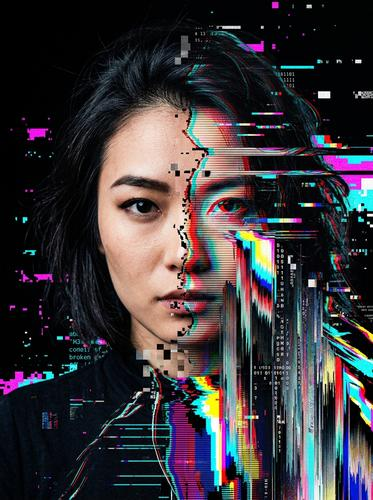

# Glitch Art / Databending

[← Back to Image Prompts](../README.md)

Intentionally corrupted digital imagery with pixel sorting, color channel displacement, horizontal scan line tears, and JPEG artifact aesthetics. The visual language of broken data — chaotic, disorienting, and strangely beautiful.



> **Sample prompt used to generate the above image (Nano Banana 2):**
> ```text
> Glitch art portrait of a woman's face fragmenting into corrupted data streams, 4:5 vertical format. The left half of the face is photorealistic and sharp; the right half dissolves into horizontal scan line tears, pixel-sorted color bands, and RGB color channel displacement — red shifted left, blue shifted right. Vertical bands of stretched and smeared pixels cascade downward like a waterfall of broken data. JPEG compression artifact blocks visible in the transition zones. The background is pure black with occasional glitched noise bursts of neon pink and electric cyan. The overall effect is simultaneously beautiful and unsettling — order disintegrating into digital chaos.
> ```

**ChatGPT**
```text
Create a glitch art portrait of [SUBJECT] that appears to be fragmenting into corrupted digital data. One portion should remain photorealistic and sharp while the rest dissolves into horizontal scan line tears, pixel-sorted color bands, and RGB color channel displacement — red shifted left, blue shifted right. Include stretched and smeared pixel cascades, JPEG compression artifact blocks in the transition zones, and occasional noise bursts of [COLOR 1] and [COLOR 2]. The background is pure black. The effect should be simultaneously beautiful and unsettling — order disintegrating into digital chaos.
```

**Midjourney**
```text
Glitch art portrait of [SUBJECT] fragmenting into corrupted data, photorealistic half dissolving into scan line tears, pixel sorting, RGB channel displacement, JPEG artifacts, stretched pixel cascades, pure black background, neon [COLOR 1] and [COLOR 2] glitch accents --ar 4:5 --s 300
```

**Stable Diffusion**
- **Prompt:** `Glitch art portrait, [SUBJECT] fragmenting into corrupted data, horizontal scan line tears, pixel sorting, RGB color channel displacement, JPEG artifacts, stretched pixels, black background, neon accents, databending aesthetic`
- **Negative Prompt:** `clean, smooth, normal, unglitched, illustration, cartoon`

**Nano Banana 2**
```text
Glitch art portrait of [SUBJECT] fragmenting into corrupted digital data streams, 4:5 vertical format. One portion remains photorealistic and sharp while the rest dissolves into horizontal scan line tears, pixel-sorted color bands, and RGB color channel displacement — red shifted left, blue shifted right. Stretched and smeared pixel cascades, JPEG compression artifact blocks in transition zones. Pure black background with occasional glitched noise bursts of [COLOR 1] and [COLOR 2]. Simultaneously beautiful and unsettling — order disintegrating into digital chaos.
```
