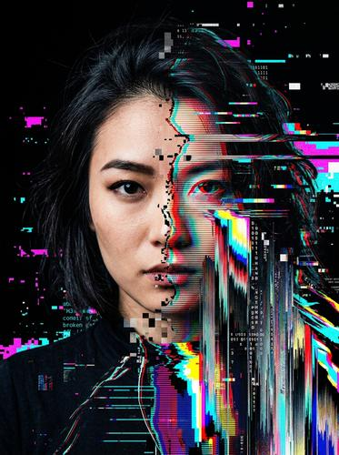

# Glitch Art

[← Back to Image Prompts](../README.md)

Digital corruption aesthetics — scan lines, pixel sorting, data-moshing, chromatic aberration, and RGB channel displacement. The visual language of broken technology embraced as art. Glitch art finds beauty in the accidental — corrupted JPEG artifacts, displaced pixel rows, color channel splits, and the eerie patterns that emerge when digital systems fail. The result feels simultaneously broken and beautiful, unsettling and hypnotic.

**Best for:** Social media posts · Album covers · Editorial illustrations · Profile pictures · Phone wallpapers · Music visualizers · Cyberpunk themed content



---

## Prompt

Replace the bracketed details with your subject and preferred format.

```text
Glitch art portrait of [SUBJECT — e.g., a person with short dark hair], 1:1 square format. The image appears corrupted — RGB color channels split with [COLOR 1] shifted left and [COLOR 2] shifted right. Horizontal scan lines distort the [AREA — e.g., eyes and mouth]. Pixel-sorted vertical streaks in the hair/background. JPEG artifact blocks in corrupted zones. Uncorrupted areas remain crisp and photorealistic. Neon [PALETTE] against dark background. Beautiful and unsettling.
```

## With a Reference Image

Attach your image and use this prompt to preserve its defining features while applying the style.

```text
Using the attached photo, apply glitch art corruption effects. Split the RGB color channels — shift red left and cyan right. Add horizontal scan line distortion across [AREA]. Apply pixel sorting to the [REGION — e.g., background/hair/sky] creating vertical color ribbons. Introduce JPEG compression artifacts in the shadows. Keep [AREA — e.g., the eyes and center of the face] relatively uncorrupted for contrast. The overall effect should feel like a beautiful system failure.
```

---

## 💡 Tips & Best Practices

- **Name specific glitch types**: "Pixel sorting," "data-moshing," "RGB channel displacement," "JPEG artifact blocks" — each produces a distinct effect. Combine 2-3 for the best results.
- **Contrast matters**: The most compelling glitch art has areas of clarity alongside areas of corruption. "Uncorrupted areas remain crisp" creates this duality.
- **Neon palette on dark**: The classic glitch art palette is neon cyan, magenta, and hot pink against dark backgrounds. The neon pops through the corruption.
- **VHS vs. digital**: "VHS tracking error" produces horizontal band distortion. "JPEG corruption" produces blocky artifacts. "Data-moshing" produces motion smears. Choose based on the mood.
- **Common pitfalls**: Avoid "slightly glitched" — go bold or the effect barely registers. Don't overload every type of glitch — choose 2-3 and commit.
- **Pairs well with:** [Cyberpunk Noir](cyberpunk-noir.md) (similar neon-on-dark palette), [Vaporwave / Synthwave Retrowave](vaporwave-synthwave.md) (shares the digital nostalgia aesthetic)
