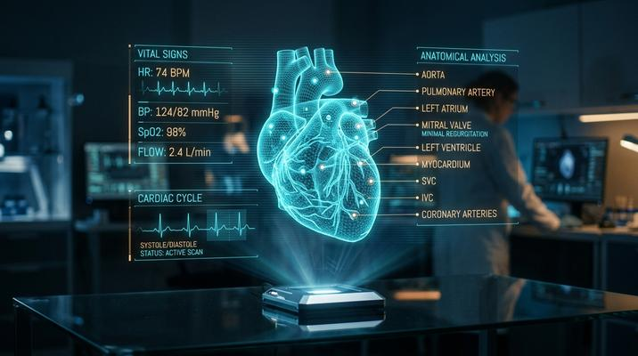

# Holographic UI / Sci-Fi

[← Back to Image Prompts](../README.md)

Translucent holographic interfaces, floating data displays, and Minority Report-style gesture control panels projected in mid-air. Thin neon lines on transparent panels, glowing cyan/amber data visualizations, and particle effects where the hologram meets the air. The style bridges real UI design and science fiction cinema, creating interfaces that look simultaneously functional and futuristic.

**Best for:** UI concept art · Social media posts · Desktop wallpapers · Presentation backgrounds · Game HUD design · Tech brand imagery · YouTube thumbnails



> **Sample prompt used to generate the above image (Nano Banana 2):**
> ```text
> Photograph of a person's hands interacting with floating holographic UI panels in a dark command center, 16:9 landscape format. Multiple translucent cyan holographic screens display data — a world map with glowing node connections, a scrolling code terminal, biometric readouts with heartbeat waveforms. The holograms cast a soft cyan glow on the operator's face and hands. Thin neon grid lines and data text float in mid-air. Subtle particle effects — tiny light motes — where fingertips touch the holographic surface. Dark ambient environment with the holograms as the primary light source. Minority Report / Iron Man JARVIS aesthetic.
> ```

---

## Prompt Variations

### 🔵 Nano Banana 2 _(Featured)_

**Variation 1 — Command Center** _(Desktop Wallpaper, Concept Art)_
```text
Photograph of a [OPERATOR — e.g., military commander] interacting with multiple floating holographic displays in a dark command center, 16:9 landscape format. Translucent [COLOR — e.g., cyan] holographic panels showing [DATA — e.g., tactical map, troop deployments, satellite feeds, communication channels]. Holograms cast soft colored glow on the operator. Thin neon grid lines and floating data text. Particle effects where hands touch holographic surfaces. Dark environment with holograms as primary light source. Minority Report / JARVIS aesthetic.
```

**Variation 2 — Medical / Biometric** _(Social Media, Product Concept)_
```text
Photograph of a holographic medical display showing a rotating 3D anatomical model of [SUBJECT — e.g., a human heart with labeled chambers and arteries highlighted in different colors], floating above a dark surface, 16:9 landscape format. Translucent holographic panels surround the model showing [DATA — e.g., ECG waveforms, blood pressure readings, cellular analysis]. Warm amber hologram color scheme. Thin data labels connected by hairline leader lines. A researcher's hand gestures toward one panel. Particle effects at the hologram edges. Clean, clinical sci-fi.
```

**Variation 3 — Personal Device / Phone** _(Social Media, Product Vision)_
```text
Photograph of a person holding their hand out with a holographic personal interface projecting upward from a device on their wrist, 4:5 vertical format. The holographic display shows [CONTENT — e.g., a message thread, weather widget, music player, and a miniature 3D map]. Translucent cyan hologram panels. The hologram light illuminates the person's face. Thin projection lines from the wrist device to the floating display. Busy urban street in the background, slightly blurred. Near-future everyday tech aesthetic.
```

**Variation 4 — Vehicle HUD** _(Wallpaper, Game Concept)_
```text
First-person view from inside a [VEHICLE — e.g., fighter jet cockpit] with holographic HUD elements overlaid on the windshield, 16:9 landscape format. Heads-up display showing [ELEMENTS — e.g., targeting reticle, altitude/speed readouts, threat indicators, and a holographic terrain map in the lower corner]. Thin neon [COLOR] HUD lines and text against the view of [ENVIRONMENT — e.g., a cloudscape at high altitude]. The HUD elements are transparent — the outside world is visible through them. Slight holographic flicker. Combat flight sim / Top Gun aesthetic.
```

**Variation 5 — Data Visualization** _(Presentation Background, Tech Branding)_
```text
Holographic data visualization floating in a dark void — [VISUALIZATION — e.g., a 3D network graph with glowing nodes connected by pulsing light lines, data flowing along the connections as animated particles], 16:9 landscape format. Translucent holographic rendering — you can see through the structure. [COLOR — e.g., cyan and amber] color scheme. Thin floating data labels and statistics surrounding the visualization. No human operator — pure abstract data beauty. The hologram casts a subtle glow on the invisible surface below. Clean, sophisticated, futuristic.
```

### ChatGPT

**Variation 1 — Command Center**
```text
Create a photograph of someone interacting with floating holographic UI panels in a dark command center. Multiple translucent [COLOR] displays showing [DATA]. Particle effects at touch points. Dark environment, holograms as light source. Minority Report aesthetic. 16:9 landscape format.
```

**Variation 2 — Medical**
```text
Create a holographic medical display: rotating 3D [ANATOMICAL MODEL] with data panels showing [READOUTS]. Amber holograms. Thin labeled connections. Clinical sci-fi. 16:9 landscape format.
```

**Variation 3 — Data Visualization**
```text
Create a holographic data visualization: [VISUALIZATION] floating in dark void. [COLOR] scheme. Floating labels and stats. Pure abstract data. 16:9 landscape format.
```

### Midjourney

**Variation 1 — Command Center**
```text
Holographic UI command center, operator touching floating [COLOR] displays, tactical data, particle effects, dark environment, Minority Report JARVIS --ar 16:9
```

**Variation 2 — Vehicle HUD**
```text
First-person holographic HUD, [VEHICLE] cockpit, targeting reticle altitude speed, neon [COLOR] overlaid on windshield, transparent, combat aesthetic --ar 16:9
```

**Variation 3 — Data Visualization**
```text
Holographic data visualization, 3D network graph, glowing nodes pulsing connections, [COLOR] scheme, dark void, floating labels, futuristic --ar 16:9
```

### Stable Diffusion

**Variation 1 — Command Center**
- **Prompt:** `Holographic UI, command center, floating translucent [COLOR] displays, tactical data, particle effects, dark environment, Minority Report, 8k`
- **Negative Prompt:** `bright, daytime, cartoon, physical screens, illustration`

**Variation 2 — Medical**
- **Prompt:** `Holographic medical display, 3D anatomical model, data panels, amber hologram, clinical sci-fi, dark background, 8k`
- **Negative Prompt:** `bright, cartoon, flat, physical screen, illustration`

---

## 🔄 Image-to-Image Transformations

Add holographic UI to existing photos:

**Nano Banana 2** _(Featured)_
```text
Using the attached photo as reference, add floating holographic UI panels to the scene. The person should appear to be interacting with translucent [COLOR] holographic displays showing [DATA]. The holograms should cast a soft glow on nearby surfaces and the person's face. Add particle effects where hands are near the holographic surfaces. Keep the original scene as the background but darken the environment so the holograms become the primary light source. Minority Report / Iron Man aesthetic.
```
> 💡 **Follow-up refinements:**
> - "Add more holographic panels with different data types"
> - "Change the hologram color from cyan to amber"
> - "Add a holographic HUD overlay to the entire scene"
> - "Make the holograms show [SPECIFIC DATA]"

**ChatGPT**
```text
[Upload Photo] "Add floating holographic UI panels. The person interacts with translucent [COLOR] displays showing [DATA]. Hologram glow on their face. Particle effects at touch points. Darken the environment."
```

**Midjourney**
```text
[IMAGE_URL] Holographic UI overlay, floating translucent [COLOR] displays, particle effects, hologram glow, dark environment, Minority Report --iw 1.5 --ar 16:9
```

**Stable Diffusion**
- **Pipeline:** Img2Img · Denoising Strength: `0.45–0.60`
- **Prompt:** `Holographic UI, floating translucent displays, [COLOR], particle effects, dark, Minority Report, 8k`
- **Negative Prompt:** `physical screens, bright, daytime, cartoon`

---

## 💡 Tips & Best Practices

- **Translucency is key**: "Translucent" holograms that you can see through are more realistic than opaque floating screens.
- **Dark environments**: Holograms should be the primary light source. Otherwise they don't glow — they just look like floating monitors.
- **Particle effects at touch points**: "Tiny light motes where fingertips touch the holographic surface" adds interactivity and sells the sci-fi.
- **Color consistency**: Pick one hologram color (cyan, amber, or green) and stick with it across all panels. Mixed colors looks chaotic.
- **Name the reference**: "Minority Report" (gesture control), "Iron Man JARVIS" (personal assistant), "Westworld" (map tables).
- **Common pitfalls**: "Futuristic screen" just produces a fancy monitor. You need "floating," "translucent," and "holographic" together. Don't make the environment too bright.
- **Pairs well with:** [Cyberpunk Noir](cyberpunk-noir.md) (holograms in a neon city), [Blueprint / Technical Drawing](blueprint-technical-drawing.md) (similar data visualization, analog vs. digital)
