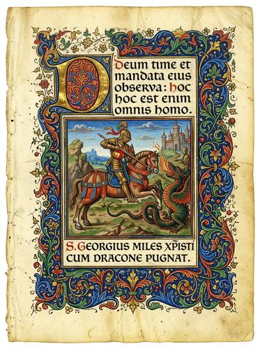

# Illuminated Manuscript

[← Back to Image Prompts](../README.md)

Medieval illuminated manuscript borders, ornate gilded initials, and richly decorated text pages on aged vellum. The visual language of the Book of Kells, the Très Riches Heures, and Gothic devotional texts — intricate Celtic knotwork, gold leaf flourishes, tiny marginalia illustrations, and richly saturated mineral pigments (ultramarine, vermillion, malachite green). Every page is a combination of text, decoration, and illustration integrated into a unified sacred design.

**Best for:** Art prints · Greeting cards · Wedding invitations · Social media posts · Book designs · Poster prints · Certificate designs



> **Sample prompt used to generate the above image (Nano Banana 2):**
> ```text
> Illuminated manuscript page on aged vellum, featuring a large ornate gilded initial letter "S" at the top left, 3:4 vertical format. The initial is decorated with Celtic knotwork interlace in gold leaf, ultramarine blue, and vermillion red, with tiny marginal illustrations of birds and vines growing from the letter. The main body contains Latin text in Gothic blackletter script. An elaborate decorative border runs down the left side and across the bottom — intertwined acanthus vines, heraldic shields, and grotesque creatures in gold and rich mineral pigments. The vellum shows realistic aging — slight foxing, warm yellowed tone, visible animal-skin texture.
> ```

---

## Prompt Variations

### 🔵 Nano Banana 2 _(Featured)_

**Variation 1 — Full Page with Initial** _(Art Print, Wedding Invite)_
```text
Illuminated manuscript page on aged vellum, [FORMAT]. Large ornate gilded initial letter "[LETTER]" decorated with [STYLE — e.g., Celtic knotwork / acanthus vine / zoomorphic]. Gold leaf, ultramarine, vermillion, malachite green. [TEXT — e.g., Latin / poem / wedding vows] in Gothic blackletter. Decorated border — [BORDER DETAILS]. Vellum aging — foxing, yellowing, animal-skin texture. Museum-quality medieval aesthetic.
```

**Variation 2 — Miniature Illustration** _(Social Media, Art Print)_
```text
Illuminated manuscript miniature illustration of [SCENE — e.g., a medieval garden with a lady reading beside a fountain], painted within a gilded rectangular frame on aged vellum, [FORMAT]. Rich mineral pigments — ultramarine sky, malachite green foliage, vermillion details. Gold leaf background and halos. Flat perspective typical of medieval art. Decorative border of acanthus vines and gold leafwork surrounding the frame. Gothic text caption below in period script.
```

**Variation 3 — Decorated Border Only** _(Frame Design, Certificate)_
```text
Illuminated manuscript decorative border frame on aged vellum, [FORMAT]. The center is empty (for text or image). The border features [ELEMENTS — e.g., intertwined ivy vines with gold leaf highlights, small bird and rabbit marginalia, heraldic shields at the corners, and grotesque creatures at the border intersections]. Rich mineral pigments. Gold leaf accents throughout. Gothic corner ornaments. The vellum shows realistic aging.
```

**Variation 4 — Bestiary Page** _(Art Print, Educational)_
```text
Illuminated manuscript bestiary page depicting [CREATURE — e.g., a dragon] on aged vellum, [FORMAT]. The creature is painted in the flat, decorative medieval style with rich mineral pigments. Gold leaf background behind the creature. Surrounded by a decorative border with knotwork. Latin descriptive text in Gothic blackletter script beside the creature. Marginal annotations in smaller hand. Museum-quality medieval bestiary illustration.
```

**Variation 5 — Modern Subject / Humorous** _(Social Media, Gift)_
```text
Illuminated manuscript page depicting [MODERN SUBJECT — e.g., a person sitting at a laptop with a coffee cup] in the flat medieval illustration style on aged vellum, [FORMAT]. The subject is rendered as a medieval miniature with flat perspective, rich mineral pigments, and gold leaf accents. Surrounded by traditional decorated borders with acanthus vines and grotesque marginalia. Gothic blackletter text beneath reading "[HUMOROUS CAPTION]." The contrast between medieval style and modern subject creates charm.
```

### ChatGPT
```text
Var 1: Create an illuminated manuscript page on aged vellum. Gilded initial "[LETTER]." [STYLE] decoration. Gold leaf, rich pigments. Gothic blackletter text. Decorated border. [FORMAT].
Var 2: Create a medieval bestiary page: [CREATURE]. Flat medieval style. Gold leaf background. Knotwork border. Latin text. [FORMAT].
```

### Midjourney
```text
Var 1: Illuminated manuscript, aged vellum, gilded initial, Celtic knotwork, gold leaf ultramarine vermillion, Gothic blackletter, decorated border --ar 4:5
Var 2: Medieval bestiary page, [CREATURE], flat medieval style, gold leaf, mineral pigments, knotwork border, Latin text --ar 4:5
```

### Stable Diffusion
- **Var 1:** `Illuminated manuscript, aged vellum, gilded initial, Celtic knotwork, gold leaf, rich mineral pigments, Gothic script, decorated border` / Neg: `modern, photograph, 3d, digital, clean white paper`

---

## 🔄 Image-to-Image Transformations

**Nano Banana 2** _(Featured)_
```text
Using the attached image, recreate the subject as an illuminated manuscript miniature on aged vellum. Render in flat medieval illustration style with rich mineral pigments (ultramarine, vermillion, malachite green) and gold leaf accents. Add a decorated border with knotwork and marginalia. Include Gothic blackletter text caption. Vellum aging — foxing, yellowing.
```

---

## 💡 Tips & Best Practices

- **Gold leaf is mandatory**: "Gold leaf" or "gilded" is what makes it "illuminated." Without gold, it's just a medieval drawing.
- **Name the pigments**: "Ultramarine, vermillion, malachite green" — these mineral pigment names produce the authentic saturated, slightly granular medieval color palette.
- **Aged vellum texture**: "Aged vellum with foxing, yellowing, and animal-skin texture" grounds the image on the correct substrate.
- **Flat perspective is correct**: Medieval art didn't use Renaissance perspective. Specify "flat perspective typical of medieval art."
- **Common pitfalls**: "Medieval painting" often produces Renaissance art. Specify "illuminated manuscript" + "gold leaf" + "Gothic blackletter" for the correct period.
- **Pairs well with:** [Botanical Illustration](botanical-illustration.md) (similar handcrafted detail), [Byzantine Mosaic](byzantine-mosaic.md) (similar medieval aesthetic, different medium)
