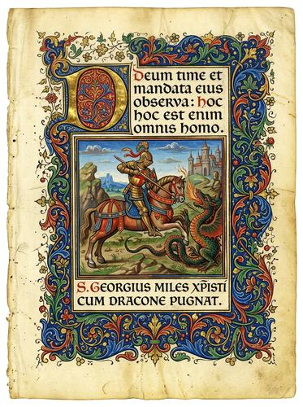

# Illuminated Manuscript

[← Back to Image Prompts](../README.md)

Medieval illuminated manuscript borders, ornate gilded initials, and richly decorated text pages on aged vellum. The visual language of the Book of Kells, the Très Riches Heures, and Gothic devotional texts — intricate Celtic knotwork, gold leaf flourishes, tiny marginalia illustrations, and richly saturated mineral pigments (ultramarine, vermillion, malachite green). Every page is a combination of text, decoration, and illustration integrated into a unified sacred design.

**Best for:** Art prints · Greeting cards · Wedding invitations · Social media posts · Book designs · Poster prints · Certificate designs



---

## Prompt

Replace the bracketed details with your subject and preferred format.

```text
Illuminated manuscript page on aged vellum, [FORMAT]. Large ornate gilded initial letter "[LETTER]" decorated with [STYLE — e.g., Celtic knotwork / acanthus vine / zoomorphic]. Gold leaf, ultramarine, vermillion, malachite green. [TEXT — e.g., Latin / poem / wedding vows] in Gothic blackletter. Decorated border — [BORDER DETAILS]. Vellum aging — foxing, yellowing, animal-skin texture. Museum-quality medieval aesthetic.
```

## With a Reference Image

Attach your image and use this prompt to preserve its defining features while applying the style.

```text
Using the attached image, recreate the subject as an illuminated manuscript miniature on aged vellum. Render in flat medieval illustration style with rich mineral pigments (ultramarine, vermillion, malachite green) and gold leaf accents. Add a decorated border with knotwork and marginalia. Include Gothic blackletter text caption. Vellum aging — foxing, yellowing.
```

---

## 💡 Tips & Best Practices

- **Gold leaf is mandatory**: "Gold leaf" or "gilded" is what makes it "illuminated." Without gold, it's just a medieval drawing.
- **Name the pigments**: "Ultramarine, vermillion, malachite green" — these mineral pigment names produce the authentic saturated, slightly granular medieval color palette.
- **Aged vellum texture**: "Aged vellum with foxing, yellowing, and animal-skin texture" grounds the image on the correct substrate.
- **Flat perspective is correct**: Medieval art didn't use Renaissance perspective. Specify "flat perspective typical of medieval art."
- **Common pitfalls**: "Medieval painting" often produces Renaissance art. Specify "illuminated manuscript" + "gold leaf" + "Gothic blackletter" for the correct period.
- **Pairs well with:** [Botanical Illustration](botanical-illustration.md) (similar handcrafted detail), [Byzantine Mosaic](byzantine-mosaic.md) (similar medieval aesthetic, different medium)
