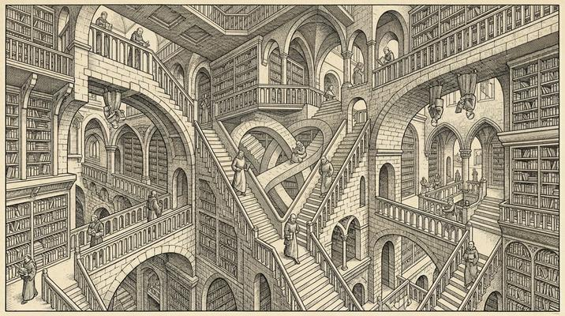

# Impossible Architecture / Escher

[← Back to Image Prompts](../README.md)

M.C. Escher-inspired impossible constructions — staircases that loop back on themselves, water flowing uphill, gravity-defying structures where up is down, and architectural paradoxes rendered with photorealistic precision. The style's power comes from the tension between the impossible geometry and the realistic rendering that makes your brain insist it should work.

**Best for:** Desktop wallpapers · Art prints · Social media posts · Puzzle/game art · Educational illustrations · Poster prints



> **Sample prompt used to generate the above image (Nano Banana 2):**
> ```text
> Photorealistic render of an impossible Escher-style architectural courtyard with staircases that connect in impossible ways — one staircase ascends to a platform that is simultaneously the bottom of another staircase going in the opposite direction, 16:9 landscape format. Multiple figures walk on the staircases at impossible orientations — some walk on the underside as if gravity pulls them in different directions. Classical stone architecture with vaulted arches. Warm afternoon sunlight casting shadows that contradict each other. Every element is rendered with architectural precision — the impossibility is in the geometry, not the rendering.
> ```

---

## Prompt Variations

### 🔵 Nano Banana 2 _(Featured)_

**Variation 1 — Impossible Staircase** — Escher-style infinite staircase, Penrose steps, multiple gravity directions, figures walking at impossible angles, classical architecture, photorealistic, [FORMAT].

**Variation 2 — Impossible Waterway** — Water flowing in impossible loops, aqueducts feeding back into themselves, waterfalls flowing upward, Escher logic, photorealistic, [FORMAT].

**Variation 3 — Tessellation** — Escher-style interlocking tessellation pattern where [SHAPES — e.g., birds transform into fish], seamless morphing, mathematically precise, [FORMAT].

**Variation 4 — Interior Paradox** — Impossible interior where a room's ceiling is another room's floor, doors lead to contradictory spaces, figures at multiple gravity orientations, photorealistic, [FORMAT].

**Variation 5 — Modern Urban** — Modern city with Escher-style impossible architecture — buildings that bridge and connect impossibly, streets that loop, contradictory perspectives, photorealistic, [FORMAT].

### ChatGPT / Midjourney / Stable Diffusion — Standard templates with "impossible architecture, Escher, Penrose, contradictory geometry, photorealistic rendering" core keywords.

---

## 🔄 Image-to-Image Transformations

**Nano Banana 2** _(Featured)_
```text
Using the attached architectural photo, introduce Escher-style impossible geometry. Make staircases that loop impossibly, doorways that lead to contradictory spaces, and perspectives that contradict each other. Keep the rendering photorealistic — the impossibility should be geometrical, not visual. Preserve the original materials and lighting but warp the spatial logic.
```

---

## 💡 Tips & Best Practices
- **Photorealistic rendering + impossible geometry**: The magic is in the contrast. The rendering must be convincing; only the spatial logic should be impossible.
- **Multiple gravity directions**: "Figures walking at impossible orientations — some on the underside" is the classic Escher device.
- **Contradictory shadows**: Shadows that point in different directions imply multiple light sources / impossible geometry.
- **Pairs well with:** [Brutalist Architecture](brutalist-architecture.md) (similar architectural drama), [3D Isometric Resin Sculptures](3d-isometric-resin-sculptures.md) (similar spatial playfulness)
