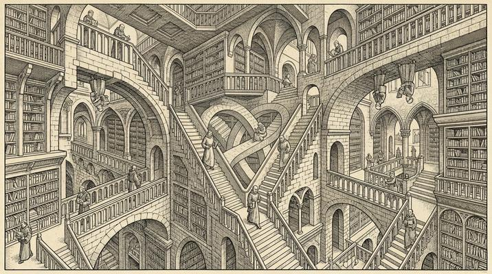

# Impossible Architecture / Escher

[← Back to Image Prompts](../README.md)

M.C. Escher-inspired impossible constructions — staircases that loop back on themselves, water flowing uphill, gravity-defying structures where up is down, and architectural paradoxes rendered with photorealistic precision. The style's power comes from the tension between the impossible geometry and the realistic rendering that makes your brain insist it should work.

**Best for:** Desktop wallpapers · Art prints · Social media posts · Puzzle/game art · Educational illustrations · Poster prints



> **Sample prompt used to generate the above image (Nano Banana 2):**
> ```text
> Photorealistic render of an impossible Escher-style architectural courtyard with staircases that connect in impossible ways — one staircase ascends to a platform that is simultaneously the bottom of another staircase going in the opposite direction, 16:9 landscape format. Multiple figures walk on the staircases at impossible orientations — some walk on the underside as if gravity pulls them in different directions. Classical stone architecture with vaulted arches. Warm afternoon sunlight casting shadows that contradict each other. Every element is rendered with architectural precision — the impossibility is in the geometry, not the rendering.
> ```

---

## Prompt Variations

### 🔵 Nano Banana 2 _(Featured)_

**Variation 1 — Impossible Staircase** _(Art Print)_
```text
Escher-style infinite staircase, Penrose steps, multiple gravity directions, figures walking at impossible angles, classical architecture, photorealistic, [FORMAT].
```

**Variation 2 — Impossible Waterway** _(Art Print)_
```text
Water flowing in impossible loops, aqueducts feeding back into themselves, waterfalls flowing upward, Escher logic, photorealistic, [FORMAT].
```

**Variation 3 — Tessellation** _(Art Print)_
```text
Escher-style interlocking tessellation pattern where [SHAPES — e.g., birds transform into fish], seamless morphing, mathematically precise, [FORMAT].
```

**Variation 4 — Interior Paradox** _(Art Print)_
```text
Impossible interior where a room's ceiling is another room's floor, doors lead to contradictory spaces, figures at multiple gravity orientations, photorealistic, [FORMAT].
```

**Variation 5 — Modern Urban** _(Social Media)_
```text
Modern city with Escher-style impossible architecture — buildings that bridge and connect impossibly, streets that loop, contradictory perspectives, photorealistic, [FORMAT].
```

### ChatGPT

**Variation 1 — Impossible Staircase** _(Desktop Wallpaper)_
```text
Create a photorealistic Escher-style courtyard with impossible Penrose staircases that loop back on themselves — figures walking at contradictory gravity orientations, some on the undersides of steps. Classical stone architecture with vaulted arches, warm afternoon sunlight casting shadows that contradict each other. The rendering is architecturally precise; only the geometry is impossible. 16:9 landscape format.
```

**Variation 2 — Impossible Waterway** _(Art Print)_
```text
Create a photorealistic scene of [STRUCTURE — e.g., a stone aqueduct] where water flows in an impossible loop — falling into a channel that feeds back uphill to its own source, Escher logic rendered with complete realism. 4:5 vertical format.
```

**Variation 3 — Interior Paradox** _(Puzzle/Game Art)_
```text
Create an impossible interior of [SPACE — e.g., a grand library] where one room's ceiling is another room's floor, doors open onto contradictory spaces, and figures stand at multiple gravity orientations. Photorealistic materials and lighting. 1:1 square format.
```

### Midjourney

**Variation 1 — Impossible Staircase** _(Desktop Wallpaper)_
```text
Escher-style impossible architecture, Penrose staircase looping on itself, figures at multiple gravity orientations, classical stone arches, warm afternoon light, contradictory shadows, photorealistic architectural render --ar 16:9 --s 250
```

**Variation 2 — Impossible Waterway** _(Art Print)_
```text
impossible waterfall flowing uphill, aqueduct feeding back into itself, Escher logic, photorealistic stone architecture, [SETTING] --ar 4:5 --s 250
```

**Variation 3 — Modern Urban Paradox** _(Poster)_
```text
modern city with Escher-style impossible architecture, buildings bridging at contradictory angles, looping streets, multiple perspectives, photorealistic render --ar 16:9 --s 300 --chaos 15
```

### Stable Diffusion

**Variation 1 — Impossible Staircase** _(Desktop Wallpaper)_
- **Prompt:** `impossible architecture, Escher style, [SETTING], Penrose staircase looping on itself, figures at multiple gravity orientations, classical stone arches, contradictory shadows, photorealistic architectural rendering, warm sunlight`
- **Negative Prompt:** `cartoon, flat illustration, sketch, normal geometry, blurry, low quality`

**Variation 2 — Interior Paradox** _(Puzzle/Game Art)_
- **Prompt:** `impossible interior, [SPACE], ceiling is another room's floor, contradictory doorways, multiple gravity orientations, Escher logic, photorealistic materials and lighting`
- **Negative Prompt:** `cartoon, painting, distorted rendering, melted surfaces, low quality`

---

## 🔄 Image-to-Image Transformations

**Nano Banana 2** _(Featured)_
```text
Using the attached architectural photo, introduce Escher-style impossible geometry. Make staircases that loop impossibly, doorways that lead to contradictory spaces, and perspectives that contradict each other. Keep the rendering photorealistic — the impossibility should be geometrical, not visual. Preserve the original materials and lighting but warp the spatial logic.
```

**ChatGPT**
```text
[Upload Photo] "Warp this architectural photo with Escher-style impossible geometry — staircases that loop, doorways to contradictory spaces, perspectives that conflict — while keeping materials, lighting, and rendering fully photorealistic."
```

**Midjourney**
```text
[IMAGE_URL] Escher-style impossible architecture, looping staircases, contradictory perspectives, multiple gravity directions, photorealistic render --iw 1 --ar 16:9
```

**Stable Diffusion**
- **Pipeline:** Img2Img · Denoising Strength: `0.6–0.75` (allows the geometry to be re-invented)
- **Prompt:** `impossible architecture, Escher style, looping staircases, contradictory geometry, multiple gravity orientations, photorealistic rendering`
- **Negative Prompt:** `cartoon, sketch, normal geometry, melted distortion, blur`

---

## 💡 Tips & Best Practices
- **Photorealistic rendering + impossible geometry**: The magic is in the contrast. The rendering must be convincing; only the spatial logic should be impossible.
- **Multiple gravity directions**: "Figures walking at impossible orientations — some on the underside" is the classic Escher device.
- **Contradictory shadows**: Shadows that point in different directions imply multiple light sources / impossible geometry.
- **Pairs well with:** [Brutalist Architecture](brutalist-architecture.md) (similar architectural drama), [3D Isometric Resin Sculptures](3d-isometric-resin-sculptures.md) (similar spatial playfulness)
