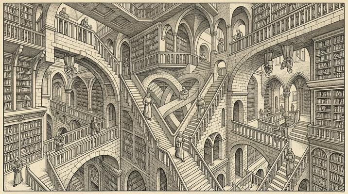

# Impossible Architecture / Escher

[← Back to Image Prompts](../README.md)

M.C. Escher-inspired impossible constructions — staircases that loop back on themselves, water flowing uphill, gravity-defying structures where up is down, and architectural paradoxes rendered with photorealistic precision. The style's power comes from the tension between the impossible geometry and the realistic rendering that makes your brain insist it should work.

**Best for:** Desktop wallpapers · Art prints · Social media posts · Puzzle/game art · Educational illustrations · Poster prints



---

## Prompt

Replace the bracketed details with your subject and preferred format.

```text
Photorealistic architectural view of [SETTING — e.g., a classical stone courtyard with vaulted arches] built around an impossible staircase, [FORMAT]. Show one continuous stair flight that appears to ascend yet joins its own lower landing; align its steps, railings, and shadows so the paradox becomes apparent on closer inspection. Small figures walk on different surfaces at conflicting gravity angles. Light the scene with warm afternoon sun and render stone joints and architectural details precisely. Keep the visual trick in the geometry while the materials and perspective remain believable.
```

## With a Reference Image

Attach your image and use this prompt to preserve its defining features while applying the style.

```text
Using the attached architectural photo, introduce Escher-style impossible geometry. Make staircases that loop impossibly, doorways that lead to contradictory spaces, and perspectives that contradict each other. Keep the rendering photorealistic — the impossibility should be geometrical, not visual. Preserve the original materials and lighting but warp the spatial logic.
```

---

## 💡 Tips & Best Practices
- **Photorealistic rendering + impossible geometry**: The magic is in the contrast. The rendering must be convincing; only the spatial logic should be impossible.
- **Multiple gravity directions**: "Figures walking at impossible orientations — some on the underside" is the classic Escher device.
- **Contradictory shadows**: Shadows that point in different directions imply multiple light sources / impossible geometry.
- **Pairs well with:** [Brutalist Architecture](brutalist-architecture.md) (similar architectural drama), [3D Isometric Resin Sculptures](3d-isometric-resin-sculptures.md) (similar spatial playfulness)
