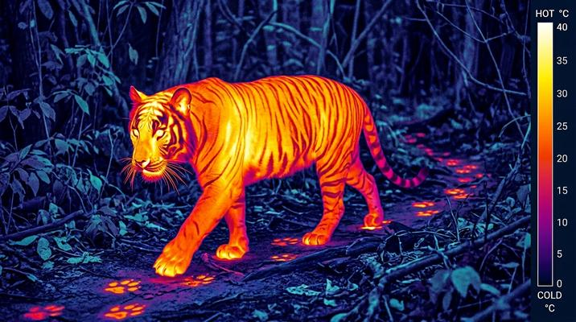

# Infrared / Thermal Imaging

[← Back to Image Prompts](../README.md)

The invisible made visible — infrared thermography maps heat radiation into vivid color gradients (ironbow palette: black → blue → purple → red → orange → yellow → white), while near-infrared photography transforms landscapes into dream-like scenes where foliage glows white and skies turn deep black. Both reveal a hidden world invisible to the naked eye.

**Best for:** Desktop wallpapers · Social media posts · Art prints · Conceptual art · Science content · Poster prints



> **Sample prompt used to generate the above image (Nano Banana 2):**
> ```text
> Infrared thermal image of a cityscape at night using the ironbow color palette, 16:9 landscape format. Buildings glow with internal heat — windows are bright yellow-white hotspots, walls radiate orange and red, rooftops cool to purple and blue. The night sky is cold black. Heat from vehicles and pedestrians creates bright orange-yellow silhouettes on the streets. A plume of hot steam from a vent glows bright yellow fading to red as it cools and disperses upward. Temperature scale bar on the right side showing range from -10°C (black) to 40°C (white). Thermal camera FLIR aesthetic.
> ```

---

## Prompt Variations

### 🔵 Nano Banana 2 _(Featured)_

**Variation 1 — Thermal Cityscape** — Thermal image of [CITY/BUILDING], ironbow palette (black→blue→red→yellow→white), heat patterns, temperature scale bar, FLIR aesthetic, [FORMAT].

**Variation 2 — Thermal Portrait** — Thermal image of [PERSON], ironbow palette, face hotspots in yellow-white, cooler extremities in red-orange, clothing in blue-purple, black background, [FORMAT].

**Variation 3 — Near-Infrared Landscape** — Near-infrared photograph of [LANDSCAPE], foliage glows bright white, sky turns deep black, water dark, Wood effect, dreamy, [FORMAT].

**Variation 4 — Thermal Animal / Wildlife** — Thermal image of [ANIMAL] in its environment, body heat visible against cool background, ironbow palette, FLIR aesthetic, [FORMAT].

**Variation 5 — Dual View / Before-After** — Split image: normal photograph on the left, thermal/infrared version on the right, same scene, revealing hidden heat patterns, [FORMAT].

### ChatGPT / Midjourney / Stable Diffusion — Standard templates with "infrared thermal, ironbow palette, heat radiation, temperature scale, FLIR aesthetic" or "near-infrared, white foliage, black sky, Wood effect" core keywords.

---

## 🔄 Image-to-Image Transformations

**Nano Banana 2** _(Featured)_
```text
Using the attached photo, transform it into a thermal infrared image using the ironbow color palette. Hot areas (bodies, engines, lit windows) glow yellow-white. Warm areas are orange-red. Cool areas are purple-blue. Cold background is black. Add a temperature scale bar on the right. FLIR thermal camera aesthetic.
```

---

## 💡 Tips & Best Practices
- **Ironbow palette**: The standard thermal palette: black (coldest) → blue → purple → red → orange → yellow → white (hottest).
- **Temperature scale bar**: Adds scientific authenticity — "scale bar showing -10°C to 40°C."
- **Near-IR vs. thermal**: Near-infrared (Wood effect) = white foliage, black sky. Thermal = heat maps. They're different imaging modes.
- **Pairs well with:** [X-Ray / Medical Imaging](x-ray-imaging.md) (both reveal invisible information), [Bioluminescent Underwater](bioluminescent-underwater.md) (similar glow-in-darkness)
