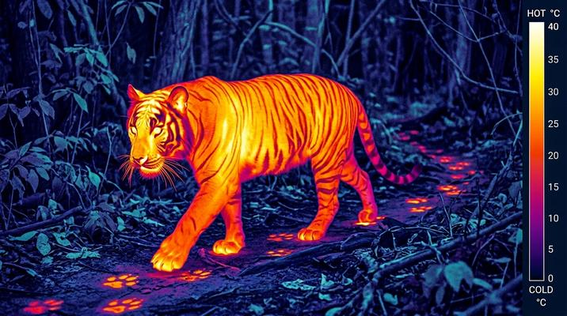

# Infrared / Thermal Imaging

[← Back to Image Prompts](../README.md)

The invisible made visible — infrared thermography maps heat radiation into vivid color gradients (ironbow palette: black → blue → purple → red → orange → yellow → white), while near-infrared photography transforms landscapes into dream-like scenes where foliage glows white and skies turn deep black. Both reveal a hidden world invisible to the naked eye.

**Best for:** Desktop wallpapers · Social media posts · Art prints · Conceptual art · Science content · Poster prints



> **Sample prompt used to generate the above image (Nano Banana 2):**
> ```text
> Infrared thermal image of a cityscape at night using the ironbow color palette, 16:9 landscape format. Buildings glow with internal heat — windows are bright yellow-white hotspots, walls radiate orange and red, rooftops cool to purple and blue. The night sky is cold black. Heat from vehicles and pedestrians creates bright orange-yellow silhouettes on the streets. A plume of hot steam from a vent glows bright yellow fading to red as it cools and disperses upward. Temperature scale bar on the right side showing range from -10°C (black) to 40°C (white). Thermal camera FLIR aesthetic.
> ```

---

## Prompt Variations

### 🔵 Nano Banana 2 _(Featured)_

**Variation 1 — Thermal Cityscape** _(Art Print)_
```text
Thermal image of [CITY/BUILDING], ironbow palette (black→blue→red→yellow→white), heat patterns, temperature scale bar, FLIR aesthetic, [FORMAT].
```

**Variation 2 — Thermal Portrait** _(Profile Picture)_
```text
Thermal image of [PERSON], ironbow palette, face hotspots in yellow-white, cooler extremities in red-orange, clothing in blue-purple, black background, [FORMAT].
```

**Variation 3 — Near-Infrared Landscape** _(Art Print)_
```text
Near-infrared photograph of [LANDSCAPE], foliage glows bright white, sky turns deep black, water dark, Wood effect, dreamy, [FORMAT].
```

**Variation 4 — Thermal Animal / Wildlife** _(Art Print)_
```text
Thermal image of [ANIMAL] in its environment, body heat visible against cool background, ironbow palette, FLIR aesthetic, [FORMAT].
```

**Variation 5 — Dual View / Before-After** _(Art Print)_
```text
Split image: normal photograph on the left, thermal/infrared version on the right, same scene, revealing hidden heat patterns, [FORMAT].
```

### ChatGPT

**Variation 1 — Thermal Cityscape** _(Desktop Wallpaper)_
```text
Create an infrared thermal image of [CITY/BUILDING] at night using the ironbow color palette — windows as bright yellow-white hotspots, walls radiating orange and red, rooftops cooling to purple and blue, cold black sky. Include a temperature scale bar on the right side. FLIR thermal camera aesthetic. 16:9 landscape format.
```

**Variation 2 — Near-Infrared Landscape** _(Art Print)_
```text
Create a near-infrared photograph of [LANDSCAPE] — foliage glowing surreal bright white (Wood effect), the sky rendered deep black, dark water, dreamlike and otherworldly. 3:2 landscape format.
```

**Variation 3 — Thermal Wildlife** _(Science Content)_
```text
Create a thermal image of [ANIMAL] in its environment at night — body heat glowing yellow-orange against a cool blue-purple background, ironbow palette, temperature scale bar, FLIR aesthetic. 16:9 landscape format.
```

### Midjourney

**Variation 1 — Thermal Cityscape** _(Desktop Wallpaper)_
```text
infrared thermal image of [CITY/BUILDING] at night, ironbow palette, yellow-white window hotspots, orange red walls, purple blue rooftops, cold black sky, temperature scale bar, FLIR aesthetic --ar 16:9 --s 150
```

**Variation 2 — Near-Infrared Landscape** _(Art Print)_
```text
near-infrared photograph of [LANDSCAPE], white glowing foliage, deep black sky, dark water, Wood effect, dreamlike surreal --ar 3:2 --s 200
```

**Variation 3 — Thermal Portrait** _(Conceptual Art)_
```text
thermal image of [PERSON], ironbow palette, yellow-white face hotspots, red-orange extremities, blue-purple clothing, black background, FLIR aesthetic --ar 3:4 --s 100
```

### Stable Diffusion

**Variation 1 — Thermal Cityscape** _(Desktop Wallpaper)_
- **Prompt:** `infrared thermal image, [CITY/BUILDING] at night, ironbow color palette, yellow-white hotspots, orange red heat, purple blue cool zones, black sky, temperature scale bar, FLIR thermal camera`
- **Negative Prompt:** `natural colors, daylight photograph, painting, low quality`

**Variation 2 — Near-Infrared Landscape** _(Art Print)_
- **Prompt:** `near-infrared photograph, [LANDSCAPE], bright white foliage, deep black sky, dark water, Wood effect, surreal dreamlike infrared photography`
- **Negative Prompt:** `green foliage, blue sky, normal color photo, oversaturated`

---

## 🔄 Image-to-Image Transformations

**Nano Banana 2** _(Featured)_
```text
Using the attached photo, transform it into a thermal infrared image using the ironbow color palette. Hot areas (bodies, engines, lit windows) glow yellow-white. Warm areas are orange-red. Cool areas are purple-blue. Cold background is black. Add a temperature scale bar on the right. FLIR thermal camera aesthetic.
```

**ChatGPT**
```text
[Upload Photo] "Transform this photo into a FLIR thermal image with the ironbow palette — hot areas glowing yellow-white, warm areas orange-red, cool areas purple-blue, cold black background, with a temperature scale bar on the right."
```

**Midjourney**
```text
[IMAGE_URL] infrared thermal image, ironbow palette, yellow-white hotspots, orange-red warmth, purple-blue cool zones, black background, temperature scale bar, FLIR --iw 1.2 --ar 16:9
```

**Stable Diffusion**
- **Pipeline:** Img2Img · Denoising Strength: `0.55–0.7` (palette remap over preserved structure)
- **Prompt:** `thermal infrared image, ironbow palette, heat map, yellow-white hotspots, purple-blue cool zones, temperature scale bar, FLIR aesthetic`
- **Negative Prompt:** `natural colors, daylight, photograph, painting`

---

## 💡 Tips & Best Practices
- **Ironbow palette**: The standard thermal palette: black (coldest) → blue → purple → red → orange → yellow → white (hottest).
- **Temperature scale bar**: Adds scientific authenticity — "scale bar showing -10°C to 40°C."
- **Near-IR vs. thermal**: Near-infrared (Wood effect) = white foliage, black sky. Thermal = heat maps. They're different imaging modes.
- **Pairs well with:** [X-Ray / Medical Imaging](x-ray-imaging.md) (both reveal invisible information), [Bioluminescent Underwater](bioluminescent-underwater.md) (similar glow-in-darkness)
