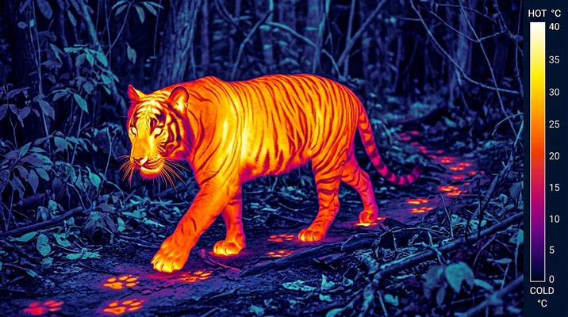

# Infrared / Thermal Imaging

[← Back to Image Prompts](../README.md)

The invisible made visible — infrared thermography maps heat radiation into vivid color gradients (ironbow palette: black → blue → purple → red → orange → yellow → white), while near-infrared photography transforms landscapes into dream-like scenes where foliage glows white and skies turn deep black. Both reveal a hidden world invisible to the naked eye.

**Best for:** Desktop wallpapers · Social media posts · Art prints · Conceptual art · Science content · Poster prints



---

## Prompt

Replace the bracketed details with your subject and preferred format.

```text
Infrared thermal camera view of [SCENE — e.g., a city street at night], [FORMAT]. Map cold sky and shaded surfaces to black and deep blue, warm walls to purple and red, and heat sources such as [HOTSPOTS — e.g., lit windows, engines, and pedestrians] to orange, yellow, and white. Let a plume of heat dissipate through progressively cooler colors. Include a compact temperature scale along one edge, matching the colors in the image. Coarse sensor texture and honest heat-dependent contrast, like a FLIR capture.
```

## With a Reference Image

Attach your image and use this prompt to preserve its defining features while applying the style.

```text
Using the attached photo, transform it into a thermal infrared image using the ironbow color palette. Hot areas (bodies, engines, lit windows) glow yellow-white. Warm areas are orange-red. Cool areas are purple-blue. Cold background is black. Add a temperature scale bar on the right. FLIR thermal camera aesthetic.
```

---

## 💡 Tips & Best Practices
- **Ironbow palette**: The standard thermal palette: black (coldest) → blue → purple → red → orange → yellow → white (hottest).
- **Temperature scale bar**: Adds scientific authenticity — "scale bar showing -10°C to 40°C."
- **Near-IR vs. thermal**: Near-infrared (Wood effect) = white foliage, black sky. Thermal = heat maps. They're different imaging modes.
- **Pairs well with:** [X-Ray / Medical Imaging](x-ray-imaging.md) (both reveal invisible information), [Bioluminescent Underwater](bioluminescent-underwater.md) (similar glow-in-darkness)
