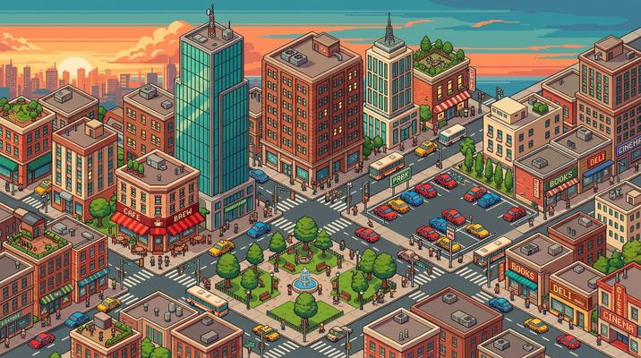

# Isometric Pixel City

[← Back to Image Prompts](../README.md)

Top-down isometric urban grids built from pixel art tiles — the visual language of city-builder and management games like SimCity, Habbo Hotel, and RollerCoaster Tycoon. Every building, road, and tree is a perfectly aligned isometric sprite, creating dense, detail-packed cityscapes that reward zooming in. The charm is in the density of micro-detail: each tiny building has personality, each block tells a story, and the isometric angle gives the flat pixel art a satisfying sense of three-dimensionality.

**Best for:** Desktop wallpapers · Game concept art · Social media posts · Poster prints · Town/city visualizations · App assets



> **Sample prompt used to generate the above image (Nano Banana 2):**
> ```text
> Isometric pixel art cityscape viewed from a classic 2:1 isometric angle, showing a dense urban neighborhood with diverse buildings — a neon-lit ramen shop, a tiny park with pixel trees, apartment blocks with laundry lines, a rooftop garden, and a canal with a small boat, 16:9 landscape format. Every building is a meticulously detailed isometric pixel sprite with visible pixel grid. SimCity / Habbo Hotel management-game aesthetic. Limited 64-color palette. Pixel-level detail — individual windows lit from inside, tiny cars on the roads, pedestrian sprites on the sidewalks. Warm evening lighting with neon glows from the commercial district.
> ```

---

## Prompt Variations

### 🔵 Nano Banana 2 _(Featured)_

> NB2 renders isometric pixel cities well when you specify the exact camera angle: "classic 2:1 isometric angle." Always include "every building is a meticulously detailed isometric pixel sprite" and name specific buildings with micro-details to get dense, interesting cityscapes.

**Variation 1 — Dense Urban Neighborhood** _(Desktop Wallpaper)_
```text
Isometric pixel art cityscape from a classic 2:1 isometric angle showing a dense [NEIGHBORHOOD — e.g., Chinatown district with red lantern strings, tea houses, and a dragon gate archway], 16:9 landscape format. Every building is a detailed isometric pixel sprite with visible pixel grid. [DETAILS — e.g., neon signage in Chinese characters, steaming dim sum carts on the street, a rooftop martial arts studio]. Limited 64-color palette. Tiny pixel pedestrian sprites and vehicles. [LIGHTING — e.g., warm evening light with red and gold neon glow]. SimCity management-game aesthetic.
```

**Variation 2 — Fantasy / Medieval Town** _(Game Art, Poster)_
```text
Isometric pixel art medieval town from a classic 2:1 isometric angle, 16:9 landscape format. [DETAILS — e.g., a castle on a hill, cobblestone streets, timber-frame houses, a market square with merchant stalls, a blacksmith with a smoking forge, farmland with pixel crops at the town edge]. Every structure is a pixel sprite with visible grid. Limited 48-color palette — warm earth tones, stone greys, and forest greens. Tiny NPC sprites going about daily life. Warm golden sunlight with long pixel shadows. RPG / strategy game aesthetic.
```

**Variation 3 — Futuristic / Sci-Fi City** _(Wallpaper, Social Media)_
```text
Isometric pixel art futuristic city from a classic 2:1 isometric angle, 16:9 landscape format. [DETAILS — e.g., towering glass spires, flying vehicle lanes at different heights, holographic pixel billboards, a monorail loop, green rooftop gardens with solar panels]. Every structure is a pixel sprite with visible grid. Limited 64-color palette — cool teals, indigo, bright neon accents. Tiny pixel drones and pedestrians on sky-bridges. Night scene with neon glow and lit windows. Cyberpunk management-game aesthetic.
```

**Variation 4 — Seasonal Variation** _(Social Media, Greeting Card)_
```text
Isometric pixel art [NEIGHBORHOOD] in [SEASON — e.g., deep winter with heavy snow], from a classic 2:1 isometric angle, 16:9 landscape format. [DETAILS — e.g., snow-covered rooftops with icicle sprites, a frozen canal with pixel ice skaters, steaming chimneys, warm lit windows, a pixel snowman in the park, holiday lights on the storefronts]. Every element is a pixel sprite. Limited 48-color palette — white, ice blue, warm amber window glow. Tiny bundled-up pedestrian sprites. Cozy, festive.
```

**Variation 5 — Single Building Detailed Close-Up** _(App Icon, Social Media)_
```text
Isometric pixel art close-up of a single detailed building — [BUILDING — e.g., a multi-story bookshop with visible interior: ground floor cafe, second floor stacks, rooftop reading garden], from a classic 2:1 isometric angle, 1:1 square format. Cutaway showing the interior on one side. Every detail is pixel-precise — tiny books on shelves, pixel patrons reading, a coffee machine, potted plants on the roof. Limited 32-color palette. Warm interior lighting visible through windows. Charming, intricate, zoomed-in.
```

### ChatGPT

**Variation 1 — Urban Neighborhood**
```text
Create an isometric pixel art cityscape from a 2:1 isometric angle showing [NEIGHBORHOOD]. Every building is a detailed pixel sprite. [SPECIFIC DETAILS]. Limited 64-color palette. Tiny pedestrian and vehicle sprites. [LIGHTING]. SimCity aesthetic. 3:2 landscape format.
```

**Variation 2 — Fantasy Town**
```text
Create an isometric pixel art medieval town. Castle, cobblestone streets, timber houses, market square. Pixel sprites with visible grid. 48-color earth-tone palette. Warm golden sunlight. RPG aesthetic. 3:2 landscape format.
```

**Variation 3 — Single Building**
```text
Create an isometric pixel art close-up of [BUILDING] with cutaway interior. Pixel-precise details. 32-color palette. Warm interior lighting. Charming, intricate. 1:1 square format.
```

### Midjourney

**Variation 1 — Urban**
```text
Isometric pixel art cityscape, 2:1 isometric angle, [NEIGHBORHOOD], detailed pixel sprites, limited 64-color palette, tiny pedestrians vehicles, SimCity aesthetic --ar 16:9
```

**Variation 2 — Fantasy**
```text
Isometric pixel art medieval town, castle, cobblestone streets, timber houses, market, pixel sprites, 48-color earth tones, golden sunlight, RPG game --ar 16:9
```

**Variation 3 — Futuristic**
```text
Isometric pixel art sci-fi city, glass spires, flying vehicles, neon billboards, monorail, pixel sprites, 64-color cool palette, night neon glow, cyberpunk --ar 16:9
```

### Stable Diffusion

**Variation 1 — Urban**
- **Prompt:** `Isometric pixel art city, 2:1 angle, [NEIGHBORHOOD], detailed pixel sprites, visible grid, limited palette, tiny pedestrians, SimCity Habbo aesthetic, 8k`
- **Negative Prompt:** `3d render, smooth, realistic, photograph, anti-aliased`

**Variation 2 — Fantasy**
- **Prompt:** `Isometric pixel art medieval town, castle, cobblestone, timber houses, pixel sprites, earth tones, golden sunlight, RPG aesthetic`
- **Negative Prompt:** `modern, 3d, smooth, realistic, photograph`

---

## 🔄 Image-to-Image Transformations

Transform aerial/city photos into isometric pixel cities:

**Nano Banana 2** _(Featured)_
```text
Using the attached aerial/city photo as reference, recreate the scene as an isometric pixel art cityscape from a classic 2:1 isometric angle. Convert each building into a detailed isometric pixel sprite. Limit the palette to 64 colors matching the original tones. Add tiny pixel pedestrian and vehicle sprites. Preserve the neighborhood layout and building density. Visible pixel grid throughout.
```
> 💡 **Follow-up refinements:**
> - "Add a seasonal overlay — snow, cherry blossoms, autumn leaves"
> - "Zoom into one building and show a cutaway interior"
> - "Add fantasy elements — a dragon flying overhead, a wizard tower"
> - "Make it nighttime with neon and lit windows"

**ChatGPT**
```text
[Upload Photo] "Recreate this as an isometric pixel art city from a 2:1 angle. Convert buildings to pixel sprites. 64-color palette. Add tiny pedestrians. Visible pixel grid."
```

**Midjourney**
```text
[IMAGE_URL] Isometric pixel art city, 2:1 angle, pixel sprites, limited palette, tiny pedestrians, SimCity aesthetic --iw 1.5 --ar 16:9
```

**Stable Diffusion**
- **Pipeline:** Img2Img · Denoising Strength: `0.75–0.90`
- **Prompt:** `Isometric pixel art city, 2:1 angle, pixel sprites, limited palette, SimCity aesthetic`
- **Negative Prompt:** `smooth, 3d, realistic, photograph, anti-aliased`

---

## 💡 Tips & Best Practices

- **"Classic 2:1 isometric angle"**: This is the exact camera angle used by isometric games. Without it, the AI might produce a generic top-down view.
- **Micro-details create magic**: Name specific tiny details — "laundry lines between buildings," "a pixel cat in a window," "steam from a manhole cover." These make the city feel alive.
- **Palette constraint is essential**: "64-color palette" or "48-color palette" keeps it retro. Unlimited colors produce modern digital art rather than pixel art.
- **Name specific game references**: "SimCity," "Habbo Hotel," "RollerCoaster Tycoon" — these establish the exact aesthetic.
- **Common pitfalls**: Avoid "isometric illustration" (too vague — could be non-pixel). Always specify "pixel art" AND "isometric" together. Don't forget the pixel grid.
- **Pairs well with:** [Pixelated / 16-bit](pixelated-16-bit.md) (same medium, side-view vs. isometric), [Minecraft / Voxel](minecraft-voxel.md) (similar blocky aesthetic, 3D vs. 2D)
