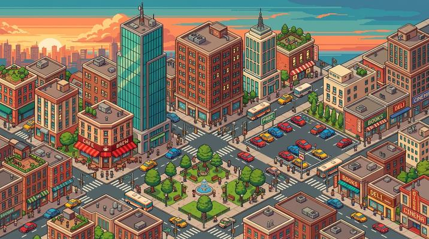

# Isometric Pixel City

[← Back to Image Prompts](../README.md)

Top-down isometric urban grids built from pixel art tiles — the visual language of city-builder and management games like SimCity, Habbo Hotel, and RollerCoaster Tycoon. Every building, road, and tree is a perfectly aligned isometric sprite, creating dense, detail-packed cityscapes that reward zooming in. The charm is in the density of micro-detail: each tiny building has personality, each block tells a story, and the isometric angle gives the flat pixel art a satisfying sense of three-dimensionality.

**Best for:** Desktop wallpapers · Game concept art · Social media posts · Poster prints · Town/city visualizations · App assets



---

## Prompt

Replace the bracketed details with your subject and preferred format.

```text
Isometric pixel art cityscape from a classic 2:1 isometric angle showing a dense [NEIGHBORHOOD — e.g., Chinatown district with red lantern strings, tea houses, and a dragon gate archway], 16:9 landscape format. Every building is a detailed isometric pixel sprite with visible pixel grid. [DETAILS — e.g., neon signage in Chinese characters, steaming dim sum carts on the street, a rooftop martial arts studio]. Limited 64-color palette. Tiny pixel pedestrian sprites and vehicles. [LIGHTING — e.g., warm evening light with red and gold neon glow]. SimCity management-game aesthetic.
```

## With a Reference Image

Attach your image and use this prompt to preserve its defining features while applying the style.

```text
Using the attached aerial/city photo as reference, recreate the scene as an isometric pixel art cityscape from a classic 2:1 isometric angle. Convert each building into a detailed isometric pixel sprite. Limit the palette to 64 colors matching the original tones. Add tiny pixel pedestrian and vehicle sprites. Preserve the neighborhood layout and building density. Visible pixel grid throughout.
```

---

## 💡 Tips & Best Practices

- **"Classic 2:1 isometric angle"**: This is the exact camera angle used by isometric games. Without it, the AI might produce a generic top-down view.
- **Micro-details create magic**: Name specific tiny details — "laundry lines between buildings," "a pixel cat in a window," "steam from a manhole cover." These make the city feel alive.
- **Palette constraint is essential**: "64-color palette" or "48-color palette" keeps it retro. Unlimited colors produce modern digital art rather than pixel art.
- **Name specific game references**: "SimCity," "Habbo Hotel," "RollerCoaster Tycoon" — these establish the exact aesthetic.
- **Common pitfalls**: Avoid "isometric illustration" (too vague — could be non-pixel). Always specify "pixel art" AND "isometric" together. Don't forget the pixel grid.
- **Pairs well with:** [Pixelated / 16-bit](pixelated-16-bit.md) (same medium, side-view vs. isometric), [Minecraft / Voxel](minecraft-voxel.md) (similar blocky aesthetic, 3D vs. 2D)
