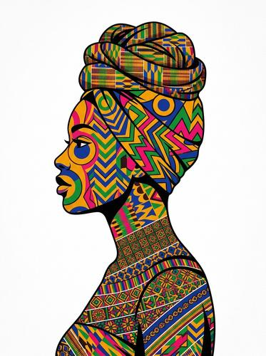

# Kente / Ankara Portraits

[← Back to Image Prompts](../README.md)

Portraits featuring vibrant West African textile traditions — Kente cloth (gold-threaded Ghanaian silk weaves with geometric patterns), Ankara/African wax print (bold, colorful repeating patterns), and traditional African fashion and jewelry. The style celebrates cultural identity through rich, saturated patterns, bold colors, and regal posture.

**Best for:** Profile pictures · Social media posts · Art prints · Cultural celebrations · Fashion concepts · Desktop wallpapers



> **Sample prompt used to generate the above image (Nano Banana 2):**
> ```text
> Portrait photograph of a woman wearing traditional Kente cloth draped over one shoulder, with elaborate gold statement jewelry and a matching headwrap in vibrant Ankara wax print, 3:4 vertical format. The Kente cloth features authentic geometric patterns in gold, emerald green, and royal blue silk threads. The Ankara headwrap has bold, repeating floral motifs in hot pink, orange, and yellow. Warm golden-hour sidelight creating a regal glow on the skin. Clean, earth-toned background. Confident, composed expression. Cultural pride and elegance.
> ```

---

## Prompt Variations

### 🔵 Nano Banana 2 _(Featured)_

**Variation 1 — Regal Portrait** — Portrait with Kente cloth and Ankara headwrap, gold jewelry, warm golden-hour light, confident expression, cultural pride, [FORMAT].

**Variation 2 — Fashion Editorial** — Full-body fashion photo, modern styling with traditional Kente/Ankara textiles, dynamic pose, urban background, editorial lighting, [FORMAT].

**Variation 3 — Pattern Close-Up** — Extreme close-up of [TEXTILE — Kente silk weave / Ankara wax print], showing thread/print detail, texture, vivid colors, [FORMAT].

**Variation 4 — Group / Cultural Event** — Group portrait at a [CELEBRATION], matching Kente/Ankara outfits, traditional styling, warm ambient light, communal joy, [FORMAT].

**Variation 5 — Contemporary Fusion** — Modern outfit incorporating Kente/Ankara elements, streetwear/high fashion fusion, urban setting, confident posture, [FORMAT].

### ChatGPT / Midjourney / Stable Diffusion — Standard templates with "Kente cloth, Ankara wax print, geometric gold patterns, vibrant colors, cultural elegance, warm golden lighting" core keywords.

---

## 🔄 Image-to-Image Transformations

**Nano Banana 2** _(Featured)_
```text
Using the attached portrait, transform the clothing into traditional Kente cloth and Ankara wax print. Replace the outfit with a draped Kente with geometric gold/green/blue patterns. Add an Ankara headwrap with bold floral motifs. Add gold statement jewelry. Apply warm golden-hour lighting. Clean earth-toned background. Regal, culturally vibrant.
```

---

## 💡 Tips & Best Practices
- **Name specific textiles**: "Kente cloth" (geometric, gold-threaded, woven silk) and "Ankara wax print" (bold, colorful, repeating) are different — specify which.
- **Authentic patterns**: "Geometric patterns in gold, emerald, and royal blue silk threads" for Kente. "Bold repeating floral/geometric motifs" for Ankara.
- **Warm golden light**: Golden-hour sidelight creates the warm, regal quality that suits these vibrant textiles.
- **Pairs well with:** [Aboriginal Dot Painting](aboriginal-dot-painting.md) (cultural art traditions), [Día de los Muertos](dia-de-los-muertos.md) (cultural celebration aesthetic)
