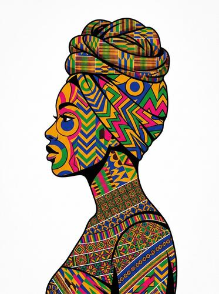

# Kente / Ankara Portraits

[← Back to Image Prompts](../README.md)

Portraits featuring vibrant West African textile traditions — Kente cloth (gold-threaded Ghanaian silk weaves with geometric patterns), Ankara/African wax print (bold, colorful repeating patterns), and traditional African fashion and jewelry. The style celebrates cultural identity through rich, saturated patterns, bold colors, and regal posture.

**Best for:** Profile pictures · Social media posts · Art prints · Cultural celebrations · Fashion concepts · Desktop wallpapers



> **Sample prompt used to generate the above image (Nano Banana 2):**
> ```text
> Portrait photograph of a woman wearing traditional Kente cloth draped over one shoulder, with elaborate gold statement jewelry and a matching headwrap in vibrant Ankara wax print, 3:4 vertical format. The Kente cloth features authentic geometric patterns in gold, emerald green, and royal blue silk threads. The Ankara headwrap has bold, repeating floral motifs in hot pink, orange, and yellow. Warm golden-hour sidelight creating a regal glow on the skin. Clean, earth-toned background. Confident, composed expression. Cultural pride and elegance.
> ```

---

## Prompt Variations

### 🔵 Nano Banana 2 _(Featured)_

**Variation 1 — Regal Portrait** _(Profile Picture)_
```text
Portrait with Kente cloth and Ankara headwrap, gold jewelry, warm golden-hour light, confident expression, cultural pride, [FORMAT].
```

**Variation 2 — Fashion Editorial** _(Art Print)_
```text
Full-body fashion photo, modern styling with traditional Kente/Ankara textiles, dynamic pose, urban background, editorial lighting, [FORMAT].
```

**Variation 3 — Pattern Close-Up** _(Pattern Design)_
```text
Extreme close-up of [TEXTILE — Kente silk weave / Ankara wax print], showing thread/print detail, texture, vivid colors, [FORMAT].
```

**Variation 4 — Group / Cultural Event** _(Art Print)_
```text
Group portrait at a [CELEBRATION], matching Kente/Ankara outfits, traditional styling, warm ambient light, communal joy, [FORMAT].
```

**Variation 5 — Contemporary Fusion** _(Art Print)_
```text
Modern outfit incorporating Kente/Ankara elements, streetwear/high fashion fusion, urban setting, confident posture, [FORMAT].
```

### ChatGPT

**Variation 1 — Regal Portrait** _(Profile Picture)_
```text
Create a portrait of [SUBJECT] wearing traditional Kente cloth draped over one shoulder — authentic geometric patterns in gold, emerald green, and royal blue silk threads — with an Ankara wax print headwrap in bold floral motifs and gold statement jewelry. Warm golden-hour sidelight, clean earth-toned background, confident regal expression. Cultural pride and elegance. 3:4 vertical format.
```

**Variation 2 — Fashion Editorial** _(Fashion Concept)_
```text
Create a full-body fashion editorial photo of [SUBJECT] in a modern outfit built around Kente and Ankara textiles — dynamic pose, urban background, crisp editorial lighting, vibrant saturated patterns. 2:3 vertical format.
```

**Variation 3 — Pattern Close-Up** _(Art Print)_
```text
Create an extreme close-up of [TEXTILE — Kente silk weave or Ankara wax print] showing individual threads and print detail, rich texture, vivid golds, greens, blues, pinks, and oranges. 1:1 square format.
```

### Midjourney

**Variation 1 — Regal Portrait** _(Profile Picture)_
```text
portrait of [SUBJECT] in traditional Kente cloth, geometric gold emerald royal blue patterns, Ankara wax print headwrap, gold statement jewelry, warm golden-hour sidelight, earth-toned background, regal --ar 3:4 --s 250
```

**Variation 2 — Fashion Editorial** _(Fashion Concept)_
```text
full-body fashion editorial, [SUBJECT], modern Kente and Ankara streetwear fusion, dynamic pose, urban setting, editorial lighting, vibrant wax print patterns --ar 2:3 --s 300
```

**Variation 3 — Cultural Celebration** _(Social Media)_
```text
group portrait at [CELEBRATION], matching Kente and Ankara outfits, traditional styling, warm ambient light, communal joy, vibrant colors --ar 3:2 --s 250
```

### Stable Diffusion

**Variation 1 — Regal Portrait** _(Profile Picture)_
- **Prompt:** `portrait, [SUBJECT], traditional Kente cloth, geometric gold emerald royal blue silk patterns, Ankara wax print headwrap, gold jewelry, warm golden-hour lighting, earth-toned background, regal confident expression`
- **Negative Prompt:** `generic fabric, dull colors, harsh flash, distorted patterns, low quality`

**Variation 2 — Fashion Editorial** _(Fashion Concept)_
- **Prompt:** `fashion editorial photo, [SUBJECT], full body, modern Kente Ankara fusion outfit, dynamic pose, urban background, editorial lighting, vibrant wax print patterns`
- **Negative Prompt:** `plain clothing, washed out colors, blurry patterns, low quality`

---

## 🔄 Image-to-Image Transformations

**Nano Banana 2** _(Featured)_
```text
Using the attached portrait, transform the clothing into traditional Kente cloth and Ankara wax print. Replace the outfit with a draped Kente with geometric gold/green/blue patterns. Add an Ankara headwrap with bold floral motifs. Add gold statement jewelry. Apply warm golden-hour lighting. Clean earth-toned background. Regal, culturally vibrant.
```

**ChatGPT**
```text
[Upload Photo] "Transform the clothing in this portrait into draped Kente cloth with geometric gold, green, and blue patterns, add an Ankara wax print headwrap with bold floral motifs and gold statement jewelry, and light it with a warm golden-hour glow."
```

**Midjourney**
```text
[IMAGE_URL] traditional Kente cloth outfit, geometric gold green blue patterns, Ankara wax print headwrap, gold jewelry, warm golden-hour light, regal --iw 1.5 --ar 3:4
```

**Stable Diffusion**
- **Pipeline:** Img2Img · Denoising Strength: `0.5–0.65` (re-dresses subject while keeping likeness)
- **Prompt:** `portrait, Kente cloth, geometric gold green blue patterns, Ankara wax print headwrap, gold jewelry, golden-hour lighting, regal`
- **Negative Prompt:** `plain clothing, dull colors, distorted face, blurry patterns`

---

## 💡 Tips & Best Practices
- **Name specific textiles**: "Kente cloth" (geometric, gold-threaded, woven silk) and "Ankara wax print" (bold, colorful, repeating) are different — specify which.
- **Authentic patterns**: "Geometric patterns in gold, emerald, and royal blue silk threads" for Kente. "Bold repeating floral/geometric motifs" for Ankara.
- **Warm golden light**: Golden-hour sidelight creates the warm, regal quality that suits these vibrant textiles.
- **Pairs well with:** [Aboriginal Dot Painting](aboriginal-dot-painting.md) (cultural art traditions), [Día de los Muertos](dia-de-los-muertos.md) (cultural celebration aesthetic)
