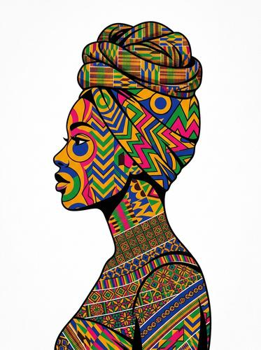

# Kente / Ankara Portraits

[← Back to Image Prompts](../README.md)

Portraits featuring vibrant West African textile traditions — Kente cloth (gold-threaded Ghanaian silk weaves with geometric patterns), Ankara/African wax print (bold, colorful repeating patterns), and traditional African fashion and jewelry. The style celebrates cultural identity through rich, saturated patterns, bold colors, and regal posture.

**Best for:** Profile pictures · Social media posts · Art prints · Cultural celebrations · Fashion concepts · Desktop wallpapers



---

## Prompt

Replace the bracketed details with your subject and preferred format.

```text
Portrait photograph of [SUBJECT] wearing Kente cloth draped over one shoulder and a distinct Ankara wax-print headwrap, [FORMAT]. Show the Kente's woven geometric bands in [KENTE COLORS — e.g., gold, emerald, and royal blue] and the headwrap's bold printed [ANKARA MOTIF — e.g., repeating floral forms in coral and yellow] as clearly different textiles. Add restrained gold jewelry. Warm golden-hour side light models natural skin texture against a quiet earth-toned backdrop. Center the subject's confident, composed expression and the material detail of both fabrics.
```

## With a Reference Image

Attach your image and use this prompt to preserve its defining features while applying the style.

```text
Using the attached portrait, transform the clothing into traditional Kente cloth and Ankara wax print. Replace the outfit with a draped Kente with geometric gold/green/blue patterns. Add an Ankara headwrap with bold floral motifs. Add gold statement jewelry. Apply warm golden-hour lighting. Clean earth-toned background. Regal, culturally vibrant.
```

---

## 💡 Tips & Best Practices
- **Name specific textiles**: "Kente cloth" (geometric, gold-threaded, woven silk) and "Ankara wax print" (bold, colorful, repeating) are different — specify which.
- **Authentic patterns**: "Geometric patterns in gold, emerald, and royal blue silk threads" for Kente. "Bold repeating floral/geometric motifs" for Ankara.
- **Warm golden light**: Golden-hour sidelight creates the warm, regal quality that suits these vibrant textiles.
- **Pairs well with:** [Aboriginal Dot Painting](aboriginal-dot-painting.md) (cultural art traditions), [Día de los Muertos](dia-de-los-muertos.md) (cultural celebration aesthetic)
