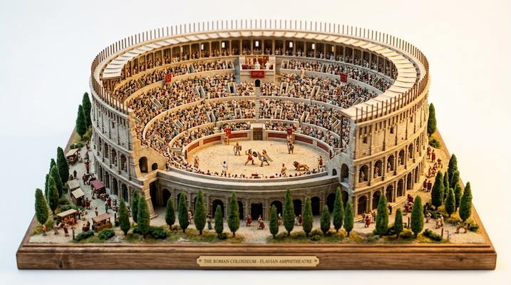

# Landmark Dioramas

[← Back to Image Prompts](../README.md)

Miniature tilt-shift architectural models of real or imaginary landmarks — tiny, meticulously detailed replicas rendered as if photographed on a model-maker's workbench. The style combines architectural precision with the whimsical charm of a scale model, making real-world monuments feel intimate and handcrafted. The tilt-shift lens effect reinforces the sense of miniaturization.

**Best for:** Desktop wallpapers · Travel content · Social media posts · Educational illustrations · Greeting cards · Poster prints



> **Sample prompt used to generate the above image (Nano Banana 2):**
> ```text
> Tilt-shift photograph of a miniature architectural diorama of the Taj Mahal, 16:9 landscape format. The model sits on a wooden display base with a tiny brass nameplate. Incredibly detailed miniature — every dome, minaret, and reflecting pool faithfully reproduced at 1:500 scale. Tiny hand-painted trees line the approach gardens. The marble surfaces have a subtle pearlescent sheen. Warm studio lighting from above-left casting soft shadows. Tilt-shift lens creating a band of sharp focus in the center with gentle blur above and below. The background is a clean workshop surface.
> ```

---

## Prompt Variations

### 🔵 Nano Banana 2 _(Featured)_

> NB2 handles architectural miniatures with remarkable precision. Use real landmark names — NB2's search grounding will reference accurate architectural details. Always include "miniature architectural diorama" and the scale reference (e.g., "1:500 scale") to anchor the miniature aesthetic.

**Variation 1 — Famous Landmark** _(Travel Content, Social Media)_
```text
Tilt-shift photograph of a miniature architectural diorama of [LANDMARK — e.g., the Colosseum in Rome], 16:9 landscape format. The model sits on a wooden display base with a tiny brass nameplate reading the landmark name. Incredibly detailed miniature at approximately 1:500 scale — every arch, column, and stone tier faithfully reproduced. Tiny hand-painted figurines of tourists for scale. Warm studio lighting from above-left casting soft shadows across the model. Tilt-shift lens creating a band of sharp focus on the model with gentle blur above and below.
```

**Variation 2 — Fantasy / Imaginary Structure** _(Desktop Wallpaper, Concept Art)_
```text
Tilt-shift photograph of a miniature architectural diorama of [STRUCTURE — e.g., a floating sky-castle connected to the ground by impossibly thin stone bridges], 16:9 landscape format. Wooden display base with a hand-lettered label. The model is crafted with the same precision as a historical replica — tiny sculpted stone blocks, miniature stained glass windows, impossibly fine suspension cables. Warm studio lighting. Tilt-shift lens effect. Clean workshop background.
```

**Variation 3 — City Block / Neighborhood** _(Urban Planning, Social Media)_
```text
Tilt-shift photograph of a miniature architectural diorama depicting [SCENE — e.g., a bustling Parisian street corner with a corner boulangerie, outdoor café tables, and a flower stall], 16:9 landscape format. Multiple buildings at 1:200 scale showing architectural detail — mansard roofs, wrought-iron balconies, tiny window shutters. Miniature figurines of pedestrians, a cyclist, and a delivery van. Hand-painted details. Warm afternoon studio lighting. Tilt-shift lens with sharp focus on the main building.
```

**Variation 4 — Seasonal Landmark** _(Greeting Card, Holiday Content)_
```text
Tilt-shift photograph of a miniature architectural diorama of [LANDMARK] during [SEASON — e.g., winter with fresh snow covering the rooftops and tiny model evergreen trees dusted in white], 3:4 vertical format. Wooden display base. Miniature string lights along the eaves emitting tiny warm glows. Frost detail on the windows. Tiny figurines bundled in winter clothing. Soft cool-toned studio lighting with warm accent from the miniature lights. Tilt-shift lens. Festive, cozy atmosphere.
```

**Variation 5 — Under Construction / Cutaway** _(Educational, Technical)_
```text
Tilt-shift photograph of a miniature architectural diorama showing [LANDMARK] as a cutaway cross-section, 16:9 landscape format. One quarter of the building is "sliced away" to reveal the interior rooms and structural framework at 1:200 scale. Tiny interior details — miniature furniture, staircases, chandeliers. Labels on thin wire stalks pointing to key architectural features. Wooden display base. Warm studio lighting from above. Tilt-shift lens. Educational, museum-exhibit aesthetic.
```

### ChatGPT

**Variation 1 — Famous Landmark**
```text
Create a tilt-shift photograph of a miniature architectural diorama of [LANDMARK]. The model sits on a wooden display base with a brass nameplate. Incredibly detailed at 1:500 scale with tiny figurines for scale reference. Warm studio lighting with soft shadows. Tilt-shift lens creating selective focus on the model. 3:2 landscape format.
```

**Variation 2 — City Block**
```text
Create a tilt-shift photograph of a miniature diorama depicting [CITY SCENE] at 1:200 scale. Multiple buildings with architectural detail — roofs, balconies, windows. Miniature figurines of pedestrians and vehicles. Warm afternoon lighting. Tilt-shift lens effect. 3:2 landscape format.
```

**Variation 3 — Seasonal**
```text
Create a tilt-shift photograph of a miniature diorama of [LANDMARK] in [SEASON]. Add seasonal details — [DETAILS]. Tiny figurines in seasonal clothing. Warm studio lighting. Tilt-shift lens. Festive atmosphere. 2:3 vertical format.
```

**Variation 4 — Floating Base / Clean Studio** _(Social Media, Art Print)_
```text
Create a miniature isometric architectural diorama of [LANDMARK NAME], accurately reflecting its real-world structure and proportions, placed on a small floating base with subtle surrounding buildings and landscape elements inspired by the landmark's city. Realistic materials and natural textures — physically accurate stone, concrete, metal, and glass surfaces. True-to-life color palette based on the actual landmark, muted and realistic tones. Off-white studio background with soft, natural lighting, gentle shadows, and clean composition. High-detail, realistic yet refined 3D render. Premium architectural model aesthetic. No people, no text. 1:1 square format.
```

### Midjourney

**Variation 1 — Famous Landmark**
```text
Tilt-shift photograph, miniature architectural diorama of [LANDMARK], wooden display base, brass nameplate, 1:500 scale, tiny figurines, warm studio lighting, tilt-shift selective focus --ar 16:9
```

**Variation 2 — Fantasy Structure**
```text
Tilt-shift photograph, miniature diorama of [FANTASY STRUCTURE], wooden base, intricate hand-sculpted detail, warm studio lighting, tilt-shift lens, clean background --ar 16:9 --s 200
```

**Variation 3 — Cutaway Cross-Section**
```text
Tilt-shift photograph, miniature architectural diorama cutaway of [LANDMARK], interior rooms visible, tiny furniture and staircases, wire labels, wooden base, studio lighting, educational exhibit --ar 16:9
```

**Variation 4 — Floating Base / Clean Studio**
```text
Miniature isometric architectural diorama of [LANDMARK NAME], accurate proportions, small floating base, surrounding buildings and landscape, realistic materials, natural textures, muted realistic tones, off-white studio background, soft natural lighting, no people, no text --ar 1:1
```

### Stable Diffusion

**Variation 1 — Famous Landmark**
- **Prompt:** `Tilt-shift photograph, miniature architectural diorama of [LANDMARK], wooden display base, 1:500 scale, tiny figurines, warm studio lighting, selective focus, 8k`
- **Negative Prompt:** `full size, real building, photograph of actual landmark, flat, illustration`

**Variation 2 — City Block**
- **Prompt:** `Tilt-shift photograph, miniature diorama of [CITY SCENE], 1:200 scale, multiple buildings, architectural detail, miniature pedestrians, warm lighting, tilt-shift lens, 8k`
- **Negative Prompt:** `full size, real city, aerial photograph, flat, sketch`

**Variation 3 — Floating Base / Clean Studio**
- **Prompt:** `Miniature isometric architectural diorama, [LANDMARK NAME], accurate proportions, floating base, realistic materials, natural textures, muted tones, off-white studio background, soft lighting, premium architectural model, no people, 8k`
- **Negative Prompt:** `full size, real building, tilt-shift, toy-like, cartoon, illustration, flat`

---

## 🔄 Image-to-Image Transformations

Transform photos of real landmarks into miniature diorama versions:

**Nano Banana 2** _(Featured)_
```text
Using the attached photograph of [LANDMARK/BUILDING], transform it into a miniature architectural diorama. Shrink the structure to a tiny model sitting on a wooden display base with a brass nameplate. Add miniature figurines for scale. Apply tilt-shift lens effect with selective focus. Warm studio lighting casting soft shadows. The background should be a clean workshop surface instead of the real sky.
```
> 💡 **Follow-up refinements:**
> - "Add a seasonal overlay — snow on the rooftops"
> - "Show a cutaway of the interior"
> - "Place it alongside two other landmark dioramas as a collection"
> - "Add tiny construction scaffolding on one side"

**ChatGPT**
```text
[Upload Photo] "Transform this building/landmark into a miniature architectural diorama on a wooden display base. Add tiny figurines for scale. Apply tilt-shift lens effect. Warm studio lighting. Clean workshop background."
```

**Midjourney**
```text
[IMAGE_URL] Miniature architectural diorama, wooden display base, tilt-shift lens, tiny figurines, warm studio lighting, clean background --iw 1.5 --ar 16:9
```

**Stable Diffusion**
- **Pipeline:** Img2Img · Denoising Strength: `0.65–0.80`
- **Prompt:** `Miniature architectural diorama, wooden display base, tilt-shift, tiny figurines, warm studio lighting, clean background, 8k`
- **Negative Prompt:** `full size, real building, sky, clouds, realistic`

---

## 💡 Tips & Best Practices

- **Name real landmarks**: NB2 and ChatGPT use search grounding to look up accurate architectural details. "The Parthenon" will produce historically faithful proportions and column styles.
- **Scale reference is critical**: Always include "at 1:500 scale" or "at 1:200 scale" — this anchors the miniature size. Tiny figurines for scale reference help too.
- **The wooden base sells it**: "Wooden display base with a brass nameplate" is the key phrase that shifts from "tiny building" to "museum-quality architectural model."
- **Tilt-shift reinforces miniaturization**: The selective focus band trick your brain into perceiving full-size objects as tiny models.
- **Common pitfalls**: Without the wooden base and tilt-shift, outputs often look like aerial photographs with a blur filter rather than actual miniature dioramas.
- **Pairs well with:** [Tilt-Shift Miniature Effect](tilt-shift-miniature.md) (applies miniature effect to real-world photos), [3D Isometric Resin Sculptures](3d-isometric-resin-sculptures.md) (similar collectible aesthetic)
