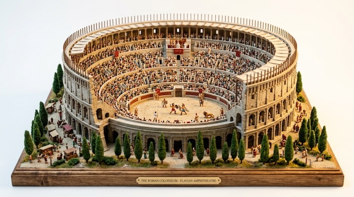

# Landmark Dioramas

[← Back to Image Prompts](../README.md)

Miniature tilt-shift architectural models of real or imaginary landmarks — tiny, meticulously detailed replicas rendered as if photographed on a model-maker's workbench. The style combines architectural precision with the whimsical charm of a scale model, making real-world monuments feel intimate and handcrafted. The tilt-shift lens effect reinforces the sense of miniaturization.

**Best for:** Desktop wallpapers · Travel content · Social media posts · Educational illustrations · Greeting cards · Poster prints



---

## Prompt

Replace the bracketed details with your subject and preferred format.

```text
Tilt-shift photograph of a miniature architectural diorama of [LANDMARK — e.g., the Colosseum in Rome], 16:9 landscape format. The model sits on a wooden display base with a tiny brass nameplate reading the landmark name. Incredibly detailed miniature at approximately 1:500 scale — every arch, column, and stone tier faithfully reproduced. Tiny hand-painted figurines of tourists for scale. Warm studio lighting from above-left casting soft shadows across the model. Tilt-shift lens creating a band of sharp focus on the model with gentle blur above and below.
```

## With a Reference Image

Attach your image and use this prompt to preserve its defining features while applying the style.

```text
Using the attached photograph of [LANDMARK/BUILDING], transform it into a miniature architectural diorama. Shrink the structure to a tiny model sitting on a wooden display base with a brass nameplate. Add miniature figurines for scale. Apply tilt-shift lens effect with selective focus. Warm studio lighting casting soft shadows. The background should be a clean workshop surface instead of the real sky.
```

---

## 💡 Tips & Best Practices

- **Name real landmarks**: Describe defining architectural details alongside the landmark's name, such as the Parthenon's Doric columns and pediments, to help preserve its recognizable proportions.
- **Scale reference is critical**: Always include "at 1:500 scale" or "at 1:200 scale" — this anchors the miniature size. Tiny figurines for scale reference help too.
- **The wooden base sells it**: "Wooden display base with a brass nameplate" is the key phrase that shifts from "tiny building" to "museum-quality architectural model."
- **Tilt-shift reinforces miniaturization**: The selective focus band trick your brain into perceiving full-size objects as tiny models.
- **Common pitfalls**: Without the wooden base and tilt-shift, outputs often look like aerial photographs with a blur filter rather than actual miniature dioramas.
- **Pairs well with:** [Tilt-Shift Miniature Effect](tilt-shift-miniature.md) (applies miniature effect to real-world photos), [3D Isometric Resin Sculptures](3d-isometric-resin-sculptures.md) (similar collectible aesthetic)
