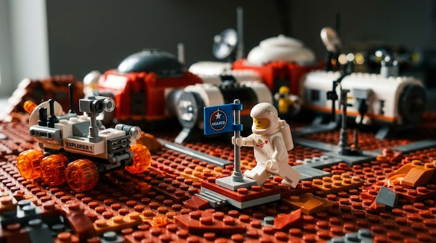

# Lego Photography

[← Back to Image Prompts](../README.md)

Macro photography of Lego minifigures and brick-built environments, capturing the charm of glossy ABS plastic textures, injection mold seams, and classic primary colors. The style works because it simultaneously feels nostalgic and surprisingly cinematic — the lighting and depth of field elevate a child's toy into something worthy of a gallery wall. Perfect for humorous scene recreations, character portraits, or turning real-world scenarios into delightful Lego dioramas.

**Best for:** Social media posts · Humorous scene recreations · Profile pictures · Desktop wallpapers · Greeting cards · Product mockups



> **Sample prompt used to generate the above image (Nano Banana 2):**
> ```text
> Macro photograph of a Lego astronaut minifigure planting a tiny Lego flag on a miniature Lego Mars base, 16:9 landscape format. A small Lego rover with translucent orange wheels parked nearby. Glossy ABS plastic texture with visible injection mold seam lines on every brick. Classic Lego colors — white spacesuit, red planet surface, blue flag. Cinematic side-lighting highlighting the plastic sheen, tilt-shift macro lens with shallow depth of field.
> ```

---

## Prompt Variations

### 🔵 Nano Banana 2 _(Featured)_

> NB2 renders plastic textures and macro photography exceptionally well. Always include "glossy ABS plastic texture with visible injection mold seam lines" — this is the key phrase that keeps the output looking like real Lego rather than generic 3D.

**Variation 1 — Character Portrait** _(Profile Picture, Social Media)_
```text
Macro photograph of a Lego minifigure depicting [SUBJECT — e.g., a pirate captain with a black tricorn hat and hook hand], 1:1 square portrait format. Tight crop from chest up showing the printed torso detail and facial expression. Glossy ABS plastic texture with visible injection mold seam lines. Classic bright Lego primary colors. Shot against a softly blurred brick-built [ENVIRONMENT — e.g., ship deck with Lego barrel and treasure chest]. Cinematic studio lighting highlighting the plastic sheen. Shallow depth of field with tack-sharp focus on the minifigure face.
```

**Variation 2 — Action Scene** _(Social Media Post, Wallpaper)_
```text
Macro photograph of Lego minifigures in a dynamic action scene — [SCENE — e.g., two knights jousting on Lego horses in front of a Lego castle], 16:9 landscape format. Every element constructed entirely from Lego bricks — horses, lances, castle walls, ground plate. Glossy ABS plastic texture with visible injection mold seam lines on every brick. Classic Lego primary colors with translucent pieces for flames or water effects. Dramatic cinematic side-lighting. Tilt-shift macro lens with shallow depth of field, foreground minifigure in sharp focus.
```

**Variation 3 — Real-World Scene Recreation** _(Humorous Post, Conversation Starter)_
```text
Macro photograph recreating a famous scene — [SCENE — e.g., the moon landing, a coffee shop meeting, a wedding ceremony] — using only Lego minifigures and bricks, 16:9 landscape format. Every element is a recognizable Lego piece — no real-world objects. Glossy ABS plastic texture with visible injection mold seam lines. The humor comes from the contrast between the epic subject and the tiny plastic medium. Cinematic lighting matching the mood of the original scene. Shallow depth of field.
```

**Variation 4 — Brick-Built Landscape** _(Desktop Wallpaper, Print)_
```text
Macro photograph of a sweeping Lego landscape with no minifigures — [SCENE — e.g., a Japanese garden with a brick-built torii gate, cherry blossom trees made from pink Lego flowers, and a baseplate pond], 16:9 landscape format. Entirely Lego bricks including trees, water, and sky elements. Glossy ABS plastic texture throughout. Soft golden-hour lighting casting long shadows across the brick surfaces. Deep depth of field showing detail from foreground to background. Dreamy, peaceful mood.
```

**Variation 5 — Holiday / Seasonal Scene** _(Greeting Card, Social Media)_
```text
Macro photograph of a Lego [HOLIDAY — e.g., Christmas] scene — [DETAILS — e.g., a minifigure family decorating a brick-built Christmas tree, tiny Lego presents with printed wrapping paper patterns, a fireplace made from red and grey bricks], 3:4 vertical format. Glossy ABS plastic texture with visible injection mold seam lines on every piece. Warm tungsten lighting from the brick fireplace casting a golden glow. Translucent Lego pieces for fairy lights and candle flames. Shallow depth of field. Cozy, charming, nostalgic.
```

### ChatGPT

**Variation 1 — Character Portrait**
```text
Create a macro photograph of a Lego minifigure depicting [SUBJECT], tight crop from chest up showing the printed torso detail and facial expression. Place against a softly blurred brick-built [ENVIRONMENT]. Cinematic studio lighting highlighting the glossy plastic sheen. Visible injection mold seam lines on each brick. Classic bright Lego primary colors. 1:1 square format. Shallow depth of field.
```

**Variation 2 — Action Scene**
```text
Create a macro photograph of Lego minifigures in a dynamic action scene: [SCENE]. Every element must be constructed from Lego bricks. Glossy ABS plastic texture with injection mold seam lines. Dramatic cinematic side-lighting. Tilt-shift macro lens with shallow depth of field. 3:2 landscape format.
```

**Variation 3 — Real-World Recreation**
```text
Create a macro photograph recreating [FAMOUS SCENE] entirely with Lego minifigures and bricks. Match the lighting and composition of the original but make every element recognizably Lego. Glossy plastic textures, injection mold seams, classic primary colors. The humor comes from the epic-meets-tiny contrast. 3:2 landscape format.
```

### Midjourney

**Variation 1 — Character Portrait**
```text
Macro photograph of a Lego minifigure of [SUBJECT], tight crop, glossy ABS plastic texture, injection mold seam lines, classic Lego colors, blurred brick-built [ENVIRONMENT] background, cinematic studio lighting, shallow depth of field --ar 1:1
```

**Variation 2 — Action Scene**
```text
Macro photograph of Lego minifigures, [ACTION SCENE], all Lego bricks, glossy plastic texture, injection mold seams, dramatic cinematic side-lighting, tilt-shift macro, shallow depth of field --ar 16:9
```

**Variation 3 — Landscape / Wallpaper**
```text
Macro photograph of a sweeping Lego brick-built [LANDSCAPE], no minifigures, glossy ABS plastic, golden-hour lighting, long shadows, deep depth of field, dreamy peaceful mood --ar 16:9
```

### Stable Diffusion

**Variation 1 — Character Portrait**
- **Prompt:** `Macro photograph of a Lego minifigure depicting [SUBJECT], tight crop, glossy ABS plastic, injection mold lines, classic Lego colors, blurred brick [ENVIRONMENT] background, studio lighting, shallow depth of field, 8k`
- **Negative Prompt:** `human skin, real person, illustration, painting`

**Variation 2 — Action Scene**
- **Prompt:** `Macro photograph, Lego minifigures in action, [SCENE], all Lego bricks, glossy plastic, injection mold seams, cinematic lighting, tilt-shift, shallow depth of field, 8k`
- **Negative Prompt:** `real people, illustration, smooth, non-Lego objects`

**Variation 3 — Seasonal / Holiday**
- **Prompt:** `Macro photograph, Lego [HOLIDAY] scene, [DETAILS], glossy ABS plastic, injection mold lines, warm tungsten lighting, translucent Lego pieces, cozy atmosphere, shallow depth of field, 8k`
- **Negative Prompt:** `real objects, human, illustration, dark, horror`

---

## 🔄 Image-to-Image Transformations

Transform existing photos into Lego scenes:

**Nano Banana 2** _(Featured)_
```text
Using the attached photo as reference, recreate the entire scene as a Lego diorama. Convert every person into a Lego minifigure — preserve their clothing colors and hairstyles as printed Lego details. Rebuild the environment entirely from Lego bricks. Maintain the original composition and lighting direction. Glossy ABS plastic texture with visible injection mold seam lines on every piece. Macro photography with shallow depth of field.
```
> 💡 **Follow-up refinements:**
> - "Make the minifigure faces more expressive"
> - "Add more detail to the background — more bricks, more objects"
> - "Use only classic Lego primary colors — no custom prints"
> - "Zoom in tighter on the main character"

**ChatGPT**
```text
[Upload Photo] "Recreate the subject and composition of this photo entirely as a Lego minifigure scene. Convert the person into a Lego minifigure and rebuild the environment from Lego bricks. Preserve clothing colors as printed Lego details. Macro photography with cinematic lighting."
```

**Midjourney**
```text
[IMAGE_URL] Recreated as a Lego minifigure scene, all Lego bricks, glossy ABS plastic texture, injection mold seam lines, bright primary colors, cinematic macro lighting --iw 1.8 --ar 16:9
```

**Stable Diffusion**
- **Pipeline:** Img2Img · Denoising Strength: `0.65–0.80` (heavy transformation needed to convert to Lego)
- **Prompt:** `Lego minifigure scene, all Lego bricks, glossy ABS plastic, injection mold lines, classic primary colors, macro photography, cinematic lighting, 8k`
- **Negative Prompt:** `human skin, real person, real objects, illustration`

---

## 💡 Tips & Best Practices

- **The magic phrase**: "Glossy ABS plastic texture with visible injection mold seam lines" is what makes it look like *real Lego* rather than generic 3D blocks.
- **Use real Lego part names**: "Translucent 1×1 round plate," "2×4 brick," "minifigure head with printed face" — these terms ground the AI in actual Lego vocabulary.
- **Lighting sells it**: Macro photography of real Lego uses dramatic side-lighting that catches the plastic sheen. Specify "cinematic side-lighting highlighting the plastic sheen" for best results.
- **Shallow depth of field**: Real Lego macro photos always have dramatic bokeh. Never skip "shallow depth of field" — it's what makes tiny Lego look cinematic.
- **Common pitfalls**: Avoid "Lego-style" (too vague) — instead specify actual Lego elements. Don't mix real objects with Lego; the whole scene should be bricks.
- **Pairs well with:** [Minecraft / Voxel](minecraft-voxel.md) (similar toy aesthetic, different geometry), [Miniature People](miniature-people.md) (similar macro photography charm)
