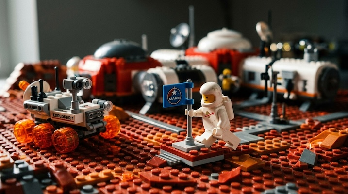

# Lego Photography

[← Back to Image Prompts](../README.md)

Macro photography of Lego minifigures and brick-built environments, capturing the charm of glossy ABS plastic textures, injection mold seams, and classic primary colors. The style works because it simultaneously feels nostalgic and surprisingly cinematic — the lighting and depth of field elevate a child's toy into something worthy of a gallery wall. Perfect for humorous scene recreations, character portraits, or turning real-world scenarios into delightful Lego dioramas.

**Best for:** Social media posts · Humorous scene recreations · Profile pictures · Desktop wallpapers · Greeting cards · Product mockups



---

## Prompt

Replace the bracketed details with your subject and preferred format.

```text
Macro photograph of a brick-built LEGO scene featuring [SUBJECT AND ACTION — e.g., an astronaut planting a flag] in [ENVIRONMENT — e.g., a miniature Mars base], [FORMAT]. Build the figures, props, and setting entirely from recognizable interlocking bricks and minifigure parts. Show the glossy ABS plastic, molded studs, printed torso and face details, and subtle injection-mold seams. Compose at minifigure eye level so the main action reads clearly; use warm directional studio light to catch the plastic sheen and a shallow depth of field that keeps the subject sharp while the brick-built setting falls softly out of focus.
```

## With a Reference Image

Attach your image and use this prompt to preserve its defining features while applying the style.

```text
Using the attached photo as reference, recreate the entire scene as a Lego diorama. Convert every person into a Lego minifigure — preserve their clothing colors and hairstyles as printed Lego details. Rebuild the environment entirely from Lego bricks. Maintain the original composition and lighting direction. Glossy ABS plastic texture with visible injection mold seam lines on every piece. Macro photography with shallow depth of field.
```

---

## 💡 Tips & Best Practices

- **The magic phrase**: "Glossy ABS plastic texture with visible injection mold seam lines" is what makes it look like *real Lego* rather than generic 3D blocks.
- **Use real Lego part names**: "Translucent 1×1 round plate," "2×4 brick," "minifigure head with printed face" — these terms ground the AI in actual Lego vocabulary.
- **Lighting sells it**: Macro photography of real Lego uses dramatic side-lighting that catches the plastic sheen. Specify "cinematic side-lighting highlighting the plastic sheen" for best results.
- **Shallow depth of field**: Real Lego macro photos always have dramatic bokeh. Never skip "shallow depth of field" — it's what makes tiny Lego look cinematic.
- **Common pitfalls**: Avoid "Lego-style" (too vague) — instead specify actual Lego elements. Don't mix real objects with Lego; the whole scene should be bricks.
- **Pairs well with:** [Minecraft / Voxel](minecraft-voxel.md) (similar toy aesthetic, different geometry), [Miniature People](miniature-people.md) (similar macro photography charm)
