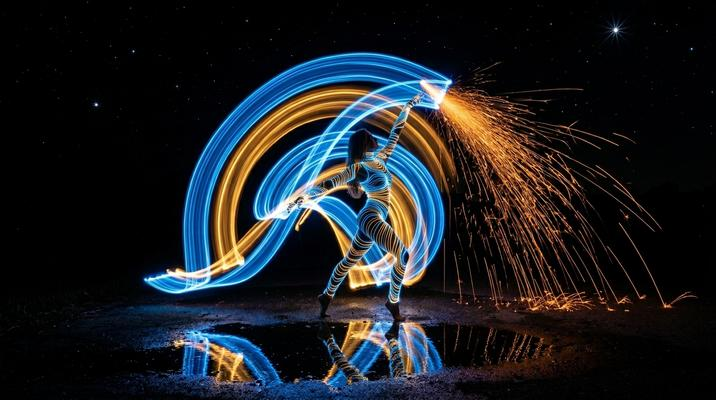

# Long Exposure Light Painting

[← Back to Image Prompts](../README.md)

Night photography with flowing light trails forming subjects — steel wool sparks, LED wands, car headlight traces, and sparklers. Pure light captured over seconds or minutes against pitch-black backgrounds, creating ethereal, kinetic compositions.



> **Sample prompt used to generate the above image (Nano Banana 2):**
> ```text
> Long exposure light painting photograph of a dancer's silhouette traced entirely by flowing LED light trails in electric blue and molten gold, captured against a pitch-black night background, 16:9 landscape format. The dancer's arms sweep upward in an arc, leaving continuous glowing trails that show the full motion path — a single fluid gesture frozen across several seconds of exposure. Steel wool sparks cascade from the dancer's hand in a radial shower of orange light. The ground reflects the light trails in a still puddle. Star points and slight diffraction spikes on the brightest light sources. Camera on tripod, long exposure silky smooth light trails with no noise.
> ```

**ChatGPT**
```text
Create a long exposure light painting photograph of [SUBJECT] traced entirely by flowing light trails in [COLOR 1] and [COLOR 2], captured against a pitch-black night background. The light trails should show the full motion path — continuous glowing lines frozen across several seconds of exposure. Include [LIGHT SOURCE — e.g., "steel wool sparks cascading in a radial shower," "LED wand traces," "sparkler arcs"]. Reflections in a still puddle or wet surface below. Star points and diffraction spikes on the brightest light sources. Silky smooth trails with no noise — long exposure on a tripod.
```

**Midjourney**
```text
Long exposure light painting photograph, [SUBJECT] traced by flowing light trails in [COLOR 1] and [COLOR 2], pitch-black night background, continuous glowing motion paths, [LIGHT SOURCE], reflections in wet surface, star points, silky smooth trails --ar 16:9 --s 200
```

**Stable Diffusion**
- **Prompt:** `Long exposure light painting photograph, [SUBJECT] traced by light trails, [COLOR 1] and [COLOR 2], pitch-black background, flowing continuous glowing paths, [LIGHT SOURCE], wet surface reflections, star diffraction, 8k`
- **Negative Prompt:** `daytime, bright, short exposure, blurry, noise, illustration`

**Nano Banana 2**
```text
Long exposure light painting photograph of [SUBJECT] traced entirely by flowing light trails in [COLOR 1] and [COLOR 2] against a pitch-black night background, 16:9 landscape format. Light trails show the full motion path — continuous glowing lines frozen across several seconds of exposure. [LIGHT SOURCE — e.g., "steel wool sparks cascading in a radial shower," "LED wand traces"]. Ground reflects the light trails in a still puddle. Star points and diffraction spikes on brightest light sources. Silky smooth trails, no noise.
```
