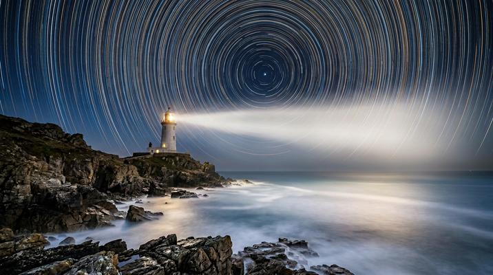

# Long Exposure / Light Painting

[← Back to Image Prompts](../README.md)

Time collapsed into a single frame — star trails arcing across the sky, car headlights streaking into ribbons of light, steel wool sparks drawing fiery orbs, and water smoothed to silk. Long exposure transforms the dynamic into the static, revealing the invisible flow of time as luminous trails and silky textures.

**Best for:** Desktop wallpapers · Social media posts · Art prints · Phone wallpapers · Photography inspiration · Night sky content



> **Sample prompt used to generate the above image (Nano Banana 2):**
> ```text
> Long exposure photograph of a coastal lighthouse at night with star trails circling Polaris in concentric arcs above, 16:9 landscape format. 4-hour exposure — hundreds of star trails forming perfect concentric circles. The ocean waves are smoothed to a flat milky surface reflecting the lighthouse beam. The lighthouse beam sweeps as a bright fan of light across the frame. Rocky foreground with sharp detail. Dark blue night sky graduating to lighter blue near the horizon. The star trails glow in subtle warm and cool colors — blue, gold, white.
> ```

---

## Prompt Variations

### 🔵 Nano Banana 2 _(Featured)_

**Variation 1 — Star Trails** _(Desktop Wallpaper, Print)_
```text
Long exposure photograph of [SCENE — e.g., a desert canyon with a natural rock arch] with star trails circling Polaris, [FORMAT]. [DURATION — e.g., 3-hour] exposure producing concentric star trail arcs. [FOREGROUND — e.g., the rock arch is sharp and lit by warm flashlight painting]. Night sky filled with hundreds of star trails in subtle colors — blue, gold, white. [HORIZON DETAIL]. No clouds. Deep blue to black sky gradient.
```

**Variation 2 — Light Trails / Traffic** _(Social Media, Urban Photography)_
```text
Long exposure photograph of [SCENE — e.g., a suspension bridge at twilight with heavy traffic], [FORMAT]. [DURATION — e.g., 30-second] exposure — car headlights become continuous white light ribbons and taillights become red ribbons, flowing across the bridge. The bridge structure is sharp. City skyline lit warm in the background. Blue-hour twilight sky. Light trails curve with the road geometry. The traffic becomes abstract art.
```

**Variation 3 — Light Painting Portrait** _(Social Media, Art)_
```text
Long exposure light painting portrait — [SUBJECT — e.g., a person standing still while colored LED wands trace glowing patterns around them], [FORMAT]. The person is frozen and sharp (illuminated by a brief flash). The light painting surrounds them — [PATTERN — e.g., swirling orbits of cyan, magenta, and gold light, drawn with LED tools during the exposure]. Pure black background. The light trails are smooth, continuous, and luminous. Ethereal, magical.
```

**Variation 4 — Steel Wool Spinning** _(Social Media, Print)_
```text
Long exposure photograph of [FIGURE] spinning burning steel wool on a chain in [LOCATION — e.g., an abandoned tunnel], [FORMAT]. Thousands of bright orange-white spark trails radiate outward in a perfect spherical pattern. Sparks bounce and create secondary trails where they hit surfaces. The tunnel walls are illuminated by the warm spark glow. The spinner is a blurred silhouette at the center. Long exposure smooths the spin into a perfect glowing orb. Dramatic, dangerous, beautiful.
```

**Variation 5 — Silky Water** _(Desktop Wallpaper, Print)_
```text
Long exposure photograph of [WATER SCENE — e.g., a waterfall cascading over mossy rocks into a pool], [FORMAT]. [DURATION — e.g., 2-second] exposure smoothing the water into flowing silk — the waterfall becomes a continuous white veil, the pool surface becomes glassy. The rocks and moss are tack-sharp — only the water is blurred. [LIGHTING — e.g., soft overcast light with rich green saturation]. The contrast between sharp rock and silky water is the magic.
```

### ChatGPT / Midjourney / Stable Diffusion — Standard templates.

### ChatGPT
```text
Var 1: Create a long exposure with star trails over [SCENE]. Concentric arcs. Sharp foreground lit by flashlight. Deep blue sky. [FORMAT].
Var 2: Create a long exposure of [SCENE] with car light trails. White headlight ribbons, red taillight ribbons. Blue-hour sky. [FORMAT].
Var 3: Create a long exposure steel wool spin in [LOCATION]. Radial spark trails. Spinner silhouette. Warm glow on surfaces. [FORMAT].
```

### Midjourney
```text
Var 1: Long exposure, star trails, [SCENE], concentric arcs, sharp foreground, deep blue sky --ar 16:9
Var 2: Long exposure, light trails, [SCENE], white red ribbons, blue hour twilight --ar 16:9
Var 3: Long exposure, silky waterfall, [SCENE], smooth water veil, sharp rocks, overcast --ar 4:5
```

### Stable Diffusion
- **Var 1:** `Long exposure, star trails, [SCENE], concentric arcs, sharp foreground, deep blue, 8k` / Neg: `daytime, sharp stars, illustration, cartoon`
- **Var 2:** `Long exposure, light trails, [SCENE], traffic ribbons, blue hour, 8k` / Neg: `daytime, sharp cars, illustration`

---

## 🔄 Image-to-Image Transformations

**Nano Banana 2** _(Featured)_
```text
Using the attached photo, apply long exposure effects. [CHOOSE: smooth all water to silky texture / transform lights into flowing ribbons / add star trails to the sky]. The static elements should remain sharp while moving elements blur into smooth, continuous streams. Maintain the original composition and static details.
```
> 💡 **Refinements:** "Longer exposure — more blur" · "Add star trails" · "Add light painting trails around the subject" · "Smooth the water more"

---

## 💡 Tips & Best Practices

- **Specify the duration**: "30-second exposure," "4-hour exposure" — this tells the AI how much blur to apply.
- **Sharp vs. blurred contrast**: The beauty is in the contrast — sharp rocks with silky water, sharp bridge with flowing light trails.
- **Star trails need darkness**: Always specify night sky, no clouds, and the location of Polaris for concentric trails.
- **Common pitfalls**: "Blurry" alone is not long exposure — you need directional motion blur or time-based smoothing.
- **Pairs well with:** [Cinematic Macro Photography](cinematic-macro-photography.md) (both reveal invisible phenomena), [Bioluminescent Underwater](bioluminescent-underwater.md) (similar light-in-darkness aesthetic)
