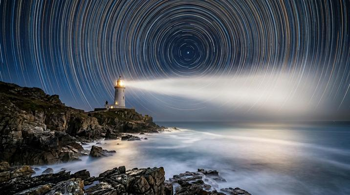

# Long Exposure / Light Painting

[← Back to Image Prompts](../README.md)

Time collapsed into a single frame — star trails arcing across the sky, car headlights streaking into ribbons of light, steel wool sparks drawing fiery orbs, and water smoothed to silk. Long exposure transforms the dynamic into the static, revealing the invisible flow of time as luminous trails and silky textures.

**Best for:** Desktop wallpapers · Social media posts · Art prints · Phone wallpapers · Photography inspiration · Night sky content



---

## Prompt

Replace the bracketed details with your subject and preferred format.

```text
Long exposure photograph of [SCENE — e.g., a desert canyon with a natural rock arch] with star trails circling Polaris, [FORMAT]. [DURATION — e.g., 3-hour] exposure producing concentric star trail arcs. [FOREGROUND — e.g., the rock arch is sharp and lit by warm flashlight painting]. Night sky filled with hundreds of star trails in subtle colors — blue, gold, white. [HORIZON DETAIL]. No clouds. Deep blue to black sky gradient.
```

## With a Reference Image

Attach your image and use this prompt to preserve its defining features while applying the style.

```text
Using the attached photo, apply long exposure effects. [CHOOSE: smooth all water to silky texture / transform lights into flowing ribbons / add star trails to the sky]. The static elements should remain sharp while moving elements blur into smooth, continuous streams. Maintain the original composition and static details.
```

---

## 💡 Tips & Best Practices

- **Specify the duration**: "30-second exposure," "4-hour exposure" — this tells the AI how much blur to apply.
- **Sharp vs. blurred contrast**: The beauty is in the contrast — sharp rocks with silky water, sharp bridge with flowing light trails.
- **Star trails need darkness**: Always specify night sky, no clouds, and the location of Polaris for concentric trails.
- **Common pitfalls**: "Blurry" alone is not long exposure — you need directional motion blur or time-based smoothing.
- **Pairs well with:** [Cinematic Macro Photography](cinematic-macro-photography.md) (both reveal invisible phenomena), [Bioluminescent Underwater](bioluminescent-underwater.md) (similar light-in-darkness aesthetic)
