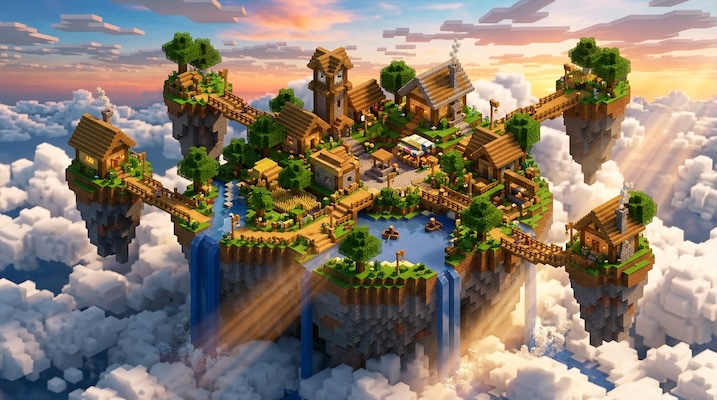

# Minecraft / Voxel

[← Back to Image Prompts](../README.md)

Blocky, volumetric voxel aesthetics with cubic geometry and ray-traced lighting, evoking the Minecraft visual language.



> **Sample prompt used to generate the above image (Nano Banana 2):**
> ```text
> 3D voxel art scene of a floating island village suspended in the sky, connected by wooden plank bridges, with waterfalls cascading off the edges into the clouds below, 16:9 landscape format. Constructed entirely from perfectly cubic blocks in the Minecraft visual style. RTX ray-traced lighting with golden-hour sunbeams filtering through the waterfall mist. Lush green grass blocks, oak wood, and glowing lantern blocks. Isometric camera perspective.
> ```

**ChatGPT**
```text
Create a 3D voxel art scene of [SUBJECT] set in a [ENVIRONMENT], constructed entirely from perfectly cubic blocks in the visual style of Minecraft with RTX ray tracing enabled. Include volumetric lighting with sunbeams filtering through the environment, glowing light-emitting blocks, and a rich, saturated color palette. Isometric camera perspective.
```

**Midjourney**
```text
Voxel art scene of [SUBJECT] in a [ENVIRONMENT], Minecraft aesthetic, perfect cubic blocks, RTX ray-traced lighting, volumetric sunbeams, glowing emissive blocks, rich saturated colors, isometric camera perspective --ar 16:9
```

**Stable Diffusion**
- **Prompt:** `Voxel art, 3D pixel art, [SUBJECT] in [ENVIRONMENT], Minecraft aesthetic, perfect cubic blocks, ray-traced volumetric lighting, glowing blocks, saturated colors, isometric perspective, octane render`
- **Negative Prompt:** `smooth, rounded, organic curves, realistic photograph`

**Nano Banana 2**
```text
3D voxel art scene of [SUBJECT] in a [ENVIRONMENT] constructed entirely from perfectly cubic blocks in the Minecraft visual style, 16:9 landscape format. RTX ray-traced lighting with volumetric sunbeams filtering through the scene. Glowing emissive light-emitting blocks, rich saturated color palette. Isometric camera perspective.
```
