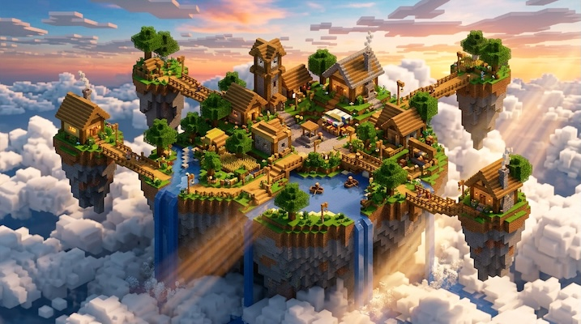

# Minecraft / Voxel

[← Back to Image Prompts](../README.md)

Blocky cubic geometry, visible voxel grids, and RTX ray-traced lighting in the Minecraft visual language. Everything is constructed from cubes — terrain, characters, animals, structures — but the lighting is cinematic, with dynamic shadows, volumetric fog, and realistic reflections on water. The contrast between the primitive geometry and the sophisticated lighting is what makes this style so visually striking.

**Best for:** Desktop wallpapers · Gaming content · YouTube thumbnails · Social media posts · Phone wallpapers · Twitch banners



---

## Prompt

Replace the bracketed details with your subject and preferred format.

```text
Minecraft-style voxel render of [ENVIRONMENT — e.g., a volcanic island with lava rivers flowing between obsidian cliffs into a vast ocean], 16:9 landscape format. Blocky cubic geometry — every element composed of visible voxel cubes. RTX ray-traced lighting with [LIGHTING — e.g., dramatic orange glow from the lava illuminating the obsidian surfaces]. Volumetric smoke and steam rising from where lava meets water. Reflective water surface catching the fiery sky. Cinematic wide-angle composition. Deep depth of field showing detail from foreground to horizon.
```

## With a Reference Image

Attach your image and use this prompt to preserve its defining features while applying the style.

```text
Using the attached photo as reference, recreate the entire scene in Minecraft voxel style. Convert all organic forms into blocky cubic geometry — every element composed of visible voxel cubes. Preserve the original composition and color palette but rebuild everything from blocks. Apply RTX ray-traced lighting matching the original lighting direction. Volumetric fog for atmosphere.
```

---

## 💡 Tips & Best Practices

- **The duality is the style**: The magic is the contrast between primitive cubic geometry and cinematic RTX lighting. Always include both elements.
- **Block textures matter**: Reference specific Minecraft block names — "oak planks," "cobblestone," "obsidian," "glowstone" — for authentic textures.
- **Prevent smoothing**: Without explicit "blocky cubic geometry" language, AI models tend to smooth blocks into rounded voxels. Be forceful about cubes.
- **Lighting is 80% of the mood**: "Sunset through spruce trees" and "torch-lit cave" and "underwater elder guardian chamber" are all Minecraft — the lighting changes everything.
- **Common pitfalls**: Avoid "Minecraft-inspired" (too loose) — specify "Minecraft-style voxel" with explicit block geometry. Don't ask for realistic proportions on characters — embrace the rectangular body and square head.
- **Pairs well with:** [Isometric Pixel City](isometric-pixel-city.md) (similar blocky aesthetic, different perspective), [Lego Photography](lego-photography.md) (similar toy-world charm)
