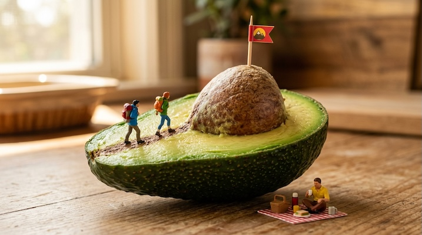

# Miniature People in Everyday Objects

[← Back to Image Prompts](../README.md)

Tiny figurines — at the scale of ants — interacting with full-size everyday objects as if they were vast landscapes. A coffee cup becomes a swimming pool, a sliced orange becomes a sunset horizon, a keyboard becomes an urban plaza. The humor and wonder come from the radical scale shift, where mundane objects are recontextualized as epic architectural or natural environments. Inspired by the real-world miniature photography of Tatsuya Tanaka and Slinkachu.

**Best for:** Social media posts · Creative advertising · Desktop wallpapers · Editorial illustrations · Conversation starters · Brand marketing



> **Sample prompt used to generate the above image (Nano Banana 2):**
> ```text
> Macro photograph of a tiny figurine construction crew laying asphalt on the surface of a chocolate chip cookie, 16:9 landscape format. Three miniature workers in orange safety vests and hard hats — one operating a tiny steamroller flattening chocolate chips, another shoveling crumbs with a miniature shovel, a third directing traffic with a tiny sign. The cookie surface is a detailed terrain of cracks and chip craters. A full-size glass of milk looms in the background, blurred. Warm studio lighting from above-left. Tilt-shift macro lens with shallow depth of field. Whimsical, humorous.
> ```

---

## Prompt Variations

### 🔵 Nano Banana 2 _(Featured)_

> NB2 handles macro photography and scale contrast brilliantly. The key is describing the mundane object's surface *as if it were terrain* — "the cookie surface is a detailed terrain of cracks and craters." This guides the AI to treat the object as a landscape rather than just making small people.

**Variation 1 — Food as Landscape** _(Social Media Post)_
```text
Macro photograph of tiny figurines using [FOOD — e.g., a halved avocado] as a landscape — [SCENE — e.g., two miniature sunbathers lounging in the avocado pit cavity as if it were a spa pool, tiny towels and umbrellas placed on the green flesh surface], 16:9 landscape format. The food surface is treated as realistic terrain at miniature scale. Full-size kitchen items blurred in the background for scale reference. Warm studio lighting from above-left. Tilt-shift macro lens with shallow depth of field. Whimsical, charming.
```

**Variation 2 — Office / Tech Object** _(Brand Marketing, Creative Ad)_
```text
Macro photograph of tiny figurines interacting with [OBJECT — e.g., a full-size mechanical keyboard] — [SCENE — e.g., miniature parkour athletes leaping between keycaps as if running across rooftops, one figure rappelling down the side of the spacebar], 16:9 landscape format. The keycap surfaces show visible texture at macro scale. RGB backlighting from between the keys casting colored light upward on the tiny figures. Tilt-shift macro lens. Dramatic, action-oriented.
```

**Variation 3 — Nature / Garden Scene** _(Desktop Wallpaper, Print)_
```text
Macro photograph of tiny figurines exploring [OBJECT — e.g., a potted succulent] as if it were a vast alien forest — [SCENE — e.g., a miniature explorer with a backpack and walking stick navigating between the fleshy leaves, another figure photographing a dewdrop the size of a boulder], 16:9 landscape format. The succulent leaves are textured terrain at macro scale — visible cell patterns, tiny hairs, dewdrop reflections. Natural window light creating dappled shadows through the leaves. Tilt-shift macro lens. Sense of wonder and discovery.
```

**Variation 4 — Seasonal / Holiday** _(Greeting Card, Social Media)_
```text
Macro photograph of tiny figurines in a [HOLIDAY] scene using everyday objects — [SCENE — e.g., miniature ice skaters skating on the frozen surface of a spilled coffee puddle on a white saucer, a sugar cube serving as a warming hut with a tiny paper flag], 3:4 vertical format. The spilled coffee has a realistic glossy frozen-liquid surface. A full-size coffee mug looms in the background. Warm festive studio lighting. Tilt-shift macro lens. Cozy, playful holiday mood.
```

**Variation 5 — Narrative Moment / Story Scene** _(Editorial, Art Print)_
```text
Macro photograph telling a micro-story — [NARRATIVE — e.g., a tiny figurine proposing to another on the rim of a wine glass at sunset, the wine reflecting golden light upward onto their faces, a miniature string quartet playing on the saucer below], 3:4 vertical portrait format. The wine glass surface shows realistic reflections and refractions at macro scale. The wine inside catches warm backlight. Cinematic golden-hour lighting. Tilt-shift macro lens with very shallow depth of field focused on the couple. Romantic, emotionally resonant.
```

### ChatGPT

**Variation 1 — Food as Landscape**
```text
Create a macro photograph of tiny figurines using [FOOD] as a landscape: [SCENE]. The food surface should be treated as realistic terrain at miniature scale. Full-size objects blurred in background for scale. Warm studio lighting. Tilt-shift macro lens with shallow depth of field. Whimsical and charming. 3:2 landscape format.
```

**Variation 2 — Tech / Office Object**
```text
Create a macro photograph of tiny figurines interacting with a full-size [OBJECT]: [SCENE]. The object's surface textures are visible at macro scale. Dramatic lighting from the object itself when possible. Tilt-shift macro lens. Action-oriented mood. 3:2 landscape format.
```

**Variation 3 — Narrative Moment**
```text
Create a macro photograph telling a micro-story: [NARRATIVE]. The everyday object becomes a dramatic stage. Cinematic lighting matching the emotional tone. Very shallow depth of field focused on the key characters. 2:3 vertical format.
```

### Midjourney

**Variation 1 — Food Scene**
```text
Macro photograph, tiny figurines using [FOOD] as landscape, [SCENE], food surface as terrain, full-size background objects blurred, warm studio lighting, tilt-shift macro, shallow depth of field, whimsical --ar 16:9
```

**Variation 2 — Office Object**
```text
Macro photograph, tiny figurines on [OBJECT], [SCENE], macro-scale surface textures, dramatic lighting, tilt-shift lens, action mood --ar 16:9
```

**Variation 3 — Narrative**
```text
Macro photograph, micro-story of tiny figurines, [NARRATIVE], everyday object as dramatic stage, cinematic lighting, very shallow depth of field, emotional --ar 4:5
```

### Stable Diffusion

**Variation 1 — Food Scene**
- **Prompt:** `Macro photograph, tiny figurines on [FOOD], miniature people using food as landscape, [SCENE], tilt-shift, warm studio lighting, shallow depth of field, whimsical, 8k`
- **Negative Prompt:** `normal size people, illustration, cartoon, full body standing, flat`

**Variation 2 — Object Scene**
- **Prompt:** `Macro photograph, tiny figurines on [OBJECT], [SCENE], macro surface textures, dramatic lighting, tilt-shift lens, 8k`
- **Negative Prompt:** `normal size, illustration, flat lighting, blurry, low quality`

**Variation 3 — Narrative**
- **Prompt:** `Macro photograph, micro-story, tiny figurines, [NARRATIVE], cinematic lighting, shallow depth of field, emotional, tilt-shift, 8k`
- **Negative Prompt:** `normal size, cartoon, flat, illustration, low quality`

---

## 🔄 Image-to-Image Transformations

Transform photos of everyday objects into miniature people scenes:

**Nano Banana 2** _(Featured)_
```text
Using the attached photo of [OBJECT/FOOD], add tiny figurines interacting with the surface as if it were a vast landscape. The figurines should be at ant-scale relative to the object. [DESCRIBE THE SCENE — e.g., miniature hikers climbing the crust of this bread loaf as if scaling a mountain]. Treat the object's surface as realistic terrain at macro scale. Preserve the original lighting direction. Add tilt-shift macro depth of field.
```
> 💡 **Follow-up refinements:**
> - "Add more figurines doing different activities"
> - "Change the narrative — make it a rescue scene instead"
> - "Add tiny vehicles — a miniature fire truck, construction equipment"
> - "Make the background blurrier to emphasize the scale shift"

**ChatGPT**
```text
[Upload Photo] "Add tiny figurines to this photo, interacting with the [OBJECT] as if it were a vast landscape. The figurines should be ant-scale. [DESCRIBE SCENE]. Tilt-shift macro depth of field. Preserve the original lighting."
```

**Midjourney**
```text
[IMAGE_URL] Add tiny miniature figurines interacting with the object as landscape, [SCENE], tilt-shift macro, shallow depth of field, whimsical --iw 1.5 --ar 16:9
```

**Stable Diffusion**
- **Pipeline:** Img2Img · Denoising Strength: `0.50–0.65` (moderate — need to add figurines while preserving the object)
- **Prompt:** `Macro photograph, tiny figurines on [OBJECT], miniature people as landscape, tilt-shift, warm lighting, shallow depth of field, 8k`
- **Negative Prompt:** `normal size people, cartoon, illustration, flat`

---

## 💡 Tips & Best Practices

- **Surface-as-terrain is the key concept**: Describe the everyday object's surface as if it were a landscape — "the cookie surface is a terrain of cracks and craters," "the avocado flesh is rolling green hills." This is what makes the AI treat the scale shift correctly.
- **Scale references sell the illusion**: Always include one blurred full-size object in the background (a coffee mug, a hand, a fork) to anchor the viewer's sense of scale.
- **Specific figurine professions add story**: "Construction workers," "sunbathers," "explorers," "photographers" — these imply a narrative that makes the image delightful.
- **Macro lens language matters**: "Tilt-shift macro lens with shallow depth of field" is essential. Without it, the image reads as a collage rather than a believable photograph.
- **Common pitfalls**: Avoid making the figurines too large — they should be ant-scale (2–3mm). Don't describe them as "people" (implies full-size) — use "tiny figurines" or "miniature figures."
- **Pairs well with:** [Tilt-Shift Miniature Effect](tilt-shift-miniature.md) (same miniaturization, different direction), [Lego Photography](lego-photography.md) (similar charm with toy subjects)
