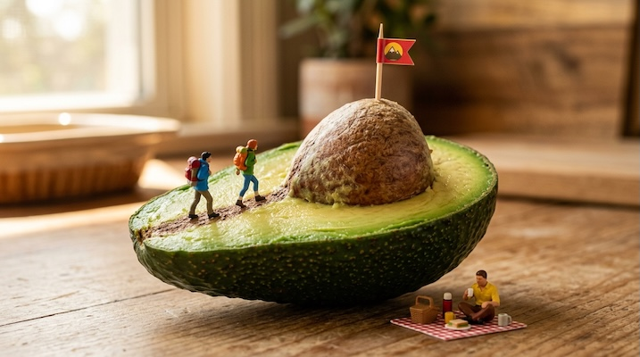

# Miniature People in Everyday Objects

[← Back to Image Prompts](../README.md)

Tiny figurines — at the scale of ants — interacting with full-size everyday objects as if they were vast landscapes. A coffee cup becomes a swimming pool, a sliced orange becomes a sunset horizon, a keyboard becomes an urban plaza. The humor and wonder come from the radical scale shift, where mundane objects are recontextualized as epic architectural or natural environments. Inspired by the real-world miniature photography of Tatsuya Tanaka and Slinkachu.

**Best for:** Social media posts · Creative advertising · Desktop wallpapers · Editorial illustrations · Conversation starters · Brand marketing



---

## Prompt

Replace the bracketed details with your subject and preferred format.

```text
Macro photograph of tiny figurines using [FOOD — e.g., a halved avocado] as a landscape — [SCENE — e.g., two miniature sunbathers lounging in the avocado pit cavity as if it were a spa pool, tiny towels and umbrellas placed on the green flesh surface], 16:9 landscape format. The food surface is treated as realistic terrain at miniature scale. Full-size kitchen items blurred in the background for scale reference. Warm studio lighting from above-left. Tilt-shift macro lens with shallow depth of field. Whimsical, charming.
```

## With a Reference Image

Attach your image and use this prompt to preserve its defining features while applying the style.

```text
Using the attached photo of [OBJECT/FOOD], add tiny figurines interacting with the surface as if it were a vast landscape. The figurines should be at ant-scale relative to the object. [DESCRIBE THE SCENE — e.g., miniature hikers climbing the crust of this bread loaf as if scaling a mountain]. Treat the object's surface as realistic terrain at macro scale. Preserve the original lighting direction. Add tilt-shift macro depth of field.
```

---

## 💡 Tips & Best Practices

- **Surface-as-terrain is the key concept**: Describe the everyday object's surface as if it were a landscape — "the cookie surface is a terrain of cracks and craters," "the avocado flesh is rolling green hills." This is what makes the AI treat the scale shift correctly.
- **Scale references sell the illusion**: Always include one blurred full-size object in the background (a coffee mug, a hand, a fork) to anchor the viewer's sense of scale.
- **Specific figurine professions add story**: "Construction workers," "sunbathers," "explorers," "photographers" — these imply a narrative that makes the image delightful.
- **Macro lens language matters**: "Tilt-shift macro lens with shallow depth of field" is essential. Without it, the image reads as a collage rather than a believable photograph.
- **Common pitfalls**: Avoid making the figurines too large — they should be ant-scale (2–3mm). Don't describe them as "people" (implies full-size) — use "tiny figurines" or "miniature figures."
- **Pairs well with:** [Tilt-Shift Miniature Effect](tilt-shift-miniature.md) (same miniaturization, different direction), [Lego Photography](lego-photography.md) (similar charm with toy subjects)
